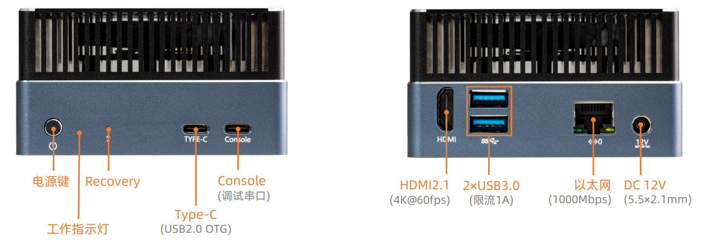
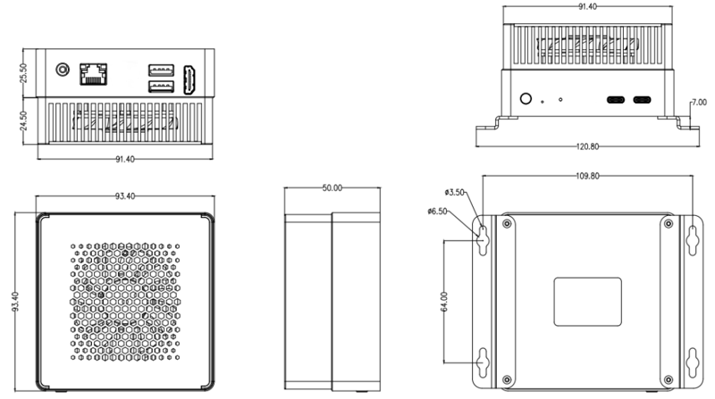

# 简介

[规格书](https://download.t-firefly.com/Spec/Computers/AIBOX-OrinNano_AIBOX-OrinNX_Specification_CN.pdf) | [购买链接](https://item.taobao.com/item.htm?spm=a1z10.5-c-s.w4002-25529778637.11.1251b62aEx8WxA&id=823460684707&skuId=5535769372396) | [下载资料](https://community.t-firefly.com/doc/download/263)

| OS 名称  | SDK 版本 | 内核版本 | 支持情况 | 维护情况 |
| :--------: | :-------: | :-------: | :-------: | :-------: |
| Ubuntu 22.04 | Jetson Linux 36.4.3 (JetPack 6.2) | 5.15 | √ | 主要维护 |

AIBOX-Orin NX 搭载NVIDIA 官方原装 Jetson Orin NX 核心板模组，拥有 16G 内存，算力高达 157 TOPS，它可以运行所有现代AI模型，包括 Transformer 和 ROS 机器人模型。可以实现更大型、更复杂的深度神经网络，如运用 TENSORFLOW、OPENCV、JETPACK、KERASMXNET、PY-TORCH 等,实现物体识别、目标检测追踪、语音识别、及其他视觉开发等功能，满足更高 AI 人工智能应用场景的需求。

## 接口描述

**AIBOX-Orin NX** 提供了丰富的接口，主要包括：
- 12V 电源接口（5.5*2.5mm）
- Power 按键
- Recovery 按键 (让设备进入Recovery 模式，便于烧录固件)
- 千兆以太网 x 1
- USB 3.0 x 2
- HDMI
- NVME 接口(PCIE3.0 x 1)
- Console (调试串口)
- Type-C（USB2.0 OTG）
- 电源指示灯

## 结构尺寸

## 资源与技术支持

* [SDK Developer Guide (r36.3)](https://docs.nvidia.com/jetson/archives/r36.3/DeveloperGuide/index.html)
* [Jetson Benchmarks](https://github.com/NVIDIA-AI-IOT/jetson_benchmarks)
* [Jetson Download Center](https://developer.nvidia.com/embedded/downloads)
* [Jetson Archived Documentation](https://docs.nvidia.com/jetson/archives/)
* [技术交流论坛](https://forum.t-firefly.com/)：超过10万企业客户和用户沟通交流平台

### 联系方式

* 邮箱：sales@t-firefly.com
* 手机：(+86) 186 8811 7175
* 座机：0760-89881218
* 全国服务热线：4001-511-533
* 地址：广东省中山市东区中山四路 57 号宏宇大厦 2101 室