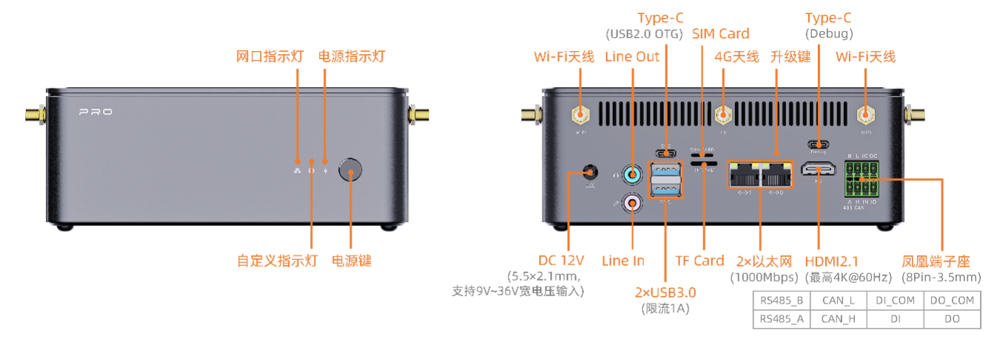
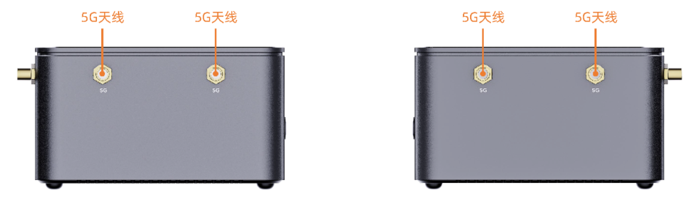

# 接口介绍

AIBOX-PRO-3588 接口丰富，主要包括：
- 12V 电源接口（5.5*2.1mm）
- Power 按键
- MaskRom 按键
- 千兆以太网 x 2
- USB 3.0 x 2
- Line out & Line in
- HDMI
- TF卡槽
- SIM卡槽
- Type-C（OTG烧录）
- Type-C（Debug）
- RS485
- CAN
- DI/DO 光耦隔离
- 电源指示灯
- Wi-Fi天线 x 2
- 4G天线
- 5G天线 x 4

