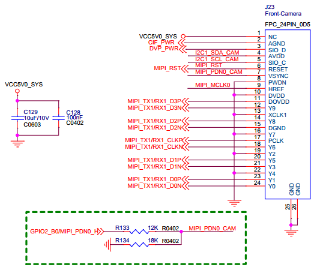

# MIPI CSI 使用

## 简介

AIO-3399Pro-JD4 开发板分别带有两个MIPI，MIPI最高支持支持4K拍照，并支持1080P 30FPS以上视频录制。此外，开发板还支持 USB 摄像头。

本文以 OV13850 摄像头为例，讲解在该开发板上的配置过程。

## 接口效果图


## DTS配置

```
isp0: isp@ff910000 {
    …
    status = "okay";
}
isp1: isp@ff920000 {
    …
    status = "okay";
}
```
## 驱动说明
与摄像头相关的代码目录如下：
```
hal3_camera :
├── AAL Android Abstraction Layer负责与 framework 交互
├── common 公用文件,如线程,消息处理,Log 打印等实现
│ ├── gcss xml 解析相关
│ ├── imageProcess 图像处理相关,如 scale
│ ├── jpeg jpeg 编码相关
│ ├── mediacontroller media pipeline 相关
│ ├── platformdata hal3 能力支持的属性,主要是管理从 xml 获取到的属性
│ ├── utils 目前只有一个 Error.h,定义了一些返回值
│ └── v4l2dev 封装了一些与 v4l2 驱动交互的具体 io
├── etc 配置文件目录
├── include Control loop 的头文件,buffer_manager 相关头文件
├── lib 3a engine 相关库
├── psl Physical Layer,物理实现层,所有的实现逻辑基本都在这里
│ └── rkisp1 目前只有 Rkisp1 一套实现方案
│ ├── tasks 基本只用到了里面的几个 Notify 的接口类和 JpegEncodeTask
│ └── workers 数据的获取处理都在这里
└── tools 包含了一个自动生成 graph setting xml 的 Python 脚本

Linux Kernel-4.4:|
|-- arch/arm64/boot/dts/rockchip DTS 配置文件
|-- drivers/phy/rockchip/  mipi dphy 驱动
	|-- phy-rockchip-mipi-rx.c
|-- drivers/media|
 |-- platform/rockchip/isp1 rkisp1 isp 驱动
  |-- capture.c  包含 mp/sp 的配置及 vb2,帧中断处理
  |-- dev.c 	 包含 probe、异步注册、clock、pipeline、iommu 及 media/v4l2 framework
  |-- isp_params.c 3A 相关参数设置
  |-- isp_stats.c 3A 相关统计
  |-- regs.c 寄存器相关的读写操作
  |-- rkisp1.c 对应 isp_sd entity 节点,包含从 mipi 接收数据,并有 crop 功能
 |-- i2c/
  |-- ov13850.c CIS(cmos image sensor)驱动
  |-- vm149c.c VCM driver ic 驱动
 |-- spi/ rk1608 ap driver 驱动
  |-- rk1608.c 注册 rk1608 spi 设备
  |-- rk1608_dev.c 注册/dev/rk_preisp misc 设备
  |-- rk1608_dphy.c 注册 v4l2 media 节点,与 rk1608 和 AP 端交互

```

## 配置原理

设置摄像头相关的引脚和时钟，即可完成配置过程。
从以下摄像头接口原理图可知，需要配置的引脚有：MIPI_PWR, MIPI_PDN0_CAM/MIPI_PDN1_CAM和RST_CAM_0/1。
* mipi接口

* MIPI_PWR 对应 RK3399Pro 的 GPIO0_B5;
* MIPI_PDN0_CAM/MIPI_PDN1_CAM 对应 RK3399Pro 的 GPIO2_A1 / GPIO2_A0;
* MIPI_RST0/MIPI_RST1 对应RK3399Pro 的 GPIO1_C4;

在开发板中，这三个引脚都是在 kernel/arch/arm64/boot/dts/rockchip/rk3399pro-firefly-usbacm.dtsi 中设置。

## 配置步骤
### 配置 ov13850驱动和VCM驱动
修改kernel/arch/arm64/boot/dts/rockchip/rk3399pro-firefly-usbacm.dtsi 初始化摄像头：

```
{
        vcc_mipi: vcc_mipi {
                compatible = "regulator-fixed";
                enable-active-high;
                gpio = <&gpio3 29 GPIO_ACTIVE_HIGH>;
                pinctrl-names = "default";
                pinctrl-0 = <&dvp_pwr>;
                regulator-name = "vcc_mipi";
        };
};
.....
&i2c1 {
        vm149c: vm149c@0c {
                compatible = "silicon touch,vm149c";
                status = "okay";
                reg = <0x0c>;
                rockchip,camera-module-index = <0>;
                rockchip,camera-module-facing = "back";
        };

        ov13850b: ov13850b@10 {
                compatible = "ovti,ov13850";
                reg = <0x10>;
                clocks = <&cru SCLK_CIF_OUT>;
                clock-names = "xvclk";
                avdd-supply = <&vcc_mipi>;
                /* dvdd-supply = <>; */
                /* dovdd-supply = <>; */
                /* reset-gpios = <>; */
                //mipi-pwr-gpios = <&gpio3 29 GPIO_ACTIVE_HIGH>;
                reset-gpios = <&gpio2 6 GPIO_ACTIVE_HIGH>;
                pwdn-gpios = <&gpio3 27 GPIO_ACTIVE_HIGH>;
                //pinctrl-names = "rockchip,camera_default", "rockchip,camera_sleep";
                //pinctrl-0 = <&cam0_default_pins>;
                //pinctrl-1 = <&cam0_sleep_pins>;
                pinctrl-names = "rockchip,camera_default";
                pinctrl-0 = <&cif_clkout>;

                firefly,clkout-enabled-index = <0>;
                rockchip,camera-module-index = <0>;
                rockchip,camera-module-facing = "back";
                rockchip,camera-module-name = "CMK-CT0116";
                rockchip,camera-module-lens-name = "Largan-50013A1";
                lens-focus = <&vm149c>;

                port {
                        ucam_out0: endpoint {
                                remote-endpoint = <&mipi_in_ucam0>;
                                data-lanes = <1 2>;
                        };
                };
        };
        vm149c_front: vm149c_front@0c {
                compatible = "silicon touch,vm149c";
                status = "okay";
                reg = <0x0c>;
                rockchip,camera-module-index = <1>;
                rockchip,camera-module-facing = "front";
        };

        ov13850f: ov13850f@10 {
                compatible = "ovti,ov13850";
                reg = <0x10>;
                clocks = <&cru SCLK_CIF_OUT>;
                clock-names = "xvclk";
                avdd-supply = <&vcc_mipi>;
                //mipi-pwr-gpios = <&gpio3 29 GPIO_ACTIVE_HIGH>;
                reset-gpios = <&gpio2 1 GPIO_ACTIVE_HIGH>;
                pwdn-gpios = <&gpio3 28 GPIO_ACTIVE_HIGH>;
                //pinctrl-names = "rockchip,camera_default", "rockchip,camera_sleep";
                //pinctrl-0 = <&cam0_default_pins>;
                //pinctrl-1 = <&cam0_sleep_pins>;
                pinctrl-names = "rockchip,camera_default";
                pinctrl-0 = <&cif_clkout>;

                firefly,second-enabled-index = <1>;
                firefly,clkout-enabled-index = <0>;
                rockchip,camera-module-index = <1>;
                rockchip,camera-module-facing = "front";
                rockchip,camera-module-name = "CMK-CT0116";
                rockchip,camera-module-lens-name = "Largan-50013A1";
                lens-focus = <&vm149c_front>;

                port {
                        ucam_out1: endpoint {
                                remote-endpoint = <&mipi_in_ucam1>;
                                data-lanes = <1 2>;
                        };
                };
        };
};

&pinctrl {
        cam0 {
                dvp_pwr: dvp-pwr {
                        rockchip,pins = <3 29 RK_FUNC_GPIO &pcfg_pull_up>;
                };
        };
};

```

修改ov13850驱动上电时序 kernel/drivers/media/i2c/ov13850.c

```
+static int __ov13850_power_on(struct ov13850 *ov13850);
+static void __ov13850_power_off(struct ov13850 *ov13850);
 static int ov13850_s_power(struct v4l2_subdev *sd, int on)
 {
        struct ov13850 *ov13850 = to_ov13850(sd);
@@ -1055,6 +1058,7 @@ static int ov13850_s_power(struct v4l2_subdev *sd, int on)
                        goto unlock_and_return;
                }

+               __ov13850_power_on(ov13850);
                ret = ov13850_write_array(ov13850->client, ov13850_global_regs);
                if (ret) {
                        v4l2_err(sd, "could not set init registers\n");
@@ -1063,9 +1067,20 @@ static int ov13850_s_power(struct v4l2_subdev *sd, int on)
                }

                ov13850->power_on = true;
+               /* export gpio */
+               if (!IS_ERR(ov13850->reset_gpio))
+                       gpiod_export(ov13850->reset_gpio, false);
+               if (!IS_ERR(ov13850->pwdn_gpio))
+                       gpiod_export(ov13850->pwdn_gpio, false);
        } else {
                pm_runtime_put(&client->dev);
+               __ov13850_power_off(ov13850);
                ov13850->power_on = false;
+               /* unexport gpio */
+               if (!IS_ERR(ov13850->reset_gpio))
+                       gpiod_unexport(ov13850->reset_gpio);
+               if (!IS_ERR(ov13850->pwdn_gpio))
+                       gpiod_unexport(ov13850->pwdn_gpio);
        }
```
根据sensor需求对__ov13850_power_on进行上电配置。

### 配置 Android
修改hardware/rockchip/camera/etc/camera/camera3_profiles_rk3399pro.xml 来注册摄像头：

```
<CameraSettings>
  <Profiles cameraId="0" name="ov13850" moduleId="m00">
        <Supported_hardware>
            <hwType value="SUPPORTED_HW_RKISP1"/>
        </Supported_hardware>

        <Android_metadata> <!-- Android static metadata only -->
            <!-- Color Correction -->
            <colorCorrection.availableAberrationModes value="OFF"/>
            <!-- Control -->
            <control.availableModes value="AUTO"/>
            <control.aeAvailableAntibandingModes value="OFF,50HZ,60Hz,AUTO"/>
            <control.aeAvailableModes value="ON,OFF"/>
            <control.aeLockAvailable value="FALSE"/>
            <!-- <control.aeAvailableTargetFpsRanges value="15,30,30,30,60,60"/> -->
            <control.aeAvailableTargetFpsRanges value="15,30,30,30"/>
            <control.aeCompensationRange value="-6,6"/>
            <control.aeCompensationStep value="1,3"/>
            <control.afAvailableModes value="OFF,AUTO,MACRO,CONTINUOUS_VIDEO,CONTINUOUS_PICTURE,EDOF"/>
            <control.availableEffects value="OFF"/>
            <!-- <control.awbAvailableModes value="AUTO"/> -->
            <control.awbAvailableModes value="AUTO,INCANDESCENT,FLUORESCENT,DAYLIGHT,CLOUDY_DAYLIGHT"/>
            <control.awbLockAvailable value="false"/>
            <control.availableSceneModes value="DISABLED"/>
            <control.availableVideoStabilizationModes value="OFF"/>
            <control.maxRegions value="1,0,1"/>
            <!-- JPEG -->
            <jpeg.maxSize value="19267584"/>  <!-- w*h*1.5 -->
            <!-- /* TODO */ -->
            <!-- The aspect ratio of the largest thumbnail size will be same as the aspect ratio of largest JPEG output size -->
            <!-- buf hw encode may not support such thumbnail size, so if we should change the jpeg output size? -->
            <jpeg.availableThumbnailSizes value="0,0,128,96,160,96,160,120,256,196"/>
            <!-- <jpeg.availableThumbnailSizes value="0,0,160,120,320,180,320,240"/> -->
            <!-- Lens Info-->
            <!-- TODO: availableApertures now is fake for we do not get the real apertures -->
            <lens.info.availableApertures value="2.0"/> <!-- HAL may override this value from CMC for RAW sensors -->
            <lens.info.availableFocalLengths value="2.04"/> <!-- HAL may override this value from CMC for RAW sensors -->
            <lens.info.availableOpticalStabilization value="OFF"/> <!-- OPTIONS: OFF, ON -->
            <lens.info.hyperfocalDistance value="0.0"/> <!-- HAL may override this value from CMC for RAW sensors -->
            <lens.info.minimumFocusDistance value="0.1"/> <!-- HAL may override this value from CMC for RAW sensors -->
            <!-- Lens -->
            <lens.facing value="BACK"/>
            <!-- Request -->
            <request.maxNumOutputStreams value="1,2,1"/>
            <request.pipelineMaxDepth value="4"/>
            <request.maxNumInputStreams value="0"/>
            <request.partialResultCount value="1"/>
            <!-- <request.availableCapabilities value="BACKWARD_COMPATIBLE,YUV_REPROCESSING,PRIVATE_REPROCESSING"/> -->
            <request.availableCapabilities value="BACKWARD_COMPATIBLE"/>
            <request.availableRequestKeys value="blackLevel.lock,
                colorCorrection.aberrationMode,
                colorCorrection.gains,
                colorCorrection.transform,
                control.aeAntibandingMode,
                control.aeExposureCompensation,
                control.aeLock,
                control.aeMode,
                control.aeTargetFpsRange,
                control.aePrecaptureTrigger,
                control.afMode,
                control.aeRegions,
                control.afRegions,
                control.afTrigger,
                control.awbLock,
                control.awbMode,
                control.captureIntent,
                control.effectMode,
                control.mode,
                control.sceneMode,
                control.videoStabilizationMode,
                edge.mode,
                flash.mode,
                jpeg.gpsLocation,
                jpeg.orientation,
                jpeg.quality,
                jpeg.thumbnailQuality,
                jpeg.thumbnailSize,
                lens.aperture,
                lens.focalLength,
                lens.opticalStabilizationMode,
                noiseReduction.mode,
                scaler.cropRegion,
                statistics.faceDetectMode,
                statistics.hotPixelMapMode,
                statistics.sceneFlicker,
                statistics.lensShadingMapMode
                "/>

            <request.availableResultKeys value="colorCorrection.mode,
                colorCorrection.transform,
                colorCorrection.gains,
                colorCorrection.aberrationCorrectionMode,
                control.aeAntibandingMode,
                control.aeExposureCompensation,
                control.aeLock,
                control.aeMode,
                control.aeTargetFpsRange,
                control.aePrecaptureTrigger,
                control.afMode,
                control.afRegions,
                control.afTrigger,
                control.awbLock,
                control.awbMode,
                control.captureIntent,
                control.effectMode,
                control.mode,
                control.sceneMode,
                control.videoStabilizationMode,
                control.aeState,
                control.afState,
                control.awbState,
                sync.frameNumber,
                edge.mode,
                flash.mode,
                jpeg.gpsLocation,
                jpeg.orientation,
                jpeg.quality,
                jpeg.thumbnailQuality,
                jpeg.thumbnailSize,
                lens.focalLength,
                lens.aperture,
                lens.opticalStabilizationMode,
                request.pipelineDepth,
                scaler.cropRegion,
                sensor.testPatternData,
                sensor.testPatternMode,
                sensor.timestamp,
                sensor.rollingShutterSkew,
                statistics.faceDetectMode,
                statistics.hotPixelMapMode,
                statistics.faces,
                noiseReduction.mode,
                statistics.sceneFlicker,
                statistics.lensShadingMapMode
                "/>
            <request.availableCharacteristicsKeys value="0"/>
            <!-- Scaler -->
            <scaler.availableMaxDigitalZoom value="4.0"/>
            <scaler.availableInputOutputFormatsMap value="IMPLEMENTATION_DEFINED,2,YCbCr_420_888,BLOB,YCbCr_420_888,2,YCbCr_420_888,BLOB"/>
			<scaler.availableStreamConfigurations value="
				BLOB,4096x3136,OUTPUT,
				BLOB,2112x1568,OUTPUT,
                BLOB,1920x1080,OUTPUT,
                BLOB,1280x960,OUTPUT,
                BLOB,1280x720,OUTPUT,
                BLOB,640x480,OUTPUT,
                BLOB,352x288,OUTPUT,
                BLOB,320x240,OUTPUT,
                BLOB,176x144,OUTPUT,
                YCbCr_420_888,2112x1568,OUTPUT,
                YCbCr_420_888,1920x1080,OUTPUT,
                YCbCr_420_888,1280x960,OUTPUT,
                YCbCr_420_888,1280x720,OUTPUT,
                YCbCr_420_888,640x480,OUTPUT,
                YCbCr_420_888,352x288,OUTPUT,
                YCbCr_420_888,320x240,OUTPUT,
                YCbCr_420_888,176x144,OUTPUT,
                IMPLEMENTATION_DEFINED,2112x1568,OUTPUT,
                IMPLEMENTATION_DEFINED,1920x1080,OUTPUT,
                IMPLEMENTATION_DEFINED,1280x960,OUTPUT,
                IMPLEMENTATION_DEFINED,1280x720,OUTPUT,
                IMPLEMENTATION_DEFINED,640x480,OUTPUT,
                IMPLEMENTATION_DEFINED,352x288,OUTPUT,
                IMPLEMENTATION_DEFINED,320x240,OUTPUT,
                IMPLEMENTATION_DEFINED,176x144,OUTPUT"/>
			<scaler.availableMinFrameDurations value="
				BLOB,4096x3136,150000000,
				BLOB,2112x1568,33333333,
                BLOB,1920x1080,33333333,
                BLOB,1280x960,33333333,
                BLOB,1280x720,33333333,
                BLOB,640x480,33333333,
                BLOB,352x288,33333333,
                BLOB,320x240,33333333,
                BLOB,176x144,33333333,
                YCbCr_420_888,2112x1568,33333333,
                YCbCr_420_888,1920x1080,33333333,
                YCbCr_420_888,1280x960,33333333,
                YCbCr_420_888,1280x720,33333333,
                YCbCr_420_888,640x480,33333333,
                IMPLEMENTATION_DEFINED,2112x1568,33333333,
                IMPLEMENTATION_DEFINED,1920x1080,33333333,
                IMPLEMENTATION_DEFINED,1280x960,33333333,
                IMPLEMENTATION_DEFINED,1280x720,33333333,
                IMPLEMENTATION_DEFINED,640x480,33333333,
                IMPLEMENTATION_DEFINED,352x288,33333333,
                IMPLEMENTATION_DEFINED,320x240,33333333,
                IMPLEMENTATION_DEFINED,176x144,33333333" />
			<scaler.availableStallDurations value="
												   BLOB,4096x3136,150000000,
												   BLOB,2112x1568,33333333,
                                                   BLOB,1920x1080,33333333,
                                                   BLOB,1280x960,33333333,
                                                   BLOB,1280x720,33333333,
                                                   BLOB,640x480,33333333,
                                                   BLOB,352x288,33333333,
                                                   BLOB,320x240,33333333,
                                                   BLOB,176x144,33333333" />
            <scaler.croppingType value="CENTER_ONLY"/>
            <!-- Sensor Info -->
            <sensor.info.activeArraySize value="0,0,4224,3136"/>
            <sensor.info.sensitivityRange value="32,2400"/>
            <sensor.info.colorFilterArrangement value="BGGR"/> <!-- HAL may override this value from CMC for RAW sensors -->
            <sensor.info.exposureTimeRange value="100000,333333330"/>
            <sensor.info.maxFrameDuration value="66666666"/>
            <sensor.info.physicalSize value="5.5,4.5"/> <!-- 4224x1.12um 3136x1.12um -->
            <sensor.info.pixelArraySize value="4224x3136"/>
            <sensor.info.whiteLevel value="0"/> <!-- HAL may override this value from CMC for RAW sensors -->
            <sensor.info.timestampSource value="UNKNOWN"/>
            <!-- Sensor -->
            <sensor.baseGainFactor value="0,1"/> <!-- HAL may override this value from CMC for RAW sensors -->
            <sensor.blackLevelPattern value="0,0,0,0"/>
            <sensor.maxAnalogSensitivity value="2400"/> <!-- HAL may override this value from CMC for RAW sensors -->
            <sensor.orientation value="180"/>
            <sensor.profileHueSatMapDimensions value="0,0,0"/>
            <sensor.availableTestPatternModes value="OFF,COLOR_BARS"/>
            <!-- Info -->
            <info.supportedHardwareLevel value="LIMITED"/>
            <!-- shading -->
            <!-- <shading.availableModes value="OFF"/> -->
            <!-- Statistics Info -->
            <statistics.info.availableFaceDetectModes value="OFF"/>
            <statistics.info.histogramBucketCount value="0"/>
            <statistics.info.maxFaceCount value="0"/>
            <statistics.info.availableHotPixelMapModes value="OFF"/>
            <statistics.info.availableLensShadingMapModes value="OFF"/>
            <!-- Flash -->
            <flash.colorTemperature value="0"/>
            <flash.maxEnergy value="0"/>
            <!-- Flash info -->
            <flash.info.available value="FALSE"/>
            <flash.info.chargeDuration value="1000000"/>
            <flash.maxEnergy value="10"/>
            <!-- Sync -->
            <sync.maxLatency value="PER_FRAME_CONTROL"/>
            <!-- maxCaptureStall -->
            <reprocess.maxCaptureStall value="4"/>
            <!-- Edge -->
            <edge.availableEdgeModes value="OFF,FAST,HIGH_QUALITY"/>
            <!-- Noise Reduction -->
            <noiseReduction.availableNoiseReductionModes value="OFF,FAST,HIGH_QUALITY"/>

        </Android_metadata>

<!-- ******************PSL specific section start **************************************************************-->
        <Hal_tuning_RKISP1> <!-- Parameters to tune the HAL and hacks for the HAL that are camera dependent -->
            <flipping value="" value_v=""/> <!-- value: SENSOR_FLIP_H or "", value_v: SENSOR_FLIP_V or "" -->
            <supportIsoMap value="false"/>
            <supportTuningSize value="4224x3136, 2112x1568"/>
        </Hal_tuning_RKISP1>

        <Sensor_info_RKISP1> <!-- Information that parametrizes the behavior or qualities of the physical sensor -->
            <sensorType value="SENSOR_TYPE_RAW"/> <!-- SENSOR_TYPE_SOC or SENSOR_TYPE_RAW -->
            <exposure.sync value="true"/> <!-- compensate expsure sync-->
            <sensor.digitalGain value="false"/> <!-- digital gain support on sensor-->
            <gain.lag value="2"/> <!-- camera3 HAL CPF parameters moved here start-->
            <exposure.lag value="2"/>
            <fov value= "54.8" value_v="42.5"/>
            <statistics.initialSkip value="1"/> <!-- camera3 HAL CPF parameters moved here end-->
            <frame.initialSkip value="3"/> <!-- camera3 HAL CPF parameters moved here end-->
            <isoAnalogGain1 value="75"/> <!--Pseudo ISO corresponding analog gain value 1.0. -->
            <cITMaxMargin value="10"/> <!--coarse integration time max margin -->
        </Sensor_info_RKISP1>

<!-- ******************PSL specific section end **************************************************************-->

```

主要修改的内容如下：

   * Sensor 名称
 ```
cameraId="0"  //cameraId 后置为 0, 前置为 1, 只有一个 camera 时, 为 0

 ```
该名字必须与 Sensor 驱动的名字一致,目前提供的 Sensor 驱动格式如下：
```
name="ov13850"
moduleId="m00"
```
通过如下命令: adb shell cat /sys/class/video4linux/*/name 可以获取所有 v4l2 设备点节的名字,其中形如
m00_b_ov13850 1-0010 为 sensor 节点名称。 该命令规则中, m00 代表 moduleId ,主要为匹配 len,flash 之
用, ‘b’ 代表 camera 方向为后置,如果是前置则为‘f’,‘ov13850’代表 sensor name , ‘1-0010’ 代表 I2c 地址。

### 调试方法

(1) RKISP 驱动如果加载成功,会有 video 及 media 设备存在于/dev/目录下。系统中可能存在
多个/dev/video 设备,通过/sys 可以查询到 RKISP 注册的 video 节点。
```
console:/ # grep '' /sys/class/video4linux/video*/name
/sys/class/video4linux/video0/name:rkisp1_mainpath
/sys/class/video4linux/video1/name:rkisp1_selfpath
/sys/class/video4linux/video2/name:rkisp1_dmapath
/sys/class/video4linux/video3/name:rkisp1-statistics
/sys/class/video4linux/video4/name:rkisp1-input-params
/sys/class/video4linux/video5/name:rkisp1_mainpath
/sys/class/video4linux/video6/name:rkisp1_selfpath
/sys/class/video4linux/video7/name:rkisp1_dmapath
/sys/class/video4linux/video8/name:rkisp1-statistics
/sys/class/video4linux/video9/name:rkisp1-input-params
```
(2) 判断 camera 驱动是否加载成功
当所有的 camera 都注册完毕,kernel 会打印出如下的 log。
```
localhost ~ # dmesg | grep Async
[ 0.682982] rkisp1: Async subdev notifier completed
```
如发现 kernel 没有 Async subdev notifier completed 这行 log,那么请首先查看 sensor
是否有相关的报错,I2C 通讯是否成功。

(3) 调试上层相关信息
```
dumpsys media.camera
```
终端下可以直接修改/vendor/etc/camera/camera3_profiles.xml调试各参数并重启生效

## FAQs

1.无法打开摄像头，首先确定sensor I2C是否通信。若不通则可检查mclk以及供电是否正常（Power/PowerDown/Reset/Mclk/I2cBus）分别排查
2.参考驱动列表ː
ov8858.c
Gc2145.c
Ov7251
tc35874x.c

