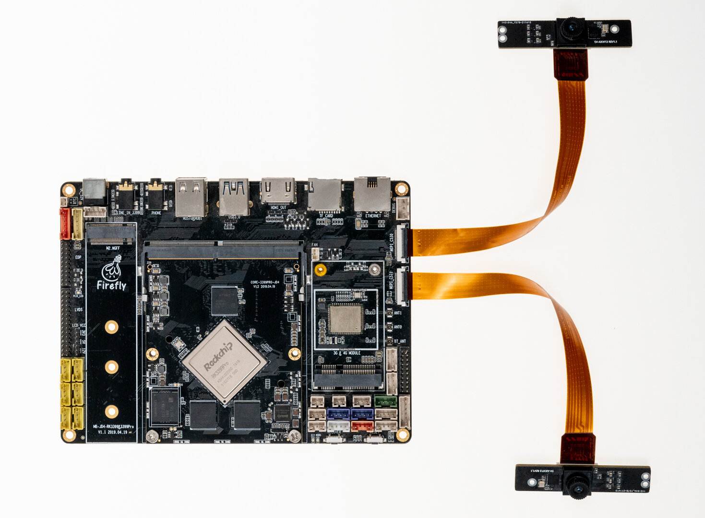

## [CAM-8MS1M 单目摄像头模组](https://item.taobao.com/item.htm?ft=t&id=659032651408)

### 产品参数
* **品牌**：SV
* **ISP**：XC7160
* **Sensor**: SC8238
* **接口**: MIPI
* **像素**: 800W(当前仅支持1080P，4K仍在适配中)

### 规格书
[CAM-8MS1M_800万单目MIPI摄像模组_规格书](https://www.t-firefly.com/doc/download/131.html#other_515)

### 参考固件
公版固件默认支持 CAM-8MS1M 单目摄像头模组。若无法使用单目摄像头 CAM-8MS1M，请更新固件
[Android 9.0 固件下载](https://www.t-firefly.com/doc/download/65.html#other_334)

### 实物图参考

### 连接方法

### 实拍图片

