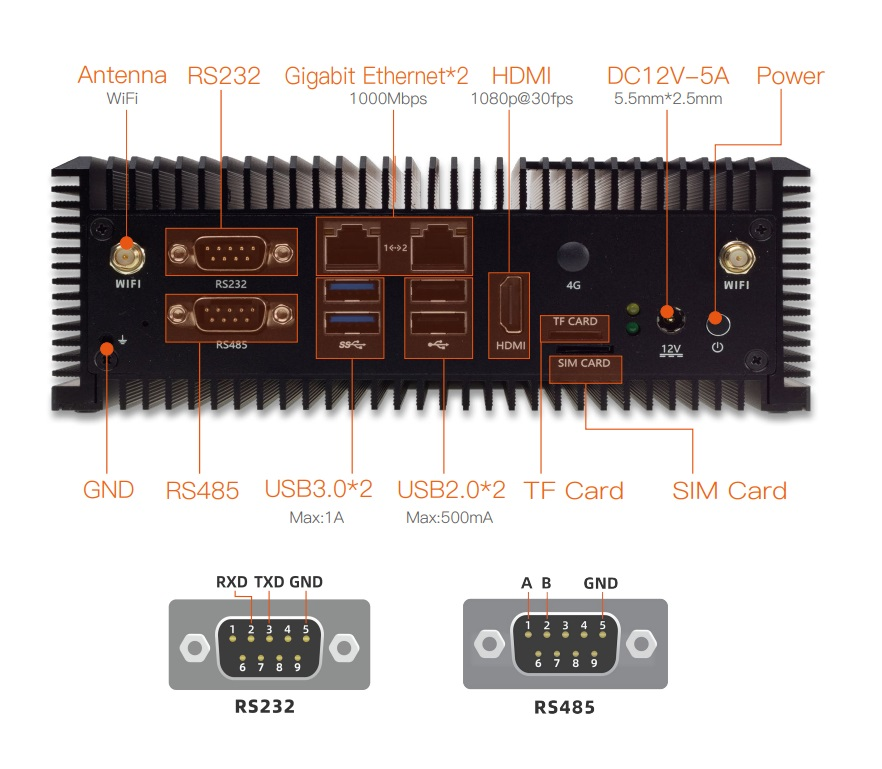
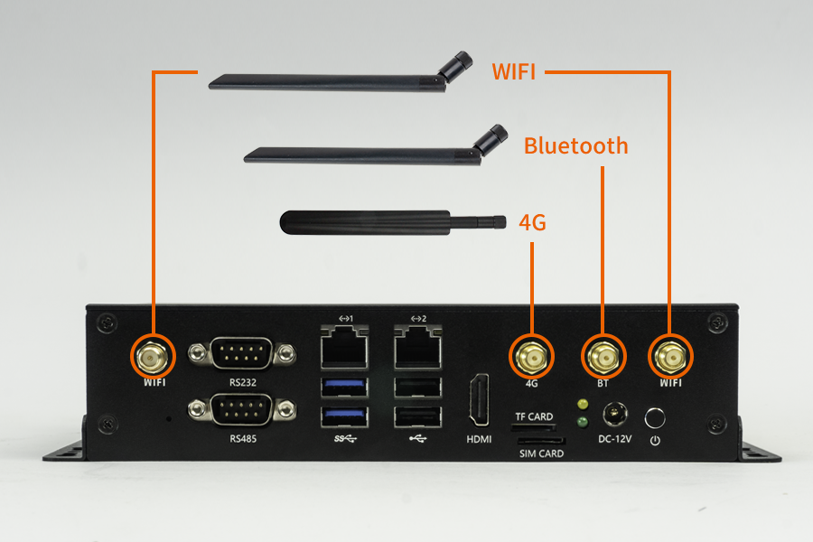
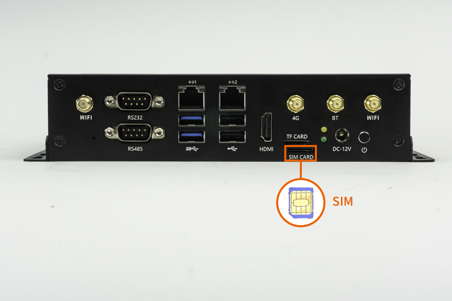

# 接口介绍

EC-A1684JD4 FD 接口丰富，主要包括：
- 12V 电源接口（5.5*2.5mm）
- POWER 按键
- RS232
- RS485
- 千兆以太网 x 2
- USB 3.0 x 2
- USB 2.0 x 2
- HDMI
- TF 卡座
- SIM 卡座
- BT 天线
- WIFI 天线 x 2
- 4G 天线

## 天线连接

## SIM 卡插入

## 串口 Pinout

