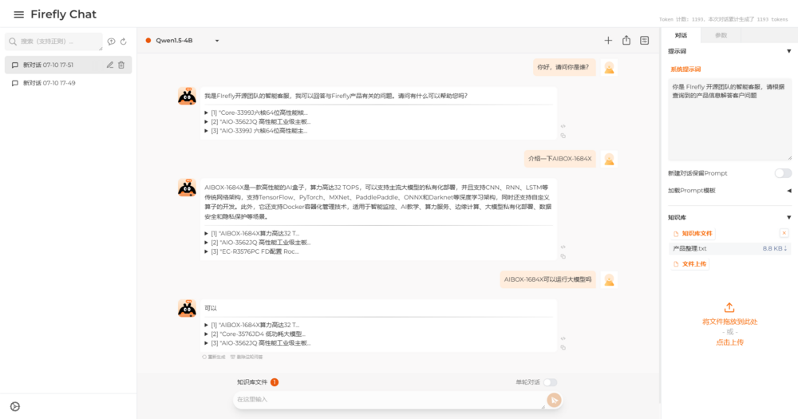

# 演示应用

## FireflyChat

FireflyChat 是由 Firefly 开源团队开发的图形化大模型应用平台，用户可在 FireflyChat 提供的可视化 WebUI 中快速体验各种大模型的实际使用效果。

<center>


</center>

## 软件安装

安装 FireflyChat 需要先从[下载中心]获取所需的安装包。共两个安装包，分别为 `fireflychat*.deb` 和 `libfirefly-ai*.deb`。

获取安装包后需将其传输至 EC-A1684XJD4 FD 上，并执行以下命令进行安装：

```bash
# 安装 venv 虚拟环境
sudo apt update
sudo apt install python3-venv

# 安装 FireflyChat
sudo dpkg -i libfirefly-ai*.deb
sudo dpkg -i fireflychat*.deb
```

在安装完 FireflyChat 后，还需将所需的模型文件导入进 FireflyChat 中，才能够正常使用。

## 模型导入

### 大模型

用户可以从[下载中心]的 LLM 模型资源中获取 Firefly 开源团队提供的模型文件（.bmodel）。

获取模型文件后需将其传输至 EC-A1684XJD4 FD 上，并执行以下命令进行导入：

```bash
# 移动模型文件位置，其中 <model_path> 请替换为实际的模型文件路径
sudo mv <model_path> /models/LLM/
```

### Embedding 模型

用户可以从[下载中心]的 Embedding 模型资源中获取 Firefly 开源团队提供的模型文件（.bmodel）。

获取模型文件后需将其传输至 EC-A1684XJD4 FD 上，并执行以下命令进行导入：

```bash
# 移动模型文件位置，其中 <model_path> 请替换为实际的模型文件路径
sudo mv <model_path> /models/embedding/
```

### 重启 FireflyChat 服务

添加或变更所需的模型文件后，还需重启 FireflyChat，才能使新的模型导入生效：

```bash
sudo systemctl restart FireflyChat
```

## 软件使用

### WebUI 使用（主要使用方法）

FireflyChat 在成功安装后将会自动运行，用户可在浏览器中输入 `<ip_address>:7860` 直接访问 FireflyChat。

注意：<ip_address> 需替换为实际的 IP 地址，例：`172.16.11.18:7860`。

### 软件后台管理

FireflyChat 是一个作为 systemd 服务注册的应用程序，可以通过以下命令控制 FireflyChat 运行状态：

```bash
# 关闭 FireflyChat
sudo systemctl stop FireflyChat

# 重启 FireflyChat
sudo systemctl restart FireflyChat

# 禁用 FireflyChat 自启动
sudo systemctl disable FireflyChat

# 查看运行日志
sudo journalctl -u FireflyChat
```

---

## 快速部署 Llama3

为了便于用户快速体验 Llama3，Firefly 开源团队提供了开箱即用的快速部署包，请从[下载中心]获取快速部署包。

## 部署流程

将部署包传输至 EC-A1684XJD4 FD 机器，推荐使用 `scp` 命令传输：

1. 在 EC-A1684XJD4 FD 上执行 `ifconfig` 命令查看其 IP 地址。
2. 输入 `scp` 命令传输部署包，例：`scp llama3.tar linaro@<aibox-ip-addr>:~/`，其中 `<aibox-ip-addr>` 为 EC-A1684XJD4 FD 的 IP 地址。

解压部署包：`tar -xvf ./llama3.tar`。

一行命令部署 Llama3：`./talk_to_llama3.sh`。

注意：部署过程中无需联网，首次部署 Llama3 需要花费较长时间进行相应的软件安装（3-5分钟），请耐心等待。

[下载中心]: https://community.t-firefly.com/doc/download/208