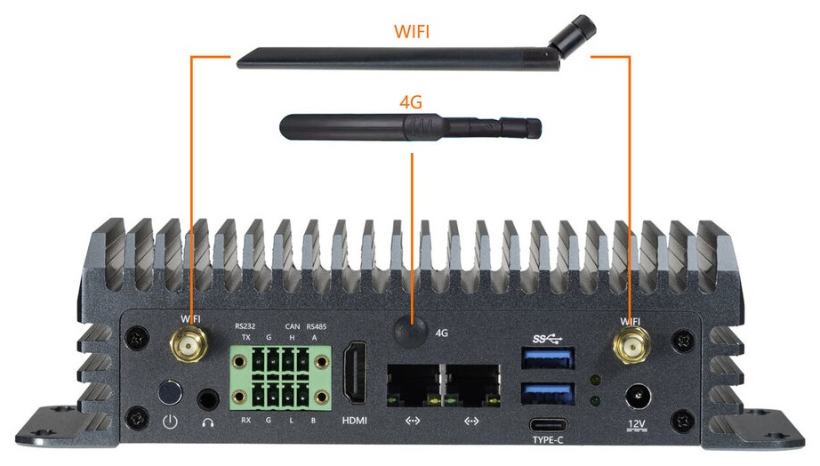

# 硬件功能使用
## 调试串口

EC-A186JD4 板载 Type-C 调试串口，使用 Type-C 转 USB 数据线连接机器的 Type-C 口和 PC 的 USB 口即可直连调试。

串口参数为：

* 波特率：115200
* 数据位：8
* 停止位：1
* 奇偶校验：无
* 流控：无

登录终端的用户名、密码均为 `linaro`。

## 显示接口

EC-A186JD4 提供 1 路 HDMI 输出接口，支持标准 HDMI 2.0 输出。

可以使用以下命令测试 HDMI 接口：

```shell
insmod /mnt/system/ko/soph_drm.ko # 安装显示框架驱动
systemctl stop SophonHDMI.service # 关闭 HDMI 的显示界面
systemctl restart SophonHDMI.service  # 恢复 HDMI 的显示界面
```

也可以通过 `modetest` 去测试：

```shell
modetest -M cvitek -s 42@40:1920x1080-60@RG24
```

其中 `42@40:1920x1080-60@RG24` 根据实际接的显示器的分辨率来修改。

## UART

EC-A186JD4 板载 RS232 串口对应设备节点 `/dev/ttyS2`，默认波特率 `115200`。

### 串口回环测试

短接串口的 TXD 与 RXD 引脚后，在设备上运行下列命令：

```shell
stty -F /dev/ttyS2 115200
cat /dev/ttyS2 &
echo "firefly test" > /dev/ttyS2
```

终端输出 `firefly test` 即表示串口收发正常。


## 登录与网络配置

除通过 Type-C 调试串口登录（见上文调试串口一节）外，EC-A186JD4 还提供 2 个千兆以太网口，可以通过以太网 SSH 远程登录。

### 以太网 SSH 登录

EC-A186JD4 默认出厂时网口 0（靠近 USB 座子）设置了动态 IP，而网口 1（靠近 HDMI 口）设置了静态 IP `192.168.150.1`，子网掩码 `255.255.255.0`，可以将 PC 设置成 `192.168.150.2/24` 来做初次登录。

网口 0 是由路由器分配 IP，事先一般是不清楚 IP 地址信息，因此用户初次登录最好选择网口 1。

在网口灯闪烁正常后，打开终端使用 `ssh` 登录，端口号为 `22`，用户名密码均为 `linaro`:

```shell
ssh linaro@192.168.150.1
```

若登录失败，可以尝试使用 PC 机是否可以 `ping` 通 EC-A186JD4 网口 1 的 IP 地址，注意的是 PC 机要添加同网段 IP，原因是 PC 机的 IP 地址不一定处于同一网段。

以下是 PC 添加同网段 IP 的方法（使用管理员模式）：

- windows 10

  ```
  netsh int ipv4 add address "以太网" 192.168.150.101 255.255.255.0
  ```
  其中`"以太网"`指的是网络接口，`192.168.150.101` 是 IP 地址，`255.255.255.0`则为子网掩码。

- linux

  ```shell
  ifconfig enp4s0:1 192.168.150.89
  ```
  其中 `enp4s0` 是 PC 机的网卡驱动名称，具体需要执行 `ifconfig` 命令查看。

### 网络 IP 配置（netplan）

在 Ubuntu 系统，双网口中的 `eth0` 默认是动态获取 IP 的（即 DHCP），`eth1` 是固定成了 `192.168.150.1`。

网络配置是通过 `/etc/netplan/01-netcfg.yaml` 文件完成的，这个文件可对 Ubuntu 系统原始网络配置进行修改。

```shell
linaro@sophon:~$ cat /etc/netplan/01-netcfg.yaml
network:
        version: 2
        renderer: networkd
        ethernets:
                eth0:
                        dhcp4: yes
                        addresses: []
                        optional: yes
                        dhcp-identifier: mac
                eth1:
                        dhcp4: no
                        addresses: [192.168.150.1/24]
                        optional: yes
```

如果用户删掉这个文件，那么 `eth1` 会变成跟 `eth0` 一样的 DHCP 方式获取 IP；如果用户想要把 `eth0` 也固定 IP，就只需在 `/etc/netplan/01-netcfg.yaml` 文件中修改 `eth0` 节点（参考 `eth1`），重启生效即可。

## USB 接口

EC-A186JD4 提供 2 个 USB 3.0 接口。

插入 U 盘等存储设备后，存储设备会被识别为 `/dev/sdb1` 之类的节点。系统不支持自动挂载，需要手工进行 `mount` 挂载：

```shell
# 创建挂载目录
mkdir disk
# 挂载
sudo mount /dev/sdb1 disk
# 查看 U 盘内的文件
ls disk
```

完成数据写入后，请及时使用 `sync` 或 `umount` 操作，关机时请使用 `sudo poweroff` 命令，避免暴力下电关机，以免数据丢失。

## TF 卡

EC-A186JD4 提供 TF 卡座。TF 卡的挂载方法与 U 盘类似：

```shell
# 创建挂载目录
mkdir media
# 挂载
sudo mount /dev/mmcblk1p1 media
# 查看 TF 卡内的文件
ls media
```

TF 卡同时也可用于固件升级，请参阅[固件升级](fw_upgrade.md)。

## SIM 卡

EC-A186JD4 的 SIM 卡槽用于配合 4G 模块实现移动网络连接。**4G 模块为选配**，需要在机箱内部安装 4G 模块后，SIM 卡功能才能正常使用。SIM 卡插入方向如下图所示，插拔前请先断电。

<center>


</center>

## 天线连接

EC-A186JD4 的天线连接如下图所示：

<center>


</center>


## NVMe SSD

EC-A186JD4 提供 NVME 接口（PCIE3.0 x 1）。一般可挂载的 PCIE 节点为：`/dev/nvme0n1p1`。

```shell
# 创建挂载目录
mkdir nvme_dir
# 挂载
sudo mount /dev/nvme0n1p1 nvme_dir
# 查看 PCIE SSD 的文件
ls nvme_dir
```

## 内存分配调整

EC-A186JD4 的内存有一部分被分配于 NPU、VPP 和 VPU 设备，因此使用 `free -h` 等指令获取的内存数据与机器的实际内存不一致。

如需查看详细的内存分配设置，或者默认内存分配与实际需求冲突，需调整内存分配的，可参照以下步骤进行相应操作。

### 安装内存分配工具

从 [下载中心](https://community.t-firefly.com/doc/download/250) 获取内存分配工具压缩包，并将其传输到 EC-A186JD4 上，执行以下命令解压压缩包：

```bash
tar -xvf memory_edit_v2.9.tar.xz
```

### 查看内存分配设置

在完成压缩包解压后，执行以下命令查看内存分配设置：

```bash
cd memory_edit
./memory_edit.sh -p
```

内存分配设置结果示例如下，其中 `Info: get max memory size ...` 显示的结果是每个设备可配置的最大内存，`Info: get now memory size ...` 显示的结果是每个设备目前所分配的内存

```bash
linaro@aibox-1688x:~/memory_edit$ ./memory_edit.sh -p
INFO: version: 2.9
Info: use dts file /home/linaro/memory_edit/output/bm1688x_se7_v1_mini.dts
Info: =======================================================================
Info: get ddr information ...
Info: ddr12_size 8589934592 Byte [8192 MiB]
Info: ddr3_size 4294967296 Byte [4096 MiB]
Info: ddr4_size 4294967296 Byte [4096 MiB]
Info: ddr_size 16384 MiB
Info: =======================================================================
Info: get max memory size ...
Info: max npu size: 0x1dbf00000 [7615 MiB]
Info: max vpu size: 0xc0000000 [3072 MiB]
Info: max vpp size: 0x100000000 [4096 MiB]
Info: =======================================================================
Info: get now memory size ...
Info: now npu size: 0xf6e00000 [3950 MiB]
Info: now vpu size: 0x80000000 [2048 MiB]
Info: now vpp size: 0xc0000000 [3072 MiB]
```

### 修改内存分配设置

可参考以下命令进行内存分配设置，其中输入的三个参数是需要 NPU、VPU、VPP 配置的大小的十进制数字，单位 MiB；或者为十六进制数值，单位 Byte。

```bash
# 十进制，单位MiB
./memory_edit.sh -c -npu 2048 -vpu 2048 -vpp 2048
# 十六进制，单位Byte
./memory_edit.sh -c -npu 0x80000000 -vpu 0x80000000 -vpp 0x80000000
```

执行以上命令之一后，检查输出中是否有 Error ，以及类似于如下输出中三个部分的大小是否与所需要配置的大小相同。

```bash
Info: output configuration results ...
Info: vpu mem area(ddr3): 0x8000000 [128 MiB] 0x20000000 -> 0x27ffffff
Info: ion npu mem area(ddr1): 0x80000000 [2048 MiB] 0x24100000 -> 0xa40fffff
Info: ion vpu mem area(ddr3): 0x80000000 [2048 MiB] 0x80000000 -> 0xffffffff
Info: ion vpp mem area(ddr4): 0x80000000 [2048 MiB] 0x80000000 -> 0xffffffff
Info: =======================================================================
Info: start check memory size ...
Info: check npu size: 0x80000000 [2048 MiB]
Info: check vpu size: 0x80000000 [2048 MiB]
Info: check vpp size: 0x80000000 [2048 MiB]
Info: check edit size ok
Info: en_emmcfile ok
```

如检查无误，请保存当前工作，并参照以下操作​将修改后的 emmcboot.itb 文件替换启动分区中的启动映像，最后重启机器使修改生效。

```bash
sudo cp emmcboot.itb /boot
sync
sudo reboot
```

## 串口（RS232 / RS485）

EC-A186JD4 有一个 RS485 接口，设备名称为 `/dev/ttyS4`，支持半双工，默认波特率为 `9600`。

还有一个 RS232 接口，设备名称为 `/dev/ttyS2`，支持全双工，默认波特率为 `115200`。

接口位置参见页首整机图。

### RS485 调试方法

用户可以根据不同的接口使用不同的主机的 USB 转串口适配器向开发板的串口收发数据，例如 RS485 的调试步骤如下：

(1) 连接硬件

将 EC-A186JD4 的 RS485 的 A、B、GND 引脚分别和主机串口适配器（USB 转 485 转串口模块）的 A、B、GND 引脚相连。

(2) 打开主机的串口终端

在终端打开 kermit，并设置波特率：

```
$ sudo kermit
C-Kermit> set line /dev/ttyUSB0
C-Kermit> set speed 9600
C-Kermit> set flow-control none
C-Kermit> connect
```

* `/dev/ttyUSB0` 为 USB 转串口适配器的设备文件

(3) 发送数据

RS485 的设备文件为 `/dev/ttyS4`。在设备上运行下列命令（**请注意，在运行命令之前，需要打开 RS485 的发送功能，因为机器有一个 gpio 切换开关，可以切换 RS485 为发送状态还是接受状态。**）：

```
sudo -s
echo 1 > /sys/class/leds/RS485_H_SEND_L_RECV/brightness # 1 -> TX ， 0 -> RX
stty -F /dev/ttyS4 9600 -echo
echo firefly RS485 test... > /dev/ttyS4
```

主机中的串口终端即可接收到字符串 "firefly RS485 test..."

(4) 接收数据

首先在设备上运行下列命令：

```
sudo -s
cat /dev/ttyS4
```

然后在主机的串口终端输入字符串 "Firefly RS485 test..."，设备端即可见到相同的字符串。

### RS232 调试方法

测试方法与 RS485 的步骤是类似的，只需要注意设备名称与波特率即可。唯一不同的是， RS232 **不需要**去做发送和接收的开关切换。

## CAN

### CAN 简介

CAN(Controller Area Network)总线，即控制器局域网总线，是一种有效支持分布式控制或实时控制的串行通信网络。CAN总线是一种在汽车上广泛采用的总线协议，被设计作为汽车环境中的微控制器通讯。如果想了解更多的内容可以参考[CAN应用报告](https://www.ti.com/lit/an/sloa101b/sloa101b.pdf)。

### 硬件连接

EC-A186JD4 的 CAN 接口位置参见页首整机图。由于只有一个 CAN，所以默认在内核中，第一个创建的设备为 `can0`。

### CAN 通信测试

使用 candump 和 cansend 工具进行收发报文测试即可：

```
#在收发端关闭can0设备
ip link set can0 down
#在收发端设置比特率为250Kbps
ip link set can0 type can bitrate 250000
#在收发端打开can0设备
ip link set can0 up
#在接收端执行candump,阻塞等待报文
candump can0
#在发送端执行cansend，发送报文
cansend can0 123#1122334455667788
```

### FAQS

总结调试过程中遇到的几个问题及解决方法：

#### 报文发送后很久才接收到，或者接收不到。

检查总线 CAN_H 和 CAN_L，杜邦线是否松动或者接反。

## 音频（耳机）

EC-A186JD4 支持美标耳机接口。

播放测试：

```
$ aplay -D hw:CARD=cv186xdac,DEV=1 /usr/share/sounds/alsa/Front_Center.wav
```

录音测试：

```
$ arecord -D hw:CARD=cv186xadc,DEV=0  -c 2 -r 48000  -f S16_LE test.wav # 录制音频（单声道）
$ aplay -D hw:CARD=cv186xdac,DEV=1  test.wav # 播放录制好的音频
```

## 调试与常见问题

**系统默认的用户名和密码是什么？**

* 用户名：`linaro`
* 密码：`linaro`
* 切换超级用户： `sudo -s`

**开机异常并循环重启怎么办？**

有可能是电源电流不够，请使用电压为 12V，电流为 5A 以上的电源。

