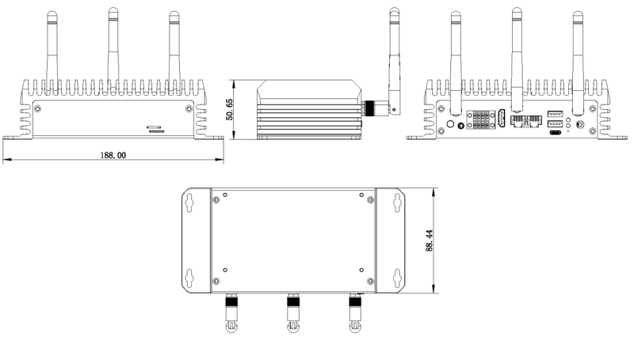

# 简介

[规格书](https://download.t-firefly.com/Spec/Computers/EC-A1688JD4_EC-A186JD4_Specification_CN.pdf) | [购买链接](https://item.taobao.com/item.htm?id=1042671359770) | [下载资料](https://community.t-firefly.com/doc/download/390)

EC-A186JD4 采用算能智算芯片 CV186AH，是面向 AI 推理、计算机视觉等高集成视觉算力芯片。可集成于智算服务器、边缘智算盒、工控机、专业智能网络摄像机、AIOT 等多种类型产品。高效适配市场上所有 AI 算法，实现图片分类、目标检测、实例分割、语义分割、行为分析、文字识别、自然语言处理、语音识别、语音合成、搜索推荐等应用，为各个行业进行 AI 赋能；并集成图像处理硬件 : 支持 HDR 宽动态、3D 降噪、3A、去雾等多种图像增强及鱼眼展开、影像拼接、双目融合等计算机视觉算法 ，为客户提供专业级的
视频图像质量和硬件图像算法加速；工业级全金属外壳，铝合金导热，高效散热，无风扇设计，零噪音。

## 接口描述

**EC-A186JD4** 提供了丰富的接口，主要包括：
- 12V 电源接口（5.5*2.5mm）
- POWER 按键
- RS232
- RS485
- CAN
- 千兆以太网 x 2
- USB 3.0 x 2
- HDMI
- TF 卡座
- SIM 卡座
- BT 天线
- WIFI 天线 x 2
- 4G 天线
- 耳机
- NVME 接口(PCIE3.0 x 1)
- Type-C（USB2.0，但默认为调试串口）
- 电源指示灯

天线连接方式如下图：
SIM 卡安装方式如下图：
## 结构尺寸

## 资源与技术支持

* [核心板 Core-186JD4 开发文档](https://wiki.t-firefly.com/Core-186JD4/)：包含 SDK 编译教程、各功能开发等资料
* [技术交流论坛](https://forum.t-firefly.com/)：超过10万企业客户和用户沟通交流平台

### 联系方式

* 邮箱：sales@t-firefly.com
* 手机：(+86) 186 8811 7175
* 座机：0760-89881218
* 全国服务热线：4001-511-533
* 地址：广东省中山市东区中山四路 57 号宏宇大厦 2101 室