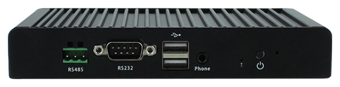

# 简介

[规格书](https://download.t-firefly.com/Spec/Computers/EC-A3288C_Specification_CN.pdf) | [购买链接](https://store.t-firefly.com/goods.php?id=81) | [下载资料](https://community.t-firefly.com/doc/download/58)

EC-A3288C 采用 RK3288 四核 Cortex-A17 处理器，主频高达 1.8GHz，集成四核 Mali-T764 GPU，最大支持 4K 硬解，能实现 4Kx2K 的 H.264 和 H.265 视频硬解码，支持双屏同显/双屏异显；丰富的扩展接口满足客户的不同的实际需求，同时美观大气的铝合金外壳让产品更加的完美和简洁，一体化的整体设计极大地缩短客户开发时间周期，是低门槛高成效的开发产品利器，可广泛应用于游戏设备、广告机、自动售货机、机器人等场景。

## 接口描述

**EC-A3288C** 提供了丰富的接口，主要包括：

* 调试串口（UART2，TTL 电平，对应系统节点 `/dev/ttyS2`）
* 1 x RS485（对应系统节点 `/dev/ttyS1`）
* 1 x RS232（对应系统节点 `/dev/ttyS3`）
* 显示输出：支持双屏同显/双屏异显，SDK 提供 LVDS 显示输出的固件配置

其余对外接口（以太网、USB 等）以实际产品为准。

整机接口如下图：

## 结构尺寸

## 资源与技术支持

* [[Wiki]](../../主板/AIO-3288C/index.md)：包含 Android & Ubuntu 驱动开发等资料(参考 AIO-3288C Wiki)
* [[技术交流论坛]](https://forum.t-firefly.com/)：超过10万企业客户和用户沟通交流平台

### 联系方式

* 邮箱：sales@t-firefly.com
* 手机：(+86) 186 8811 7175
* 座机：0760-89881218
* 全国服务热线：4001-511-533
* 地址：广东省中山市东区中山四路 57 号宏宇大厦 2101 室
 