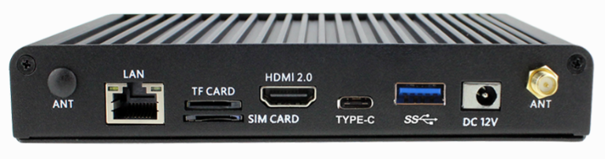
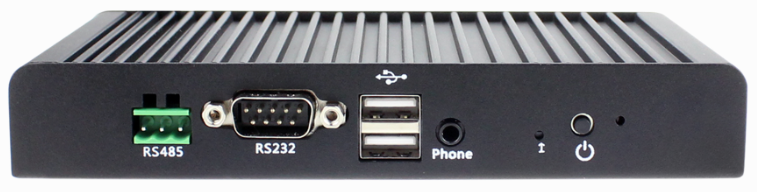
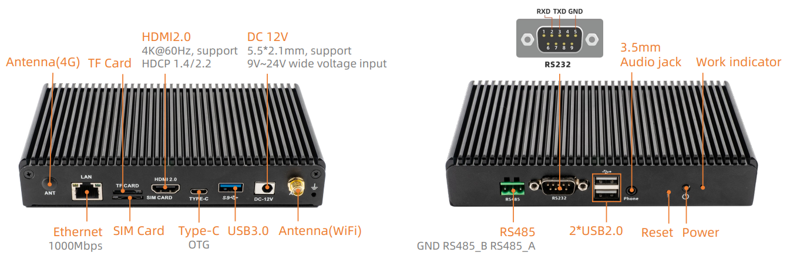
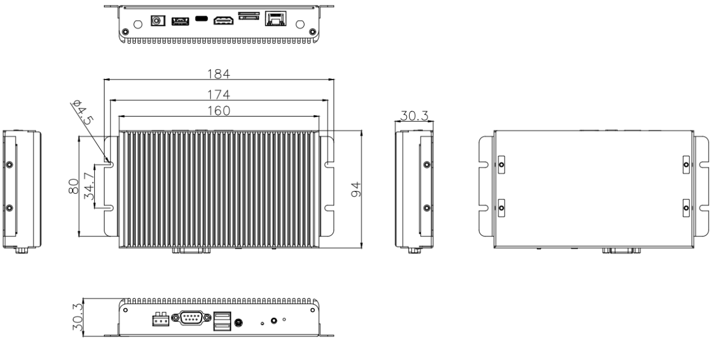

# 产品简介

EC-A3399C采用基于ARM全新Cortex-A72架构的RK3399主控芯片（双Cortex-A72大核 + 四Cortex-A53 小核）设计，其主频高达2.0 GHz，硬件解码支持H.265 HEVC 和VP9、H.264编码、4K HDR，最大支持4K硬解。支持双屏同显/双屏异显,拥有丰富的扩展接口满足客户的不同的实际需求，同时美观大气的铝合金外壳让产品更加的完美和简洁，而一体化的整体设计极大的缩短客户开发时间周期， 基本上就是低门槛高成效的开发产品利器。

# 产品参数

# 主机尺寸

# 产品资源

* [[开发使用文档]](../../主板/AIO-3399C/index.md) 
包含 Android&Ubuntu 驱动开发等资料(参考 AIO-3399C Wiki)

* [[技术交流论坛]](http://dev.t-firefly.com/forum.php)
超过10万企业客户和用户沟通交流平台

# 联系方式

EC-R3399PC 可以在多种场景实现客户不同方面的需要，在游戏设备，广告机，自动售货机，机器人等
已经广泛的使用，品质和性能在行业内已经有非常好的口碑，专业的技术团队为广大客户解决硬件设计和软件功能上
的各种各样问题。专业技术支持和更详细资料请联系商务。

* 邮箱：sales@t-firefly.com
* 手机：(+86) 186 8811 7175
* 座机：0760-89881218
* 全国服务热线：4001-511-533
* 地址：广东省中山市东区中山四路 57 号宏宇大厦 2101 室
 