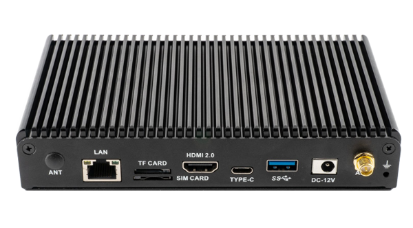

# 产品简介

EC-A3399C 六核迷你嵌入式主机基于 AIO-3399C 高性能开源平台，搭载 Rockchip RK3399 六核 64 位处理器，采用双 Cortex-A72 大核与四 Cortex-A53 小核架构，主频最高可达 2.0 GHz。主机配备工业级铝合金外壳和无风扇散热系统，可长时间稳定运行，并提供丰富的扩展接口。

EC-A3399C 支持 H.265/HEVC、VP9 硬件解码和 H.264 编码，支持 4K HDR 及最高 4K 硬件解码；兼容双路 LVDS、eDP、HDMI、DP 1.2 等显示输出接口，支持双屏同显和双屏异显，可应用于游戏设备、广告机、自动售货机及机器人等场景。

 