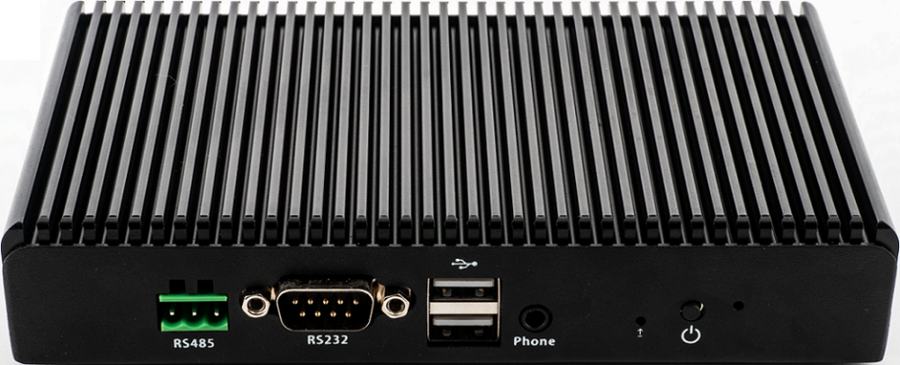
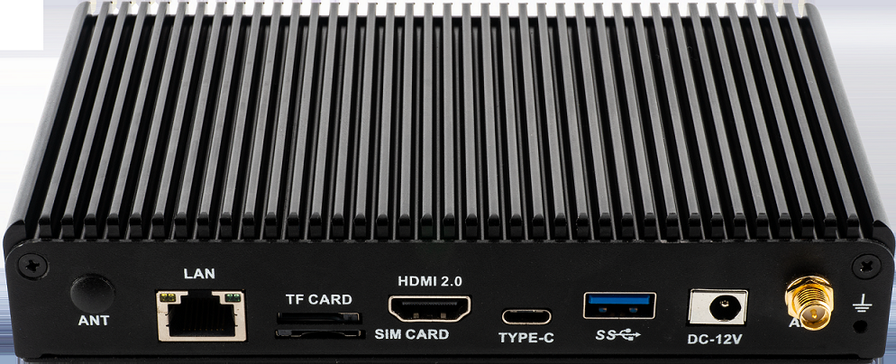
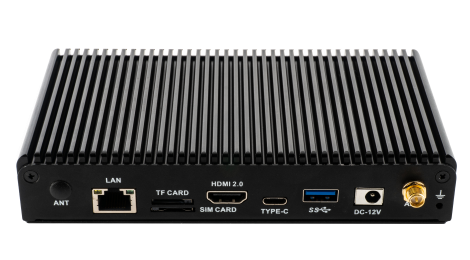
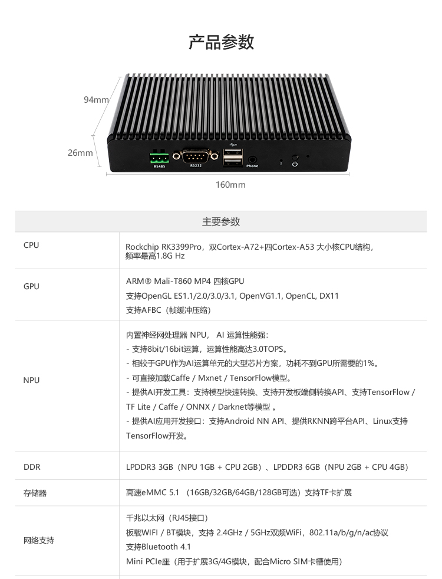
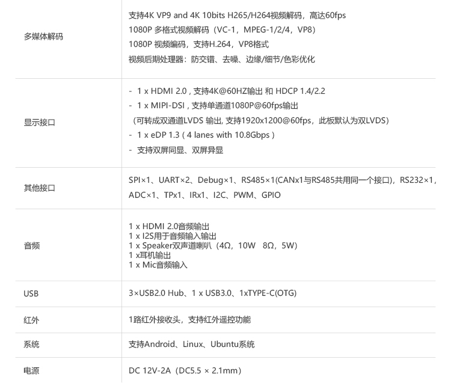
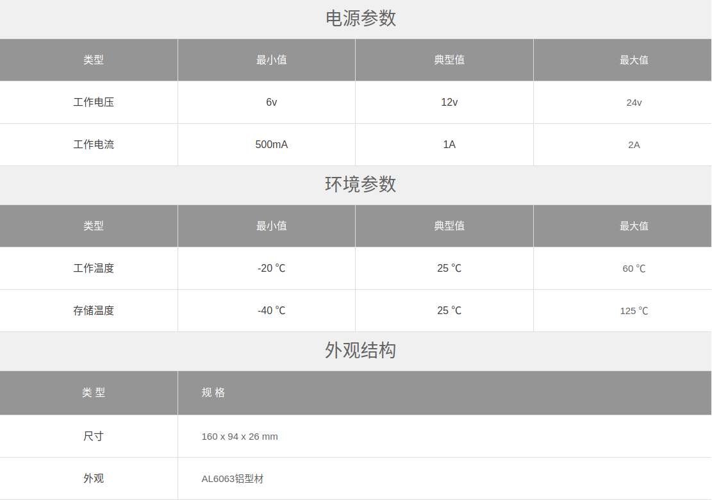

## 产品简介

EC-A3399ProC 六核 64 位 AI 嵌入式主机，基于 AIO-3399ProC 人工智能开源，配置工业级金属外壳，高效散热，
支持多操作系统，运行稳定，拥有超强的 AI 运算性能和丰富的扩展接口，CPU内部集成 AI 神经网络处理器 NPU，
支持 8bit/16bit 运算且性能高达3.0TOPS，提供 Rock-X SDK AI 视觉识别 API 组件库，可快速实现机器视觉识别。
支持TensorFlow/Caffe/Mxnet 通用模型，支持 Android NN API，RKNN 跨平台 API，TensorFlow 的开发接口，
提供模型转换，端侧转换 API 等 AI 开发工具。 
拥有强大的硬件编解码能力，支持 4K VP9、4K 10bit H265/H264 和 1080P 多格式（VC-1，MPEG-1/2/4，VP8）视频解码。
丰富的扩展接口满足客户的不同的实际需求，而一体化的整体设计极大的缩短客户开发时间周期，基本上就是低门槛高成效的开发产品利器。

# 产品参数

# 其他参数

# 产品资源

* [开发使用文档](../../主板/AIO-3399ProC/index.md) 包含固件编译、系统使用、接口使用等教程（参考 AIO-3399ProC Wiki）
* [资源下载页面](https://community.t-firefly.com/doc/download/76) 包括固件、文件系统以及各种工具的下载地址
* [技术交流论坛](http://dev.t-firefly.com/forum.php) 超过 10 万企业客户和用户沟通交流平台

## 产品技术支持
EC-A3399ProC 主机可以在多种场景实现客户不同方面的需要，
超强的 AI 运算性能和丰富的扩展接口，可直接应用到：AI 驾驶监测（人脸识别、驾驶
行为习惯识别、抽烟检测、打电话检测、分心驾驶）、工控主机、AI 服务器、无人
零售货架、刷脸支付设备、人脸识别设备、智能售货柜、智慧教育等行业产品中。
以上应用场景已经得到客户广泛使用，品质和性能在行业内已经有非常好的口碑，专业的技术团队为广大客户解决硬件设计和软件功能上
的各种各样问题。专业技术支持和更详细资料请联系商务。

### 技术案例
* Android多路编解码
* 双目摄像头数据采集
* Android双屏异显

### 联系方式
* 邮箱：sales@t-firefly.com
* 手机：(+86) 186 8811 7175
* 座机：0760-89881218
* 全国服务热线：4001-511-533
* 地址：广东省中山市东区中山四路 57 号宏宇大厦 2101 室
 