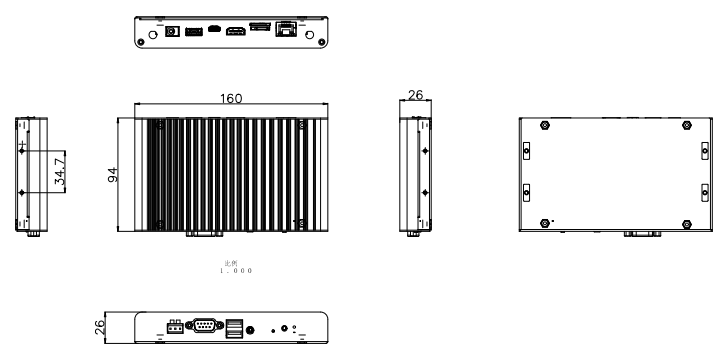

# 简介

[规格书](https://download.t-firefly.com/Spec/Computers/EC-A3399ProC_Specification_CN.pdf) | [购买链接](https://item.taobao.com/item.htm?ft=t&id=607867284628) | [下载资料](https://community.t-firefly.com/doc/download/77)

EC-A3399ProC 六核 64 位 AI 嵌入式主机，基于 AIO-3399ProC 人工智能开源平台，配置工业级金属外壳，高效散热，支持多操作系统，运行稳定，拥有超强的 AI 运算性能和丰富的扩展接口，CPU 内部集成 AI 神经网络处理器 NPU，支持 8bit/16bit 运算且性能高达 3.0TOPS，提供 Rock-X SDK AI 视觉识别 API 组件库，可快速实现机器视觉识别。支持 TensorFlow/Caffe/Mxnet 通用模型，支持 Android NN API、RKNN 跨平台 API、TensorFlow 的开发接口，提供模型转换、端侧转换 API 等 AI 开发工具。

EC-A3399ProC 拥有强大的硬件编解码能力，支持 4K VP9、4K 10bit H265/H264 和 1080P 多格式（VC-1，MPEG-1/2/4，VP8）视频解码。丰富的扩展接口满足客户的不同实际需求，而一体化的整体设计极大地缩短客户开发时间周期。

## 接口描述

**EC-A3399ProC** 提供了丰富的接口，主要包括：

* 1 x DC 12V 电源接口（DC 5.5 x 2.1mm）
* 1 x RJ45（千兆以太网）
* 1 x HDMI 2.0（最高支持 4K@60Hz 输出，支持 HDCP 1.4/2.2）
* 1 x Type-C（OTG，可用于固件烧写）
* 1 x USB3.0
* 2 x USB2.0（前面板双层 USB 座）
* 1 x RS232（DB9）
* 1 x RS485（接线端子，与 CAN 共用同一接口）
* 1 x TF Card
* 1 x Micro SIM 卡槽（配合 Mini PCIe 3G/4G 模块使用，模块选配）
* 1 x 3.5mm 耳机接口（Phone）
* 2 x WiFi/蓝牙天线（ANT）
* 1 x IR 红外接收
* 1 x Power 按键

具体接口布局如下图所示：

## 结构尺寸

整机尺寸 160 x 94 x 26 mm，外壳采用 AL6063 铝型材。

## 资源与技术支持

* [[Wiki]](../../主板/AIO-3399ProC/index.md)：包含固件编译、系统使用、接口使用等教程(参考 AIO-3399ProC Wiki)
* [[资源下载页面]](https://community.t-firefly.com/doc/download/76)：包括固件、文件系统以及各种工具的下载地址
* [[技术交流论坛]](https://forum.t-firefly.com/)：超过10万企业客户和用户沟通交流平台

### 联系方式

* 邮箱：sales@t-firefly.com
* 手机：(+86) 186 8811 7175
* 座机：0760-89881218
* 全国服务热线：4001-511-533
* 地址：广东省中山市东区中山四路 57 号宏宇大厦 2101 室
 