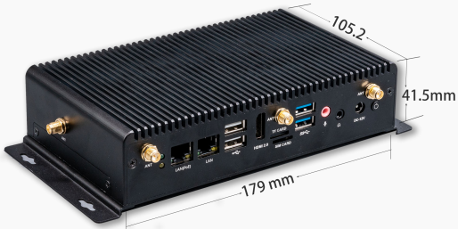
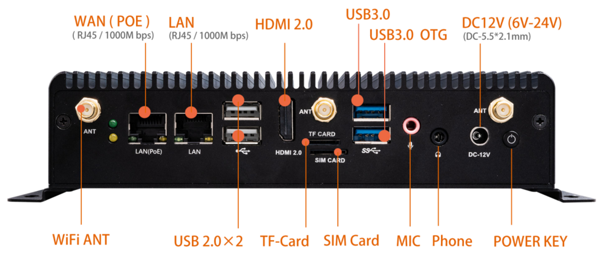

# 简介

[规格书](https://download.t-firefly.com/Spec/Computers/EC-A3568J_Specification_CN.pdf) | [购买链接](https://item.taobao.com/item.htm?id=646557508332) | [下载资料](https://community.t-firefly.com/doc/download/108)

EC-A3568J 嵌入式主机，基于 AIO-3568J 高性能开源平台，配置工业级外壳，防尘防干扰，长时间稳定运行，支持 4K 硬解，丰富的接口方便连接各种工业设备。搭载 ARM 全新 Cortex-A55 架构、四核64位高性能处理器，主频高达 2.0GHz，ARM G52 2EE 图形处理器，RKNN NPU AI 加速器（SoC 集成）。

## 接口描述

**EC-A3568J** 提供了丰富的接口，主要包括：

* 1 x WAN（RJ45，1000Mbps，支持 PoE）
* 1 x LAN（RJ45，1000Mbps）
* 1 x HDMI 2.0（最高支持 4K 输出）
* 2 x USB 2.0
* 1 x USB 3.0
* 1 x USB 3.0 OTG
* 1 x TF Card
* 1 x SIM 卡槽
* 1 x MIC（麦克风输入）
* 1 x Phone（音频输出）
* 1 x CAN（支持 CAN/CANFD）
* 2 x RS232
* 2 x RS485
* 1 x SATA 3.0（2.5 寸 SSD/HDD）
* 2 x WiFi 天线（ANT）
* 1 x DC 12V 电源接口（DC-5.5*2.1mm，支持 6V-24V 宽压输入）
* 1 x 电源按键（Power Key）

具体如下图：

## 结构尺寸

## 资源与技术支持

* [[Wiki]](../../主板/AIO-3568J/index.md)：包含 Android&Ubuntu 驱动开发等资料(参考 AIO-3568J Wiki)
* [[技术交流论坛]](https://forum.t-firefly.com/)：超过10万企业客户和用户沟通交流平台

### 联系方式

* 邮箱：sales@t-firefly.com
* 手机：(+86) 186 8811 7175
* 座机：0760-89881218
* 全国服务热线：4001-511-533
* 地址：广东省中山市东区中山四路 57 号宏宇大厦 2101 室
 