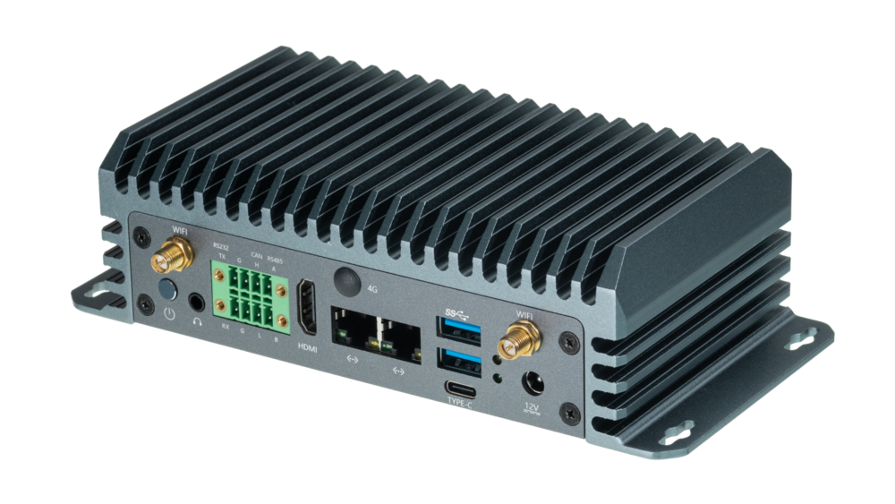

# 产品简介

**EC-A3576JD4** 配置 Rockchip 八核 64 位 AIOT 处理器 RK3576，采用先进工艺制程，内置 ARM Mali G52 MC3 GPU，集成 6 TOPS 算力 NPU，支持 Transformer 架构下大模型的私有化部署。同时支持 4K@120fps 解码 / 4K@60fps 编码，具备 4K@120fps 高清高帧率显示能力，支持外部看门狗，拥有工业级的稳定性，广泛适用于 AI 本地部署的应用场景。

 