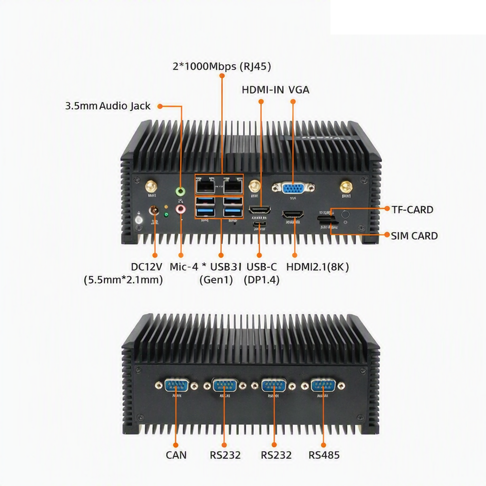

# 简介

[规格书](https://download.t-firefly.com/Spec/Computers/EC-A3588Q_EC-A3588JQ_EC-A3588MQ_Specification_CN.pdf) | [购买链接](https://item.taobao.com/item.htm?id=713126283039) | [下载资料](https://community.t-firefly.com/doc/download/203)

EC-A3588JQ采用Rockchip RK3588J八核64位处理器，最大可配32GB超大内存；支持8K视频编解码；拥有丰富的接口，支持千兆以太网、WiFi 6、5G/4G 扩展和多种视频输入输出、M.2 SATA/PCIe 固态硬盘； 
支持多种操作系统；采用工业级的芯片、精密元器件，在-40°C 至 85°C工作温度下可长时间稳定运行，可满足各种工业级的使用需求。

## 接口描述

**** 提供了丰富的接口，主要包括：

* 1 x HDMI2.1（最大支持 8K@60Hz 输出）
* 1 x HDMI2.0
* 1 x Display Port1.4（最大支持 8K@30Hz 输出）
* 1 x USB3.0 OTG(Type-C)
* 1 x VGA
* 2 x MIPI-DSI
* 1 x MIPI-CSI
* 1 x EDP
* 1 x M.2(SATA3.0/PCIe2.0)
* 1 x PCIe3.0x4
* 1 x TF Card
* 1 x 4G LTE
* 1 x 5G 移动网络
* 1 x SIM 卡槽
* 4 x USB3.0
* 3 x USB2.0
* 1 x WIFI（支持 wifi6）
* 1 x Bluetooth
* 1 x FAN
* 2 x RJ45（支持 1Gbps）
* 1 x Line-In
* 1 x RS485
* 2 x RS232
* 1 x CAN

整机接口如下图：

## 结构尺寸

## 资源与技术支持

* [[Wiki]](../../核心板/iCore-3588JQ/index.md)：包含 Android&Ubuntu 驱动开发等资料(参考 iCore-3588JQ Wiki)
* [[技术交流论坛]](https://forum.t-firefly.com/)：超过10万企业客户和用户沟通交流平台

### 技术案例

* Android 多路编解码
* 双目摄像头数据采集
* Android 双屏异显
* 人脸识别

### 联系方式

* 邮箱：sales@t-firefly.com
* 手机：(+86) 186 8811 7175
* 座机：0760-89881218
* 全国服务热线：4001-511-533
* 地址：广东省中山市东区中山四路 57 号宏宇大厦 2101 室