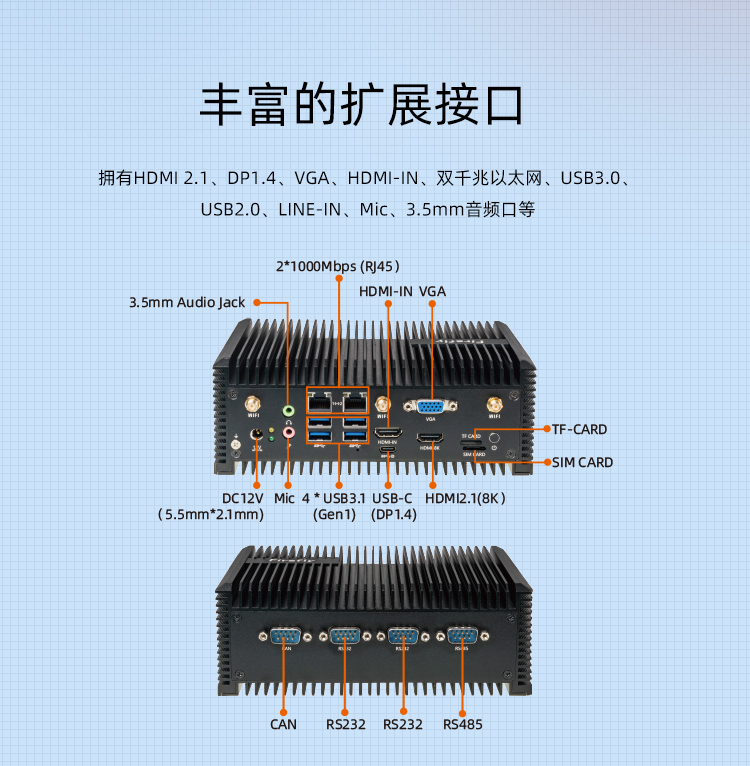

## 产品简介

EC-A3588JQ采用Rockchip RK3588J八核64位处理器，最大可配32GB超大内存；支持8K视频编解码；拥有丰富的接口，支持千兆以太网、WiFi 6、5G/4G 扩展和多种视频输入输出、M.2 SATA/PCIe 固态硬盘； 
支持多种操作系统；采用工业级的芯片、精密元器件，在-40°C 至 85°C工作温度下可长时间稳定运行，可满足各种工业级的使用需求。

 