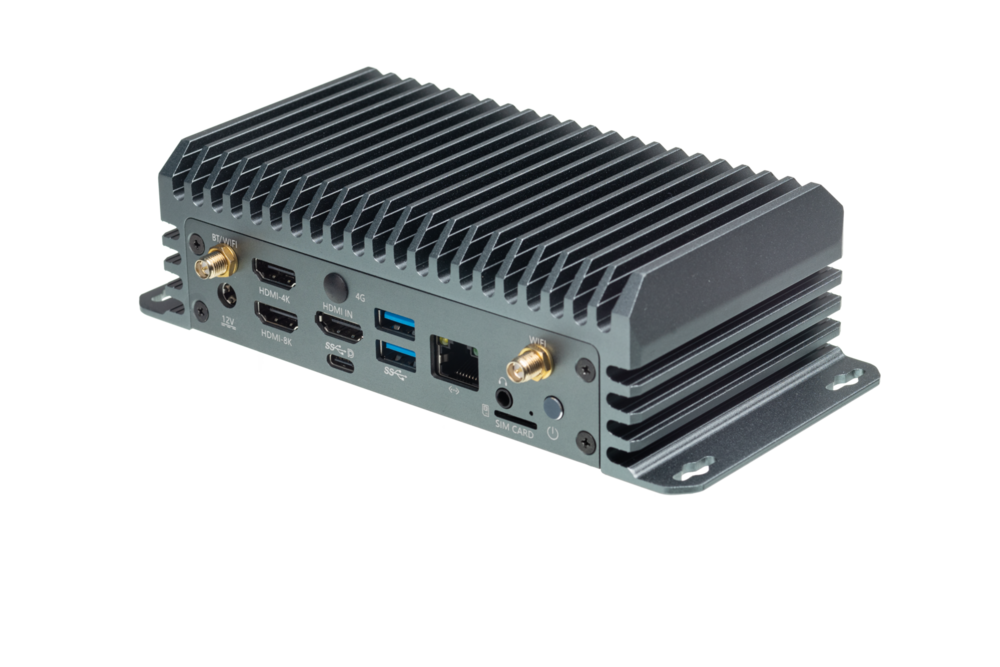
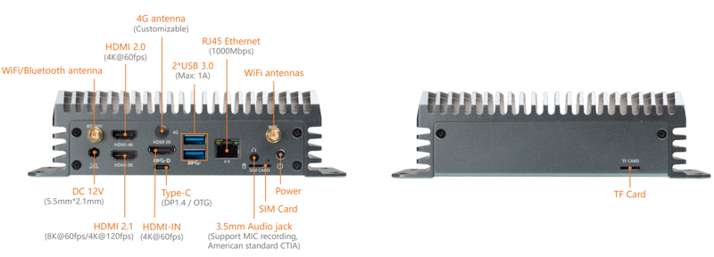

# 简介

[规格书](https://download.t-firefly.com/Spec/Computers/EC-A3588L_Specification_CN.pdf) | [购买链接](https://item.taobao.com/item.htm?id=790085974196) | [下载资料](https://community.t-firefly.com/doc/download/249)

EC-A3588L 嵌入式主机，基于 AIO-3588L 高性能开源平台，配置工业级外壳，防尘防干扰，长时间稳定运行，支持 8K 编解码，丰富的接口方便连接各种工业设备。
基于 Rockchip 全新一代旗舰 AIoT 芯片 -- **RK3588**，采用了 8nm LP 制程；搭载八核（Cortex-A76 x 4 + Cortex-A55 x 4）64位 CPU，主频高达2.4 GHz。集成 ARM Mali-G610 MP4 四核 GPU，内置 AI 加速器 NPU，可提供6 Tops 算力，支持主流的深度学习框架

## 接口描述

**** 提供了丰富的接口，主要包括：

* 1 x HDMI（8K 输出）
* 1 x HDMI-IN（HDMI 输入）
* 1 x Type-C
* 2 x USB 3.0
* 1 x RJ45（千兆以太网）
* 1 x TF 卡槽
* 1 x SIM 卡槽（配合 4G 模块）
* 1 x DC 12V 电源接口
* 天线接口：BT/WB、4G、WIFI
* 电源按键

整机接口如下图：

## 结构尺寸

## 资源与技术支持

* [[Wiki]](../../核心板/Core-3588L/index.md)：包含 Android&Ubuntu 驱动开发等资料(参考 Core-3588L Wiki)
* [[技术交流论坛]](https://forum.t-firefly.com/)：超过10万企业客户和用户沟通交流平台

### 联系方式

* 邮箱：sales@t-firefly.com
* 手机：(+86) 186 8811 7175
* 座机：0760-89881218
* 全国服务热线：4001-511-533
* 地址：广东省中山市东区中山四路 57 号宏宇大厦 2101 室