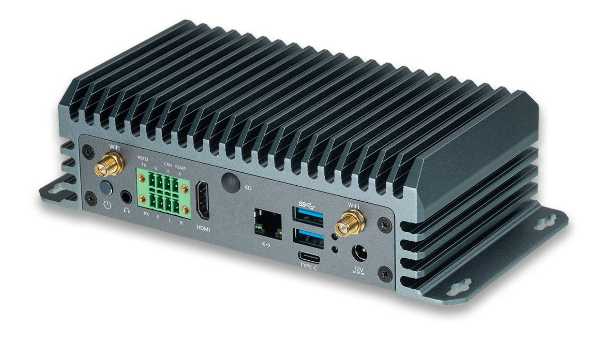
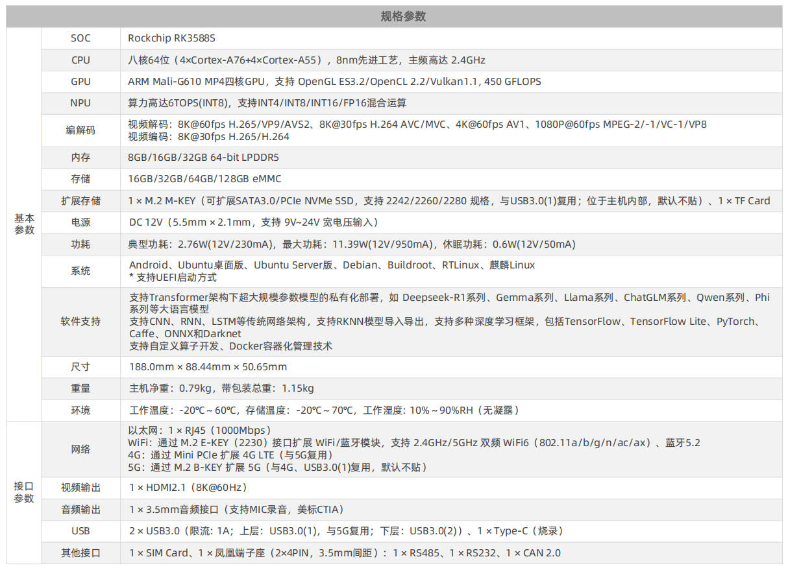
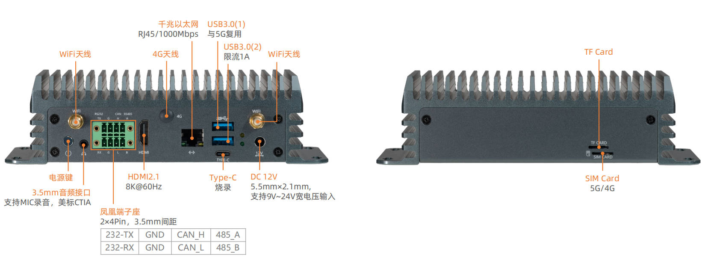
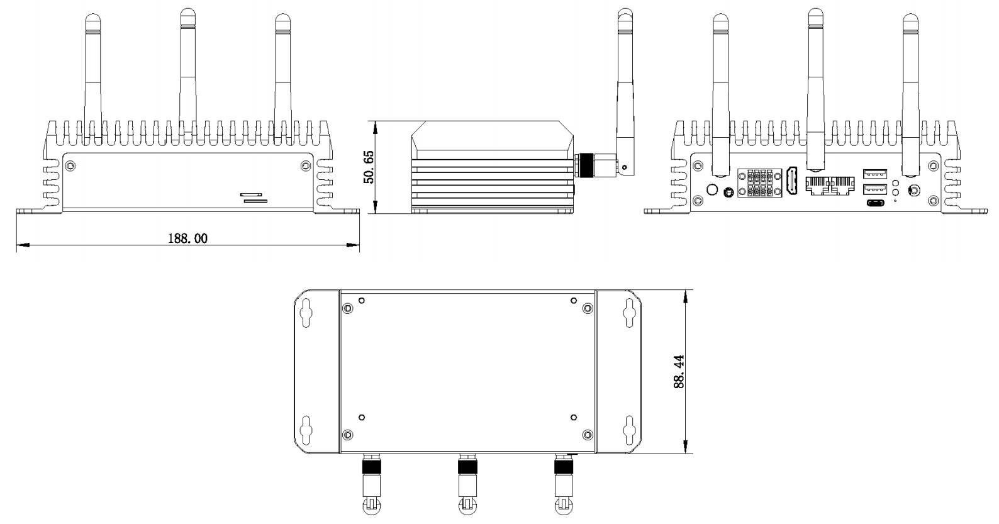

# 产品简介

EC-A3588SJD4-AI 嵌入式主机，基于 AIO-3588SJD4 AI 高性能开源平台，搭载 Rockchip 新一代八核64位 AIoT 处理器 RK3588S，8nm先进制程工艺，主频最高 2.4GHz。支持8K@60fps H.265/VP9、8K@30fps H.264视频解码；8K@30fps H.265/H.264 视频编码，支持同编同解。算力可达 6 TOPS，支持INT4/INT8/INT16 混合运算，满足大多数终端设备边缘计算需求。工业级全铝合金外壳，无风扇高效被动散热，7×24小时稳定运行，满足工业级的应用需求。支持壁挂安装，节省空间。拥有HDMI2.1、USB3.0、RS485、RS232、CAN、TF Card、SIM Card、Type-C等扩展接口，方便连接各类外设。

# 产品参数

# 产品接口

# 主机尺寸

# 产品资源

* [[开发使用文档]](../../核心板/Core-3588SJD4-AI/index.md) 
包含 SDK 编译教程、各功能开发等资料(参考 Core-3588SJD4 AI Wiki)

* [[技术交流论坛]](http://dev.t-firefly.com/forum.php)
超过10万企业客户和用户沟通交流平台

# 联系方式
EC-A3588SJD4 AI 可以在多种场景实现客户不同方面的需要，在游戏设备，广告机，自动售货机，机器人等
已经广泛的使用，品质和性能在行业内已经有非常好的口碑，专业的技术团队为广大客户解决硬件设计和软件功能上
的各种各样问题。专业技术支持和更详细资料请联系商务。

* 邮箱：sales@t-firefly.com
* 手机：(+86) 186 8811 7175
* 座机：0760-89881218
* 全国服务热线：4001-511-533
* 地址：广东省中山市东区中山四路 57 号宏宇大厦 2101 室
 