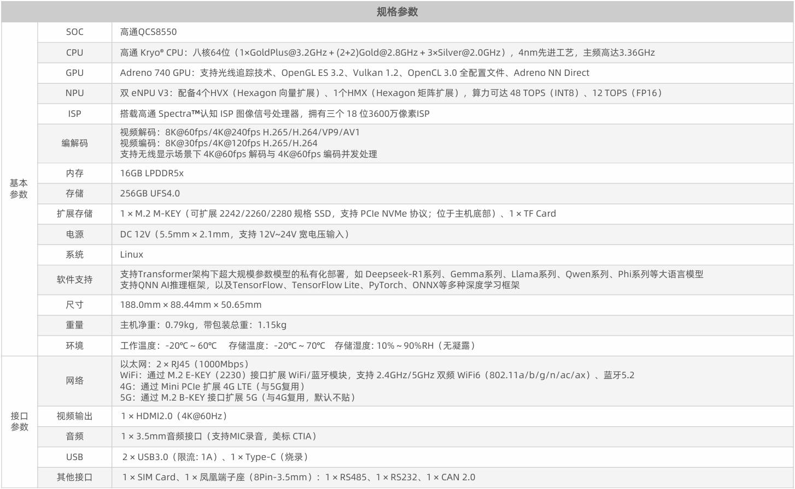
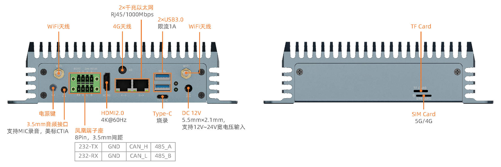
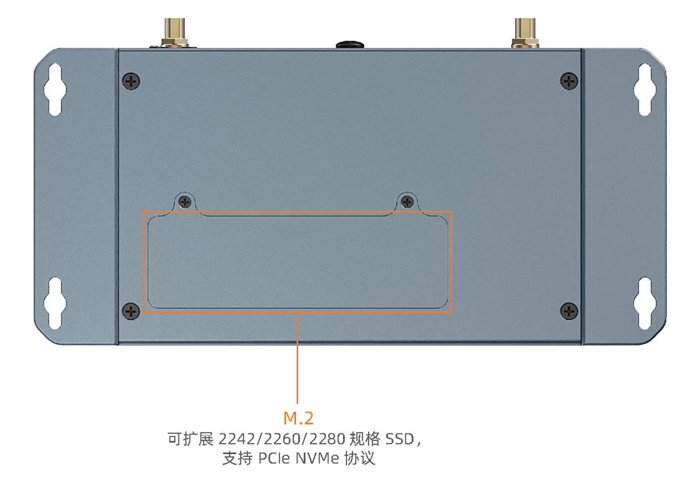

# 介绍
**EC-A8550JD4** 采用高通八核高性能 AI 处理器 QCS8550，集成 48 TOPS NPU，支持多种主流 AI 大模型和深度学习框架。内置 Adreno 740 GPU，支持光线追踪技术、8K 视频编解码。拥有 HDMI2.0、RS485、RS232、USB3.0 等多种扩展接口，提供 AI 模型优化工具、维基教程等技术资料，可高效进行二次开发。

# 产品参数

# 产品尺寸

# 产品资源

* [开发使用文档](../../主板/AIO-8550JD4/index.md) 包含固件编译、系统使用、接口使用等教程 (参考 AIO-8550JD4 wiki)
* [资源下载页面](https://www.t-firefly.com/doc/download/371.html) 包括固件、文件系统以及各种工具的下载地址
* [技术交流论坛](http://dev.t-firefly.com/forum.php) 超过 10 万企业客户和用户沟通交流平台

# 技术支持

一般问题可咨询电商客服、交流群提问或在论坛发帖。专业技术支持和更详细资料可以联系我们。

* 邮箱：sales@t-firefly.com
* 手机：(+86) 186 8811 7175
* 座机：0760-89881218
* 全国服务热线：4001-511-533
* 地址：广东省中山市东区中山四路 57 号宏宇大厦 2101 室
