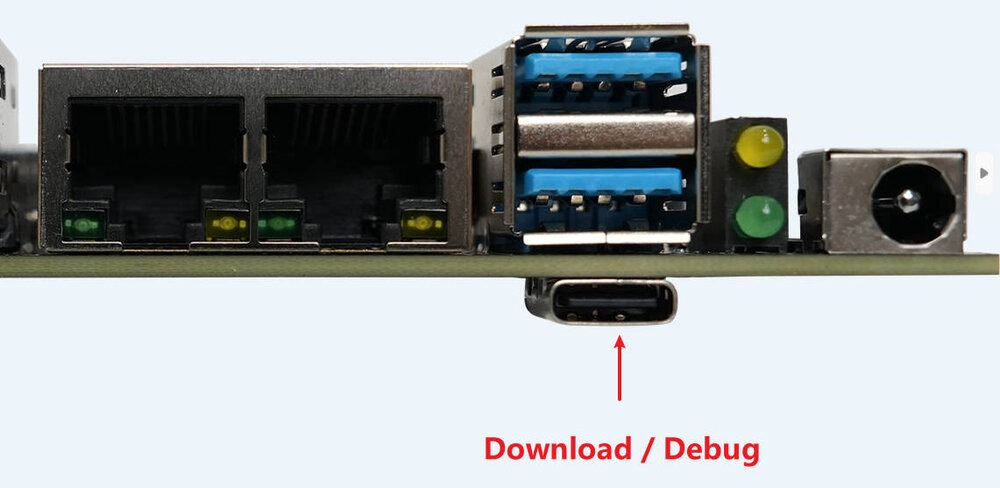

# FAQ

## Q：如何进入 EDL 升级模式？

**A：** 有两种方式：

* 硬件方式：设备完全断电后，通过恢复（EDL）按键触发进入。不同整机的按键位置与操作细节略有差异，请参阅[升级固件](qfil_upgrade_firmware.md)中"进入 EDL 升级模式"一节。
* 软件方式：在设备正常运行的情况下，使用数据线连接好设备的烧录口和电脑，然后在设备终端或调试串口上运行：

```shell
sudo systemctl reboot edl
```

## Q：如何确认设备已进入 EDL 模式？

**A：** 设备成功进入 EDL 模式后，QFIL 工具上一般会显示 Qualcomm HS-USB QDLoader 9008；如果显示 Please Select an Existing Port，点击右侧 SelectPort，也可以看到 Qualcomm HS-USB QDLoader 9008，选中并点击 OK 即可。

**注意：必须要显示 9008 设备才行。** 如果显示其他编号（如 900E），说明设备状态异常，请断电后重新尝试进入升级模式。

## Q：QFIL 提示 No Port Available / 识别不到设备怎么办？

**A：** 通常是驱动或连接问题，请依次排查：

* 确认 Windows 电脑已安装两份 USB 驱动：先安装 **Qualcomm USB Driver**，再安装 **Google USB 驱动**（解压 usb_driver_r13-windows 后，右键 android_winusb.inf 选择安装）。驱动均可从官方资源下载页面获取。
* 检查数据线是否为良好的数据线，建议更换 USB 线或电脑 USB 端口后再试。
* 重新执行进入 EDL 模式的操作，并观察 QFIL 端口列表是否出现 9008 设备。

## Q：QFIL 烧写失败或中途出错怎么办？

**A：** 请按以下步骤排查：

* 确认 FireHose Configuration 按照教程正确设置，并重新点击 OK。
* 确认 Select Programmer 时选择的是正确的 programmers 文件（`xbl_s_devprg_ns.melf` 或 `prog_firehose_ddr.elf`，不同芯片不一样），文件类型需选择 All Files。
* Load XML 时需分两次全选所有 xml 文件。
* 若仍失败，断电后重新进入 EDL 模式，更换 USB 线或 USB 端口后再次烧写。

完整的烧写步骤请参阅[升级固件](qfil_upgrade_firmware.md)。

## Q：烧写完成后设备没有正常启动怎么办？

**A：** 烧写完成后请等待一会，设备会自动重启到正常模式。如果长时间没有重启或无法进入系统：

* 使用完整固件重新烧写一次（烧写完整固件会更新所有分区数据并擦除主板上的所有数据）。
* 如果是烧写分区镜像后出现的问题，可能是分区与文件不匹配，请用完整固件恢复后再单独烧写分区。

## Q：如何进行分区刷写？

**A：** 以下内容面向需要单独烧写分区镜像（如 boot、dtbo 等）的进阶用户；仅需完整固件升级请参阅[升级固件](qfil_upgrade_firmware.md)。支持分分区镜像升级的机型才可按此方式操作。

### 进入 Bootloader 升级模式

在设备正常运行的情况下，使用 Type-A 转 C USB 数据线 连接好设备的烧录口和电脑，然后在设备终端或调试串口上运行：

```shell
sudo systemctl reboot bootloader
```

<center>


</center>

打开 Windows 终端 (PowerShell)，前往之前下载的 Android Platform Tools 的位置，执行 `.\fastboot.exe devices`。如果设备成功进入 bootloader 模式，此时 fastboot 工具应该会显示一个设备：

```
PS D:\path\to\platform-tools> .\fastboot.exe devices
xxxxxxxx         fastboot
```

如果没有显示设备，则检查驱动是否安装成功、USB 线连接是否正确。

### 烧写分区镜像

烧写命令为 `fastboot.exe flash <分区名> <镜像文件位置>`，比如：

```
.\fastboot.exe flash boot D:\path\to\boot.img

.\fastboot.exe flash dtbo D:\path\to\dtbo.img

# 烧录完成后执行下面命令重启设备
.\fastboot.exe reboot
```

**注意：烧录错误的文件会导致系统故障**，烧录前请确认分区和文件正确；如果不明白可以先寻求帮助，不要盲目操作。
