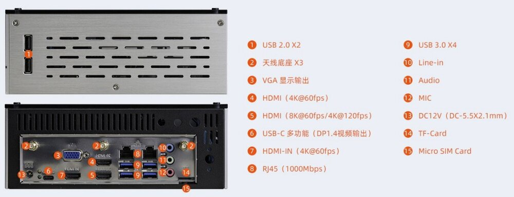
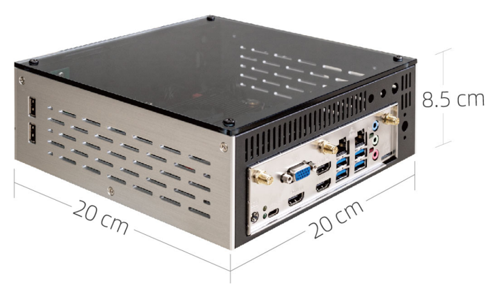

# 简介

[规格书](https://download.t-firefly.com/Spec/Computers/EC-I3588J_Specification_CN.pdf) | [购买链接](https://item.taobao.com/item.htm?id=673089864770) | [下载资料](https://community.t-firefly.com/doc/download/167)

EC-I3588J 嵌入式主机，基于 ITX-3588J  高性能开源平台，配置工业级外壳，防尘防干扰，长时间稳定运行，支持 8K 编解码，丰富的接口方便连接各种工业设备。
基于 Rockchip 全新一代旗舰 AIoT 芯片 -- **RK3588**，采用了 8nm LP 制程；搭载八核（Cortex-A76 x 4 + Cortex-A55 x 4）64位 CPU，主频高达2.4 GHz。集成 ARM Mali-G610 MP4 四核 GPU，内置 AI 加速器 NPU，可提供6 Tops 算力，支持主流的深度学习框架

## 接口描述

**** 提供了丰富的接口，主要包括：

* 1 x HDMI2.1（最大支持 8K@60Hz 输出）
* 1 x HDMI2.0
* 1 x HDMIIN2.0（最大支持 4K@60Hz 输入）
* 1 x Display Port1.4（最大支持 8K@30Hz 输出）
* 1 x USB3.0 OTG(Type-C)
* 1 x VGA
* 2 x MIPI-DSI
* 1 x MIPI-CSI
* 4 x SATA3.0
* 1 x M.2(SATA3.0)
* 1 x PCIe3.0x4
* 1 x TF Card
* 1 x 4G LTE
* 1 x 5G 移动网络
* 1 x SIM 卡槽
* 4 x USB3.0
* 4 x USB2.0
* 1 x WIFI（支持 wifi6）
* 1 x Bluetooth
* 1 x FAN（V1.1 版本及后续版本为 4 PIN，通过 PWM 控制和 ADC 检测接入）
* 2 x RJ45（支持 1Gbps）
* 1 x Speaker
* 1 x Line-In
* 1 x RS485
* 1 x RS232
* 1 x CAN（V1.1 版本新增，V1.1 版本 H 与 L 标反，V1.2 及后续版本丝印正确）
* 多种电源输入接口

具体如下图：

## 结构尺寸

## 资源与技术支持

* [[Wiki]](../../核心板/Core-3588J/index.md)：包含 Android&Ubuntu 驱动开发等资料(参考 Core-3588J Wiki)
* [[技术交流论坛]](https://forum.t-firefly.com/)：超过10万企业客户和用户沟通交流平台

### 联系方式

* 邮箱：sales@t-firefly.com
* 手机：(+86) 186 8811 7175
* 座机：0760-89881218
* 全国服务热线：4001-511-533
* 地址：广东省中山市东区中山四路 57 号宏宇大厦 2101 室