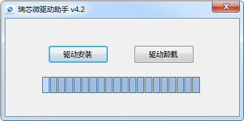
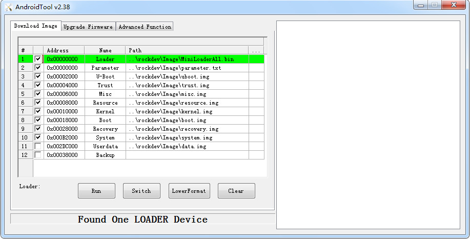
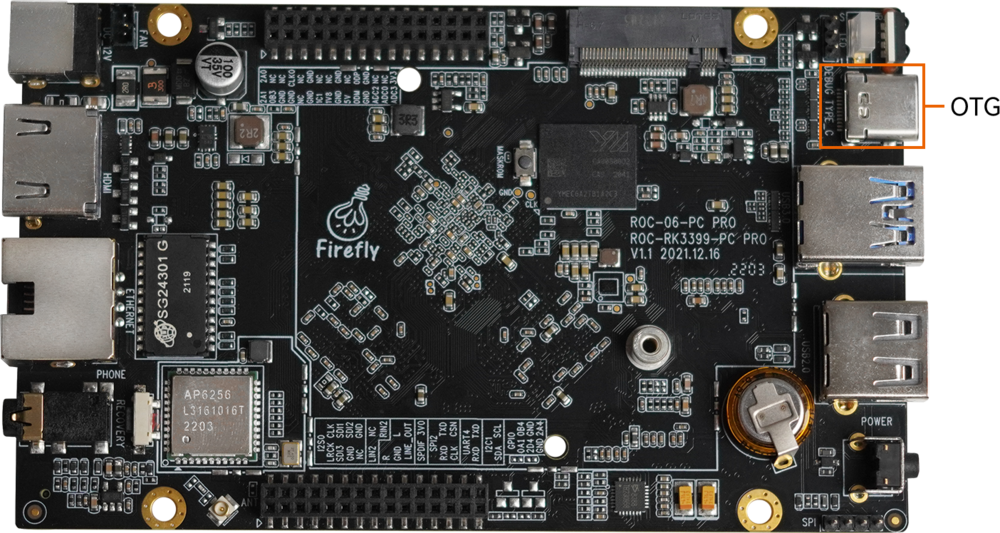
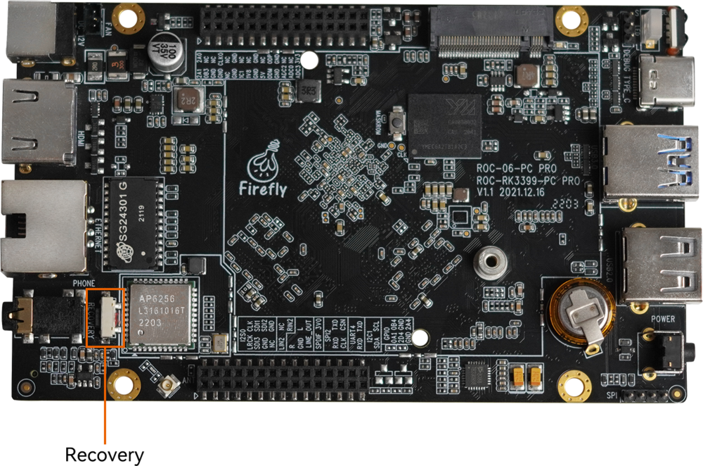
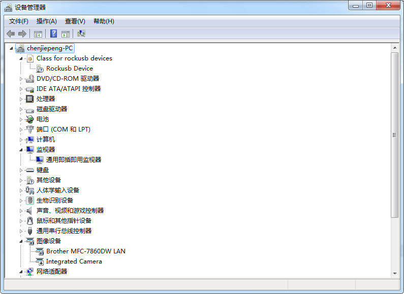
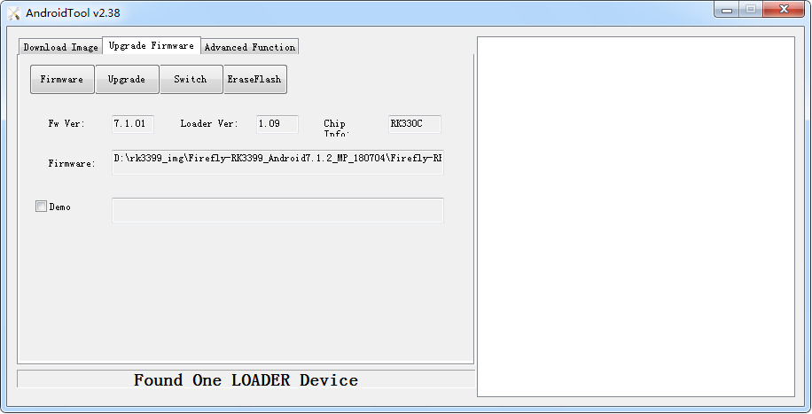

# 使用USB线缆升级固件

## 前言

本文介绍了如何将主机上的固件，通过USB数据线烧录到 EC-R3328PC 开发板的存储器中。升级时，需要根据主机操作系统和固件类型来选择合适的升级方式。

## 准备工具

* EC-R3328PC 开发板
* 固件
* 主机
* 良好的Type-C数据线数据线

## 准备固件
固件可以通过编译 SDK 获得，也可以通过[资源下载](https://community.t-firefly.com/doc/download/84)处下载公版固件(统一固件)。固件文件一般有两种：

* 单个统一固件

统一固件是由分区表、bootloader、uboot、kernel、system等所有文件打包合并成的单个文件。Firefly正式发布的固件都是采用统一固件格式，升级统一固件将会更新主板上所有分区的数据和分区表，并且擦除主板上所有数据。

* 多个分区镜像

即各个功能独立的文件，如分区表、bootloader、kernel等，在开发阶段生成。独立分区镜像可以只更新指定的分区，而保持其它分区数据不被破坏，在开发过程中会很方便调试。

>    通过统一固件解包/打包工具，可以把统一固件解包为多个分区镜像，也可以将多个分区镜像合并为一个统一固件。

## 安装烧写工具

### Windows操作系统

* 安装RK USB驱动

下载 [Release_DriverAssistant.zip](https://community.t-firefly.com/doc/download/84#other_11)，解压，然后运行里面的 DriverInstall.exe 。为了所有设备都使用更新的驱动，请先选择`驱动卸载`，然后再选择`驱动安装`。

<center>


</center>

* 下载并运行[AndroidTool](https://community.t-firefly.com/doc/download/84#other_248)的RKDevTool.exe

**<font color=#ff0000 >注意</font>**:不同固件使用的工具版本可能不同,请根据[《使用USB线烧写须知(重要)》]下载对应的版本

<center>


</center>

### Linux操作系统

Linux 下无须安装设备驱动

* [Linux_Upgrade_Tool](https://community.t-firefly.com/doc/download/84#windows_375)工具

**<font color=#ff0000 >注意</font>**:不同固件使用的工具版本可能不同,请根据[《使用USB线烧写须知(重要)》]下载对应的版本

下载 [Linux_Upgrade_Tool](https://community.t-firefly.com/doc/download/84#windows_375), 并按以下方法安装到系统中，方便调用：

```
unzip Linux_Upgrade_Tool_xxxx.zip
cd Linux_UpgradeTool_xxxx
sudo mv upgrade_tool /usr/local/bin
sudo chown root:root /usr/local/bin/upgrade_tool
sudo chmod a+x /usr/local/bin/upgrade_tool
```

## 进入升级模式

通常我们升级固件的模式有两种，分别是`Loader模式`和`MaskRom模式`。烧写固件前，我们需要连接好设备，并让板子进入到可升级模式。

### Loader模式
#### 硬件方式进入Loader模式

连接设备并通过**RECOVERY**按键进入Loader升级模式步骤如下：

* 先断开电源适配器连接
* Type-C数据线连接好设备和主机。

    <center>

    
    </center>
* 按住设备上的 RECOVERY （恢复）键并保持。

    <center>

    
    </center>
* 插上电源
* 大约两秒钟后，松开 RECOVERY 键。

#### 软件方式进入Loader模式

Type-C数据线 接好后在串口调试终端或adb shell给板子运行以下命令：

```
reboot loader
```

#### 查看Loader模式

如何确定板子是否进入Loader模式，我们可以通过工具去查看

**Windows操作系统**

通过AndroidTool工具可以看到下方提示`Found One LOADER Device`

<center>


</center>

如果有进行“进入Loader模式”的操作，仍旧没有看到烧写工具提示LOADER，此时可以看一下Windows主机是否有提示发现新硬件并配置驱动。打开设备管理器，会见到新设备 `Rockusb Device` 出现，如下图。如果没有，可返回上一步重新[安装驱动](loader_mode.html#windows-cao-zuo-xi-tong)。

<center>


</center>

**Linux操作系统**

运行upgrade_tool后可以看到连接设备中有个`Loader`的提示

```
firefly@T-chip:~/severdir/down_firmware$ sudo upgrade_tool
List of rockusb connected
DevNo=1 Vid=0x2207,Pid=0x330c,LocationID=106    Loader
Found 1 rockusb,Select input DevNo,Rescan press <R>,Quit press <Q>:q
```

### MaskRom模式

进入MaskRom模式的方法，请参考[《MaskRom模式》](04-03-upgrade_firmware.html)

## 烧写固件
### Windows操作系统
#### 烧写统一固件 update.img

烧写统一固件 update.img 的步骤如下:

1.切换至`Upgrade Firmware`页。
2.按`Firmware`按钮，打开要升级的固件文件。升级工具会显示详细的固件信息。
3.按`Upgrade`按钮开始升级。
4.<font color=#ff0000 >如果升级失败，可以尝试先按 `EraseFlash` 按钮来擦除 Flash，然后再升级。一定要根据[《使用USB线烧写须知(重要)》]进行擦除烧写</font>

<center>


</center>

### Linux操作系统
#### 烧写统一固件 update.img

```
sudo upgrade_tool uf update.img
```

<font color=#ff0000 >如果升级失败，可以尝试先擦除后再升级。一定要根据[《使用USB线烧写须知(重要)》]的表格进行擦除烧写</font>

```
# 擦除 flash 使用 ef 参数需要指定 loader 文件或者对应的 update.img
sudo upgrade_tool ef update.img   #update.img :你需要烧写的 Ubuntu 固件
# 重新烧写
sudo upgrade_tool uf update.img
```

[《使用USB线烧写须知(重要)》]: 02-upgrade_table.md
[RKDevTool]: https://community.t-firefly.com/doc/download/84#other_248