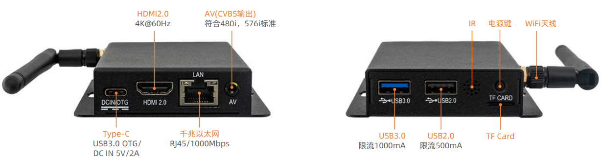
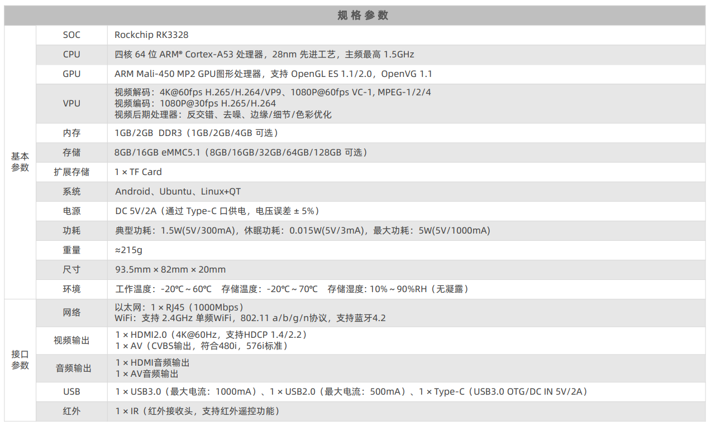

# 产品简介

EC-R3328PC 嵌入式主机依托 ROC-RK3328-PC 高性能开源平台设计，搭载 RK3328 四核 64 位 Cortex-A53 处理器，主频 1.5GHz。芯片集成 Mali-450 四核 GPU，兼容 OpenGL ES1.1/2.0、OpenVG1.1 标准，图形处理能力强劲；内置 VPU 视频引擎，支持 4K@60fps VP9、4K 10bit H.264 解码，以及 VC-1、MPEG、VP8 等格式 1080P 解码，并具备 1080P H.264 编码能力。整机采用优质金属外壳，兼具高效散热、防尘抗震特性，机身小巧易部署，适合长期不间断稳定运行。

# 产品参数

# 主机尺寸

# 产品资源

* [[开发使用文档]](../../主板/ROC-RK3328-PC/index.md) 
包含 Android&Ubuntu 驱动开发等资料(参考 ROC-RK3328-PC Wiki)

* [[技术交流论坛]](http://dev.t-firefly.com/forum.php)
超过10万企业客户和用户沟通交流平台

# 联系方式

EC-R3328PC 可以在多种场景实现客户不同方面的需要，在游戏设备，广告机，自动售货机，机器人等
已经广泛的使用，品质和性能在行业内已经有非常好的口碑，专业的技术团队为广大客户解决硬件设计和软件功能上
的各种各样问题。专业技术支持和更详细资料请联系商务。

* 邮箱：sales@t-firefly.com
* 手机：(+86) 186 8811 7175
* 座机：0760-89881218
* 全国服务热线：4001-511-533
* 地址：广东省中山市东区中山四路 57 号宏宇大厦 2101 室
 