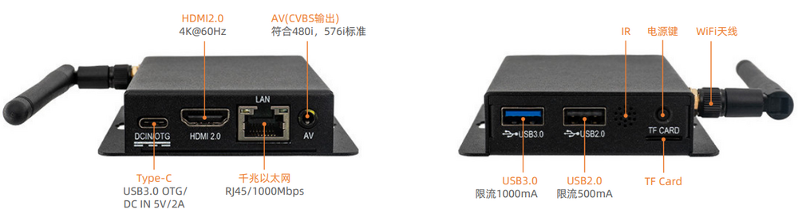

# 产品简介

EC-R3328PC 嵌入式主机依托 ROC-RK3328-PC 高性能开源平台设计，搭载 RK3328 四核 64 位 Cortex-A53 处理器，主频 1.5GHz。芯片集成 Mali-450 四核 GPU，兼容 OpenGL ES1.1/2.0、OpenVG1.1 标准，图形处理能力强劲；内置 VPU 视频引擎，支持 4K@60fps VP9、4K 10bit H.264 解码，以及 VC-1、MPEG、VP8 等格式 1080P 解码，并具备 1080P H.264 编码能力。整机采用优质金属外壳，兼具高效散热、防尘抗震特性，机身小巧易部署，适合长期不间断稳定运行。

 