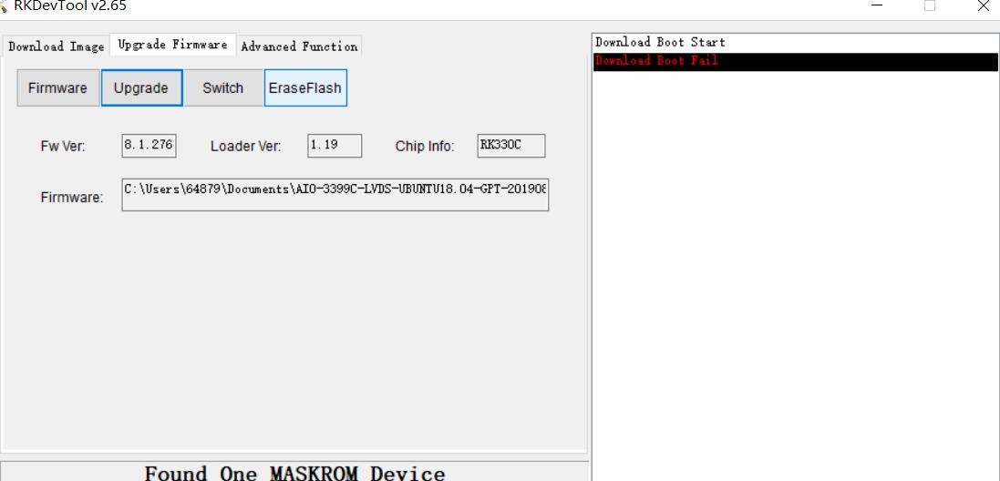

# FAQ

## Q：设备有哪些启动模式？

**A：** EC-R3328PC 有三种启动模式：

* Normal 模式
* Loader 模式
* MaskRom 模式

### Normal 模式

Normal 模式就是正常的启动过程，各个组件依次加载，正常进入系统。

### Loader 模式

在 Loader 模式下，bootloader 会进入升级状态，等待主机命令，用于固件升级等。

### MaskRom 模式

MaskRom 模式用于 bootloader 损坏时的系统修复。

一般情况下是不用进入 `MaskRom 模式`的，只有在 bootloader 校验失败（读取不了 IDB 块，或 bootloader 损坏） 的情况下，BootRom 代码 就会进入 `MaskRom 模式`。此时 BootRom 代码等待主机通过 USB 接口传送 bootloader 代码，加载并运行之。

## Q：如何判断当前处于哪种升级模式？

**A：** 如何确定板子当前处于哪种升级模式，我们可以通过工具去查看。

**Windows操作系统**

通过AndroidTool/RKDevTool工具可以看到下方提示`Found One LOADER Device`

<center>


</center>

如果有进行"进入Loader模式"的操作，仍旧没有看到烧写工具提示LOADER，此时可以看一下Windows主机是否有提示发现新硬件并配置驱动。打开设备管理器，会见到新设备 `Rockusb Device` 出现，如下图。如果没有，可返回上一步重新[安装驱动](loader_mode.md)。

<center>


</center>

若烧写工具提示 `Found One MASKROM Device`，则说明设备当前处于 MaskRom 模式。

**Linux操作系统**

运行upgrade_tool后可以看到连接设备中有个`Loader`的提示

```shell
firefly@T-chip:~/severdir/down_firmware$ sudo upgrade_tool
List of rockusb connected
DevNo=1 Vid=0x2207,Pid=0x330c,LocationID=106    Loader
Found 1 rockusb,Select input DevNo,Rescan press <R>,Quit press <Q>:q
```

若列表中显示的是 `MaskRom`，则说明设备当前处于 MaskRom 模式。

**调试串口辅助判断**

如果设备已连接调试串口，也可以通过串口终端观察 U-Boot/内核启动日志，辅助判断设备所处的模式。以 Windows 下的 MobaXterm 为例，串口配置如下（波特率 1500000，具体连接方式请参阅[调试串口](usb_to_ttl.md)）：

<center>


</center>
<center>


</center>

如何让设备进入可升级模式，请参阅[《使用USB线缆升级固件》](loader_mode.md)。

## Q：如何进行分区刷写？

**A：** 以下内容面向需要单独烧写分区（boot/kernel/rootfs 等）的进阶用户；仅需完整固件升级请参阅[《使用USB线缆升级固件》](loader_mode.md)。

### Windows 操作系统

#### 烧写分区映像

烧写分区映像的步骤如下：

1. 切换至`下载镜像`页。
2. 勾选需要烧录的分区，可以多选。
3. 确保映像文件的路径正确，需要的话，点路径右边的空白表格单元格来重新选择。
4. 点击`执行`按钮开始升级，升级结束后设备会自动重启。

<center>


</center>

注意：不同固件使用的工具版本可能不同。使用 `Androidtool_2.58` 烧写 `ubuntu(GPT)` 使用默认配置即可，烧写 `Android8.1` 固件请先切换至`下载镜像页面`，右键点击表格选择`导入配置`，并选择 rk3399-Android81.cfg；使用 `Androidtool_2.71` 烧写 `Android10` 或 `Android9` 固件时使用默认配置即可。

### Linux 操作系统

#### 烧写分区镜像

Android7.1、Android8.1使用以下方式:

```shell
sudo upgrade_tool di -b boot.img
sudo upgrade_tool di -k kernel.img
sudo upgrade_tool di -s system.img
sudo upgrade_tool di -r recovery.img
sudo upgrade_tool di -m misc.img
sudo upgrade_tool di -re resource.img
sudo upgrade_tool di -p paramater   # 烧写 parameter
sudo upgrade_tool ul bootloader.bin # 烧写 bootloader
```

Android9.0、Android10.0使用以下方式:

```shell
sudo upgrade_tool di -b boot.img
sudo upgrade_tool di -dtbo dtbo.img
sudo upgrade_tool di -misc misc.img
sudo upgrade_tool di -parameter parameter.txt
sudo upgrade_tool di -r recovery.img
sudo upgrade_tool di -super super.img
sudo upgrade_tool di -trust trust.img
sudo upgrade_tool di -uboot uboot.img
sudo upgrade_tool di -vbmeta vbmeta.img
```

Ubuntu(GPT)使用以下方式:

```shell
sudo upgrade_tool ul $LOADER
sudo upgrade_tool di -p $PARAMETER
sudo upgrade_tool di -uboot $UBOOT
sudo upgrade_tool di -trust $TRUST
sudo upgrade_tool di -boot $BOOT
sudo upgrade_tool di -recovery $RECOVERY
sudo upgrade_tool di -misc $MISC
sudo upgrade_tool di -oem $OEM
sudo upgrade_tool di -userdata $USERDATA
sudo upgrade_tool di -rootfs $ROOTFS
```

如果因 flash 问题导致升级时出错，可以尝试低级格式化、擦除 emmc：

```shell
sudo upgrade_tool lf update.img	# 低级格式化
sudo upgrade_tool ef update.img	# 擦除
```

## Q：烧写时出现异常怎么办？

**A：**

### 烧写失败分析

如果烧写过程中出现Download Boot Fail, 或者烧写过程中出错，如下图所示，通常是由于使用的USB线连接不良、劣质线材，或者电脑USB口驱动能力不足导致的，请更换USB线或者电脑USB端口排查。

<center>


</center>

### 升级失败 / Loader 版本不一致

如果升级失败，可以尝试先按`擦除 Flash`按钮来擦除 Flash，然后再升级。如果烧写的固件 loader 版本与原来的机器不一致，请在升级固件前先执行`擦除 Flash`。

<center>


</center>

### 无法识别设备 / 提示发现新设备

如果有进行"进入Loader模式"的操作，仍旧没有看到烧写工具提示LOADER，通常是主机尚未识别设备或未装好驱动，处理方法已在上文《如何判断当前处于哪种升级模式》一节中说明（含发现新设备 `Rockusb Device` 及驱动安装的截图），此处不再重复。

## Q：如何进入 MaskRom 模式？

**A：** `MaskRom` 模式是设备变砖的最后一条防线。强行进入 `MaskRom` 涉及硬件操作，有一定风险，因此仅在设备进入不了 `Loader` 模式的情况下，方可尝试 `MaskRom` 模式。进入 `MaskRom` 的原理是人为的把 EMMC 的数据脚与地线短接，系统会认为 EMMC 数据出错，从而清除 EMMC 数据。

具体操作步骤请参阅[《MaskRom 模式》](03-upgrade_firmware.md)。

**请小心阅读，并谨慎操作！**

