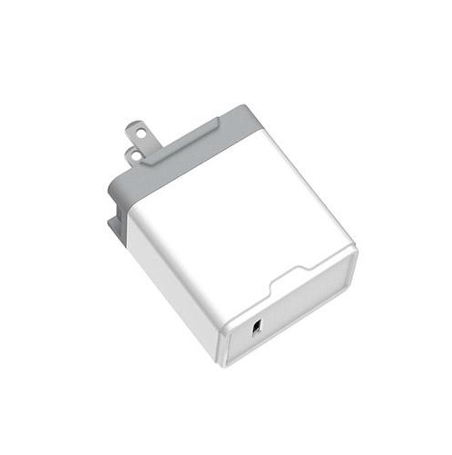

# [PD电源适配器](https://store.t-firefly.com/goods.php?id=92)
### 产品参数
* 产品：Type-C PD 充电器
* 输入标准：AC 110-240V
* 输出标准：PD 2.0 15V/3A 5V/3A，9V/3A，12V/2A，14.5V/2A
* 输出功率：29W
* 快充协议：PD2.0

* 注意：ROC-3399-PC一体机正常工作需要电源14.5V/2A，电流低于2A可能会因电流过小而异常重启，为了保证开发板的正常工作，请使用电压为14.5V，电流为2A~3A的电源，推荐使用Firefly官网电源配件。
### 实物图

