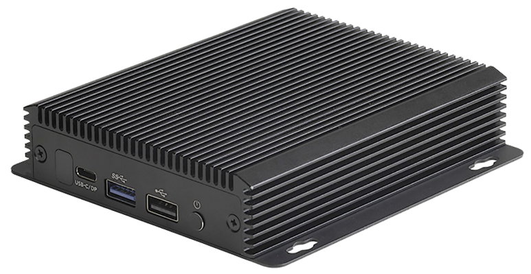
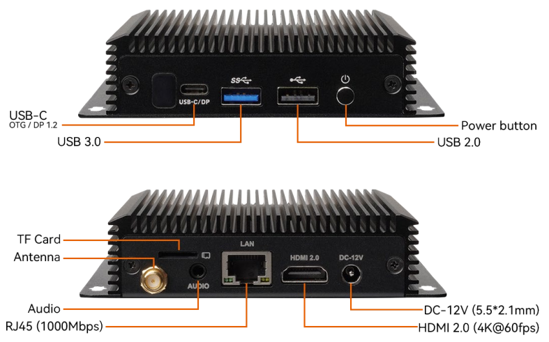
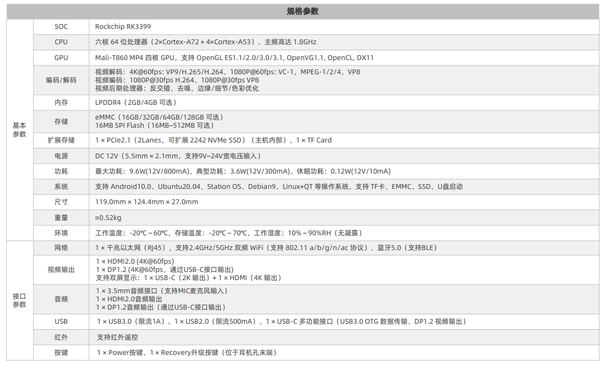
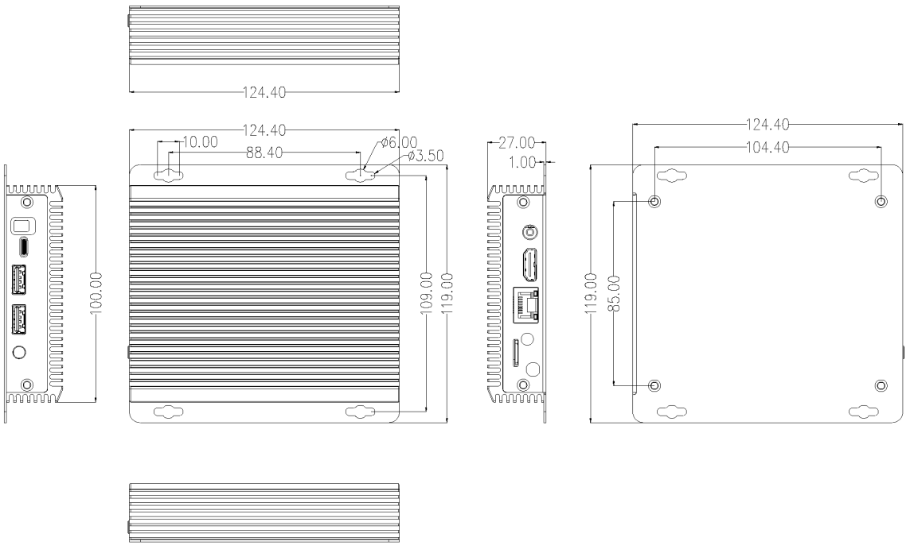

# 产品简介

EC-R3399PC 嵌入式主机，基于 ROC-RK3399-PC 高性能开源平台，配置工业级外壳，防尘防干扰，长时间稳定运行，支持 4K 硬解。
搭载Rockchip RK3399六核处理器，采用“服务器级”（双核Cortex-A72+四核Cortex-A53）大小核构架，主频高达1.8GHz，支持OpenGL ES1.1/2.0/3.0/3.1，内置 VPU视频处理器。

# 产品参数

# 主机尺寸

# 产品资源

* [[开发使用文档]](../../主板/ROC-RK3399-PC/index.md) 
包含 Android&Ubuntu 驱动开发等资料(参考 ROC-RK3399-PC Wiki)

* [[技术交流论坛]](http://dev.t-firefly.com/forum.php)
超过10万企业客户和用户沟通交流平台

# 联系方式

EC-R3399PC 可以在多种场景实现客户不同方面的需要，在游戏设备，广告机，自动售货机，机器人等
已经广泛的使用，品质和性能在行业内已经有非常好的口碑，专业的技术团队为广大客户解决硬件设计和软件功能上
的各种各样问题。专业技术支持和更详细资料请联系商务。

* 邮箱：sales@t-firefly.com
* 手机：(+86) 186 8811 7175
* 座机：0760-89881218
* 全国服务热线：4001-511-533
* 地址：广东省中山市东区中山四路 57 号宏宇大厦 2101 室
 