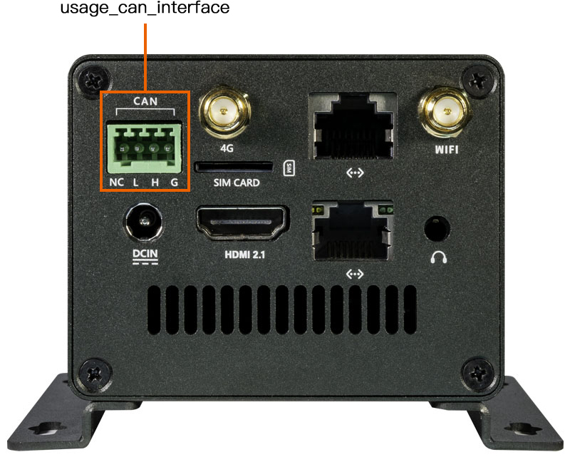
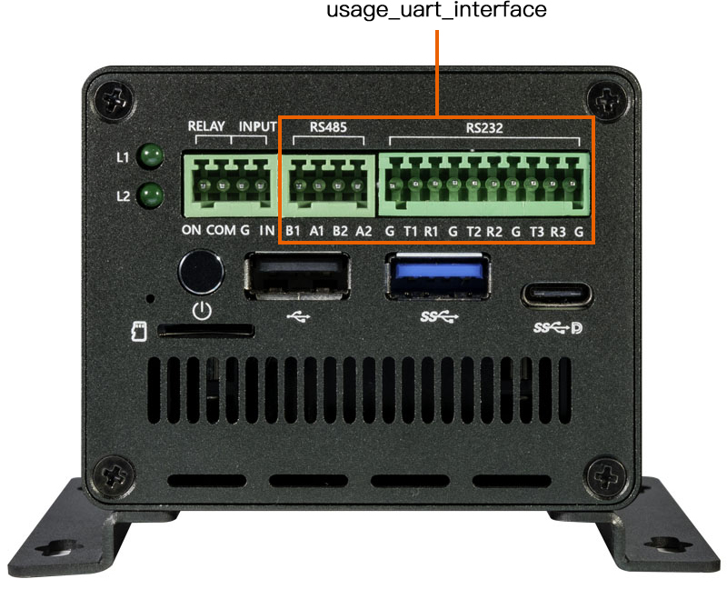
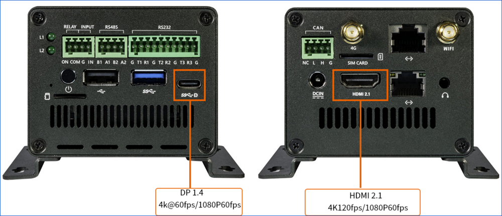
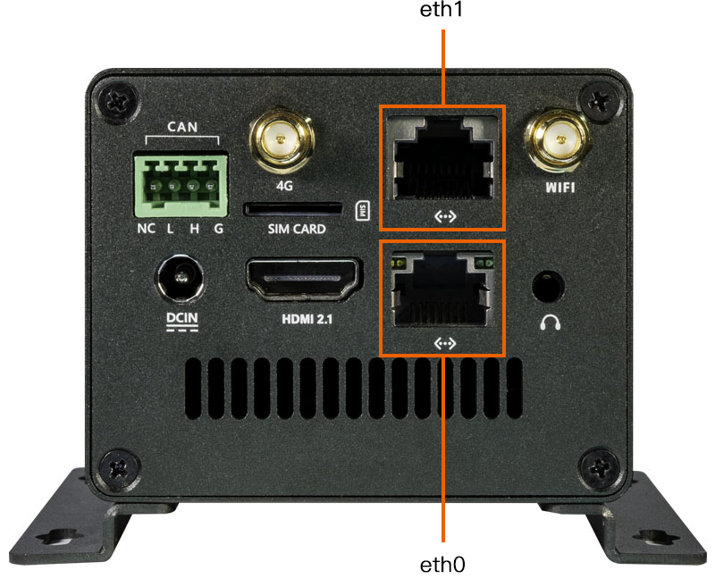
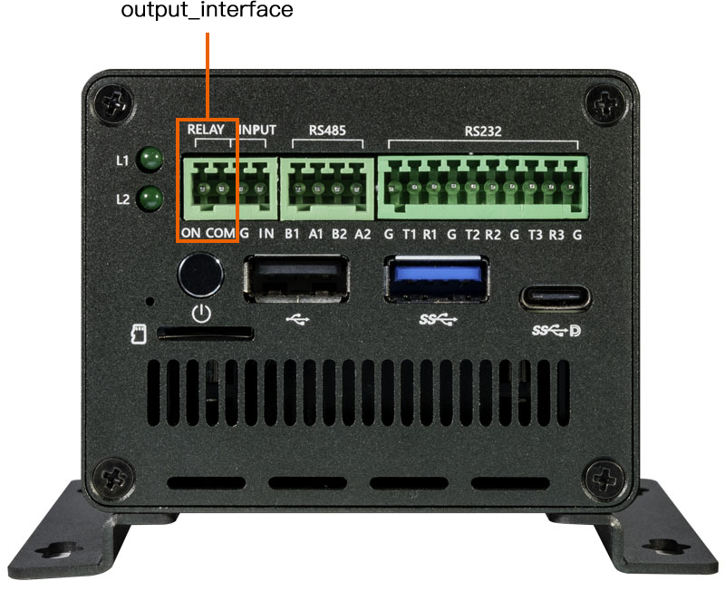

# 硬件功能使用
## 调试串口

EC-R3576PC 整机未引出调试串口接口，需要拆开主机后接入主板上的调试串口，并外接 USB 转 TTL 串口模块进行调试；日常调试也可以通过 ADB 通道执行命令。

调试串口的连接方式与使用方法详见：[调试串口](usb_to_ttl.md)。

## CAN

EC-R3576PC 提供 1 路 CAN 接口。接线时 CAN_H 接 CAN_H，CAN_L 接 CAN_L。

<center>


</center>

CAN 设备在系统中识别为 `can0`，通信测试命令如下（Ubuntu 系统可使用 `apt update && apt install can-utils` 安装测试工具）：

```
# 关闭 can0 设备
ip link set can0 down
# 设置比特率为 250Kbps
ip link set can0 type can bitrate 250000
# 打开 can0 设备
ip link set can0 up
# 接收端执行 candump，阻塞等待报文
candump can0
# 发送端执行 cansend，发送报文
cansend can0 123#1122334455667788
```

调试与验证说明：

* 通信两端的比特率必须配置一致，否则会接收不到报文；可用 `ip -details link show can0` 查看 CAN 设备的详细配置与状态。
* 若发送后接收不到报文，请检查总线 CAN_H 和 CAN_L 是否松动或者接反。

## UART（RS232 / RS485）

EC-R3576PC 提供 3 个 RS232 接口和 2 个 RS485 接口，接口图如下：

<center>


</center>

配置好串口后，硬件接口对应软件上的节点为（丝印参考接口图）：

```
RS485 节点:   /dev/ttysWK0(丝印：A1 B1)    /dev/ttysWK1(丝印：A2 B2)
RS232 节点:   /dev/ttysWK3(丝印：T1 R1)    /dev/ttysWK2(丝印：T2 R2)   /dev/ttyS6(丝印：T3 R3)
```

其中 RS485 由 SPI 转 UART 芯片扩展，RS232 中的 T3/R3 由主控 UART6 扩展。

### 收发验证

最简单的验证方式是短接收发引脚，然后在调试串口或 ADB 执行命令。

以 RS232 的 `/dev/ttyS6` 为例，短接 T3、R3 后：

```
busybox stty -echo -F /dev/ttyS6          # 关闭回显
cat /dev/ttyS6 &                          # 后台获取输入字符串
echo "firefly uart test..." > /dev/ttyS6  # 输入字符串
```

终端即可接收到字符串 `firefly uart test...`。

RS485 的验证：将 A1-A2、B1-B2 对应短接（或与外部 RS485 设备对接），将上述命令中的节点换成 `/dev/ttysWK0`、`/dev/ttysWK1` 即可，其余 RS232 节点（`/dev/ttysWK2`、`/dev/ttysWK3`）同理。

## 显示接口

EC-R3576PC 提供 HDMI、Display Port 两种显示输出接口，可以做到多屏同显/异显：

* HDMI：支持 HDMI2.1 协议，分辨率最高可以支持 4K@120Hz。
* Display Port：软件上表示为 `dp0`，支持 DP TX 1.4a 协议，分辨率最高可以支持 4K@60Hz。

<center>


</center>

RK3576 拥有 3 路 Video 输出端口，每一个 Video 输出端口都绑定了固定的显示控制器，各端口可输出的最大分辨率如下：

* Port0 最大可以输出 4K@120Hz
* Port1 最大可以输出 2560x1600@60Hz
* Port2 最大可以输出 1920x1080@60Hz

SDK 默认配置将 HDMI 连接在 Port0、dp0 连接在 Port2；如需 dp0 输出更高分辨率，可将 dp0 改配到 Port0（修改 `rk3576-firefly-roc-rk3576-pc-ext.dtsi` 中的 `dp0_in_vp2` 为 `dp0_in_vp0`）。

### 调试手段

* 获取 HDMI/Display Port 的 edid、所支持的分辨率与连接状态（以 HDMI 为例）：

```
busybox hexdump /sys/class/drm/card0-HDMI-A-1/edid
cat /sys/class/drm/card0-HDMI-A-1/modes
cat /sys/class/drm/card0-HDMI-A-1/status
```

* 获取系统中正在使用的 Video Portx（与所连接的显示控制器）信息：

```
cat /sys/kernel/debug/dri/0/summary
```

一般如果遇到 HDMI/Display Port 无法显示的问题，都需要先执行上面的命令查看连接状态、edid 和分辨率是否正确。

## 以太网

EC-R3576PC 提供 2 个 RJ45 网口，对应系统中的 `eth0`、`eth1` 两个设备：

<center>


</center>

| 硬件设备名 | 驱动 | Android 系统设备名 | 主副关系 | 网速 |
|---|---|---|---|---|
| eth0 | rk_gmac | Ethernet | 主网口，用于外网 | 千兆网 |
| eth1 | r8152 | Ethernet 2 | 副网口，用于内网 | 百兆网 |

**注意**：eth1 副网口为 USB2.0 拓展网口，因此最高速率为百兆。

双网口接入网络后，可以通过调试串口或者 adb 查看 IP 地址并进行连通性测试：

```
ifconfig eth0
ifconfig eth1
ping -I eth0 -c 10 www.baidu.com
ping -I eth1 -c 10 168.168.4.168
```

## 存储（M.2 SATA3.0 / PCIe2.0）

**注意**：EC-R3576PC 默认配置不包含 SATA 或 PCIe 存储设备。

EC-R3576PC 整机带有 1 个 M.2 接口，可以软件配置成 M.2 SATA3.0 接口（支持 SATA 协议的 SSD），也可以软件配置成 M.2 PCIe2.0 接口（支持 NVMe 协议的 SSD）。默认软件配置成 M.2 SATA3.0 接口。

<center>


</center>

SATA 与 PCIe 的切换通过 DTS 中的 `M2_SATA_OR_PCIE` 宏控制（位于 `rk3576-firefly-roc-rk3576-pc.dtsi`）：**默认值为 1 即配置成 SATA3.0，如果需要配置成 PCIe2.0，需修改为 0**。

挂载与测速：系统识别到的设备节点一般为 `/dev/block/sda`，格式化与挂载命令如下：

```
mkfs.ext4 /dev/block/sda
mount /dev/block/sda /mnt/media_rw/
df -h
```

## RELAY（继电器输出）

EC-R3576PC 支持一路继电器输出，其中 ON 对应于硬件原理图中的 OUTPUT1，COM 对应于硬件原理图中的 RELAY_COM1。

<center>


</center>

当 GPIO3_D0 输出低电平时，OUTPUT1、RELAY_COM1 断开；输出高电平时，OUTPUT1、RELAY_COM1 导通。由于下层单色灯 Ext Yellow(L2) 与继电器为同一 GPIO 控制，控制该灯即为控制继电器输出：

```
echo 1 > /sys/class/leds/extuser/brightness # 下层单色灯(L2)灯亮，即继电器吸合
echo 0 > /sys/class/leds/extuser/brightness # 下层单色灯(L2)灯灭，即继电器断开
```

## INPUT（光耦隔离输入）

EC-R3576PC 支持一路光耦隔离输入，其中 IN 在硬件原理图中对应于 INPUT1，G 对应于 INPUT_COM。

<center>


</center>

当 `INPUT(IN)` 与 `INPUT_COM(G)` 导通时，GPIO 会检测到低电平；断开时检测到高电平。检测方式如下：

```
# 申请 GPIO
echo 112 > /sys/class/gpio/export
# 设置为输入
echo in > /sys/class/gpio/gpio112/direction
# 读取电平值
cat /sys/class/gpio/gpio112/value
```

**注意**：如需接入高压信号（如 24V），需要在 INPUT(IN) 前串联一个阻值为 3.9K 至 4.7K 之间的电阻，以防烧坏光耦隔离芯片。

## LED

EC-R3576PC 提供 3 个 LED（一个三色灯，两个单色灯）。LED 以设备的形式定义在 `/sys/class/leds/` 目录下，用户可以通过写 `brightness` 控制亮灭，例如：

```
echo 1 > /sys/class/leds/extuser/brightness # 点亮下层单色灯(L2)
echo 0 > /sys/class/leds/extuser/brightness # 熄灭下层单色灯(L2)
```

具体设备名以系统中 `ls /sys/class/leds/` 的实际输出为准。
