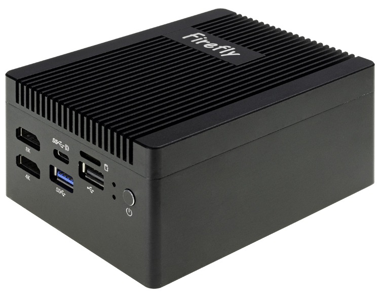
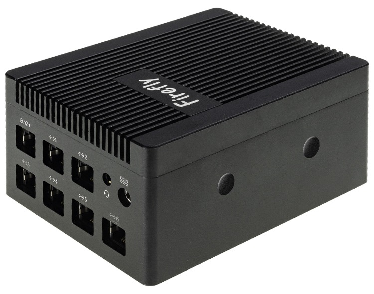
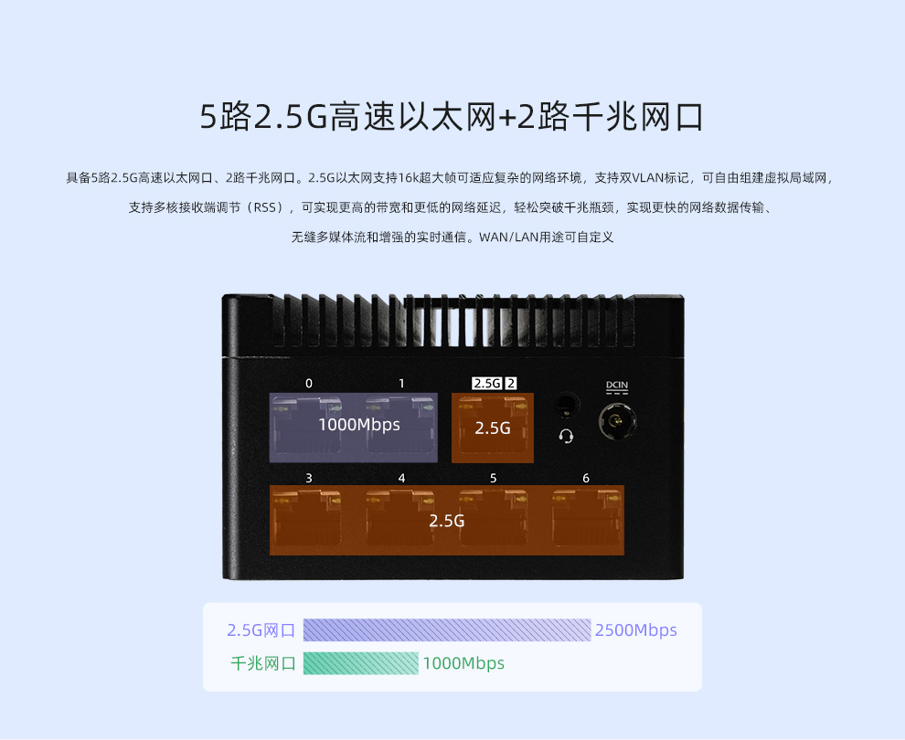
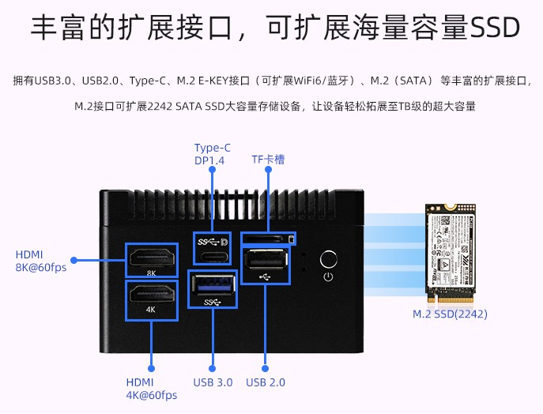

## 产品简介

EC-R3588RT_2G5 采用Rockchip RK3588旗舰级八核64位处理器，主频高达2.4GHz，6 TOPS算力NPU；支持8K视频编解码、8K HDMI、8K DP输出；
支持1路2.5G以太网口、2路千兆以太网、支持M.2接口扩展WiFi6、拥有丰富的扩展接口(4路2.5G网口)，支持OpenWRT、Linux和安卓等多种操作系统；
2.5G以太网支持巨型帧，同时拥有高带宽和低时延等特点，可轻松对接主流工业摄像头，可适用于智能路由、视觉控制器等领域 。

 