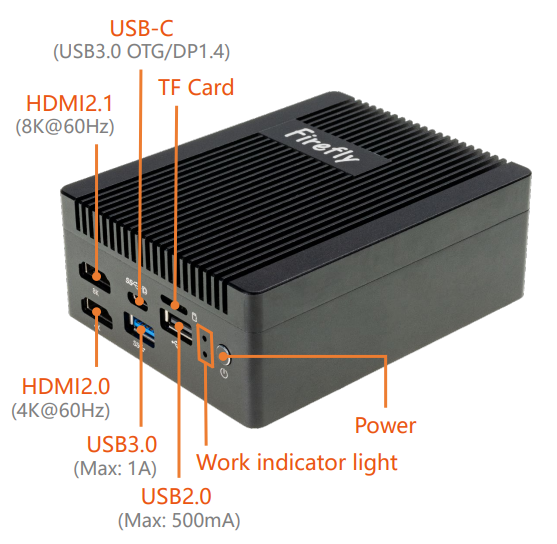
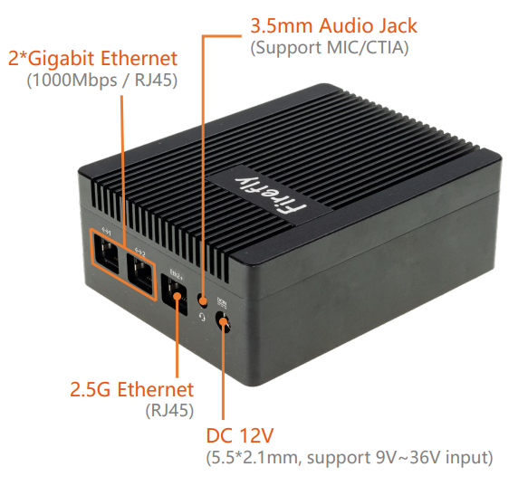
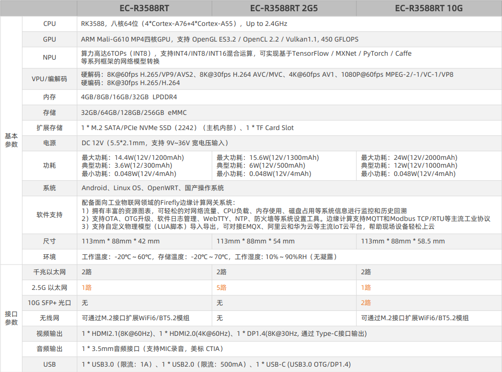
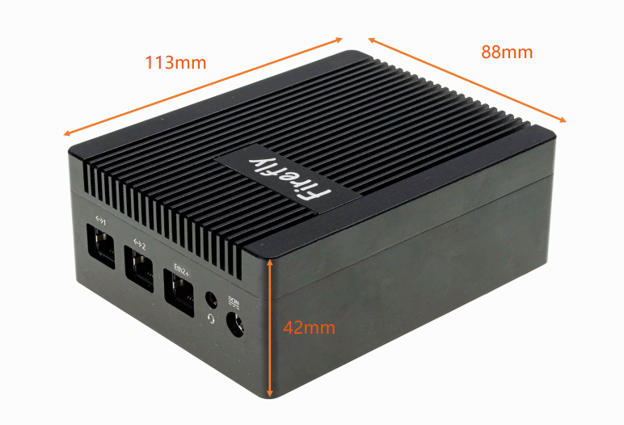
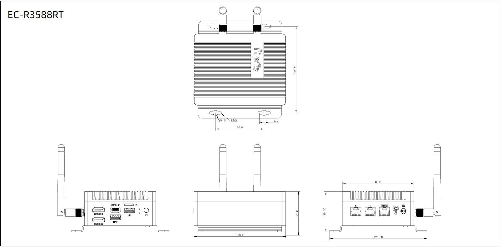

## 产品简介

EC-R3588RT 采用Rockchip RK3588旗舰级八核64位处理器，主频高达2.4GHz，6 TOPS算力NPU；支持8K视频编解码、8K HDMI、8K DP输出；
支持1路2.5G以太网口、2路千兆以太网、支持M.2接口扩展WiFi6、拥有丰富的扩展接口，支持OpenWRT、Linux和安卓等多种操作系统；
2.5G以太网支持巨型帧，同时拥有高带宽和低时延等特点，可轻松对接主流工业摄像头，可适用于智能路由、视觉控制器等领域 。

## 产品参数

## 主机尺寸

## 产品资源

* [[Wiki]](https://wiki.t-firefly.com/zh_CN/ROC-RK3588-RT)
包含 Android&Ubuntu 驱动开发等资料(参考 ROC-RK3588-RT Wiki)

* [[SDK 下载地址]](https://www.t-firefly.com/doc/download/240.html) 
Android/Linux SDK 源码

* [[固件 下载地址]](https://www.t-firefly.com/doc/download/240.html) 
Android 固件/ Linux 固件

* [[技术交流论坛]](http://dev.t-firefly.com/forum.php)
超过10万企业客户和用户沟通交流平台

## 产品技术支持
EC-R3588RT 已经广泛适用于ARM PC、迷你主机、工业软路由、智能网关、NAS存储、边缘计算、人工智能、工业控制等领域。

### 联系方式
* 邮箱：sales@t-firefly.com
* 手机：(+86) 186 8811 7175
* 座机：0760-89881218
* 全国服务热线：4001-511-533
* 地址：广东省中山市东区中山四路 57 号宏宇大厦 2101 室
 