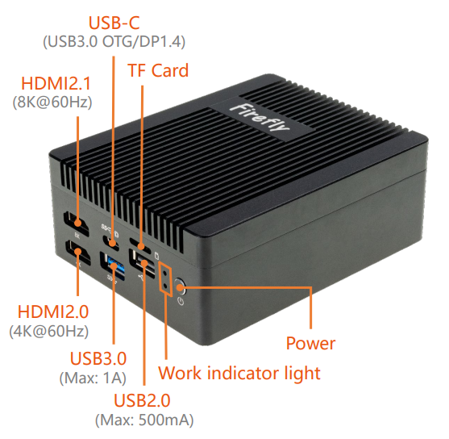

# 简介

[规格书](https://download.t-firefly.com/Spec/Computers/EC-R3588RT_EC-R3588RT%202G5_EC-R3588RT%2010G_Specification_CN.pdf) | [购买链接](https://item.taobao.com/item.htm?id=770452682897) | [下载资料](https://community.t-firefly.com/doc/download/240)

EC-R3588RT 采用Rockchip RK3588旗舰级八核64位处理器，主频高达2.4GHz，6 TOPS算力NPU；支持8K视频编解码、8K HDMI、8K DP输出；
支持1路2.5G以太网口、2路千兆以太网、支持M.2接口扩展WiFi6、拥有丰富的扩展接口，支持OpenWRT、Linux和安卓等多种操作系统；
2.5G以太网支持巨型帧，同时拥有高带宽和低时延等特点，可轻松对接主流工业摄像头，可适用于智能路由、视觉控制器等领域 。

## 接口描述

**** 提供了丰富的接口，主要包括：

* 2 x HDMI2.1（最大支持 8K@60Hz 输出）
* 1 x Display Port1.4 / Type-C OTG（最大支持 8K@30Hz 输出）
* 1 x PCIe2.0 (M.2 NVMe)
* 1 x PCIe2.0 (M.2 E-KEY for WiFi6/BT5.0)
* 1 x TF Card
* 1 x USB3.0
* 1 x USB2.0
* 2 x RJ45（支持 1Gbps）
* 1 x RJ45 (支持 2.5Gbps)
* 1 × 3.5mm耳机接口
* 1 x BTB Connector

整机接口如下图：

## 结构尺寸

## 资源与技术支持

* [[Wiki]](../../主板/ROC-RK3588-RT/index.md)：包含 Android&Ubuntu 驱动开发等资料(参考 ROC-RK3588-RT Wiki)
* [[技术交流论坛]](https://forum.t-firefly.com/)：超过10万企业客户和用户沟通交流平台

### 联系方式

* 邮箱：sales@t-firefly.com
* 手机：(+86) 186 8811 7175
* 座机：0760-89881218
* 全国服务热线：4001-511-533
* 地址：广东省中山市东区中山四路 57 号宏宇大厦 2101 室