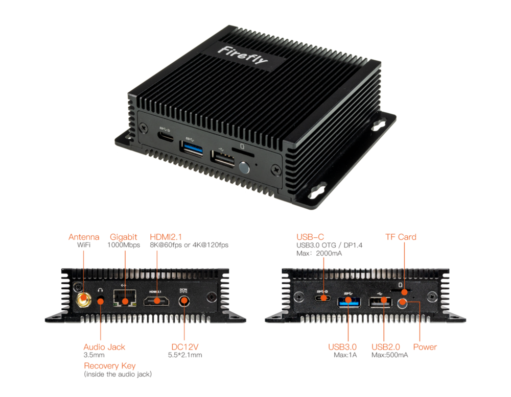

# 简介

[规格书](https://download.t-firefly.com/Spec/Computers/EC-R3588SPC%20FD_Specification_CN.pdf) | [购买链接](https://item.taobao.com/item.htm?id=732346633494) | [下载资料](https://community.t-firefly.com/doc/download/221)

EC-R3588S-FD 嵌入式主机，基于 ROC-3588S-PC 高性能开源平台，长时间稳定运行，支持 8K 编解码，丰富的接口方便连接各种工业设备。采用Rockchip RK3588S新一代八核64位处理器，最大可配32GB超大内存。支持8K视频编解码，支持千兆网、双频WiFi，4G LTE；拥有RS485、RS232、CAN等丰富接口，适用 于边缘计算、人工智能、智能家居、智慧零售、智能工业等领域中。

## 接口描述

**** 提供了丰富的接口，主要包括：

* 1 x HDMI2.1（最大支持 8K@60Hz 输出）
* 1 x Display Port1.4（最大支持 8K@30Hz 输出）
* 1 x USB3.0 OTG(Type-C)
* 2 x MIPI-DSI
* 1 x MIPI-CSI
* 1 x SATA3.0 或 PCIe2.0
* 1 x TF Card
* 1 x USB3.0
* 3 x USB2.0 (其中2个USB2.0由20Pin排针引出)
* 1 x WIFI
* 1 x Bluetooth
* 1 x FAN
* 1 x RJ45（支持 1Gbps）
* 1 × 3.5mm耳机接口（V1.1版本支持录音）
* 1 × Mic输入（2P-1.25mm）

具体如下图：

## 结构尺寸

## 资源与技术支持

* [[Wiki]](../../主板/ROC-RK3588S-PC/index.md)：包含 Android&Ubuntu 驱动开发等资料(参考 ROC-RK3588S-PC Wiki)
* [[技术交流论坛]](https://forum.t-firefly.com/)：超过10万企业客户和用户沟通交流平台

### 联系方式

* 邮箱：sales@t-firefly.com
* 手机：(+86) 186 8811 7175
* 座机：0760-89881218
* 全国服务热线：4001-511-533
* 地址：广东省中山市东区中山四路 57 号宏宇大厦 2101 室