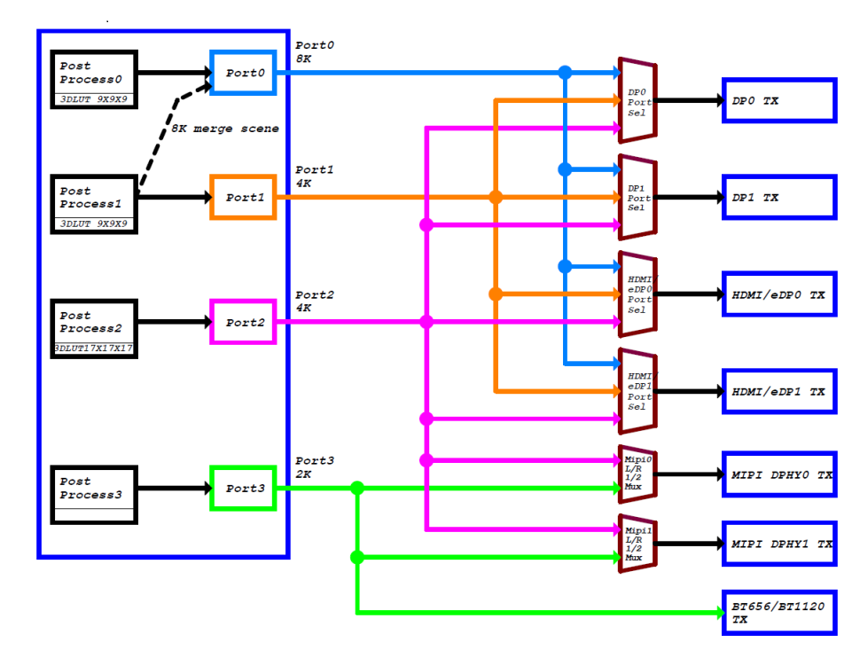
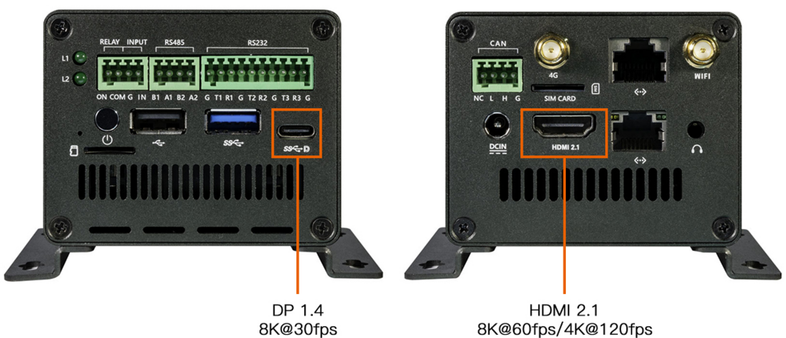
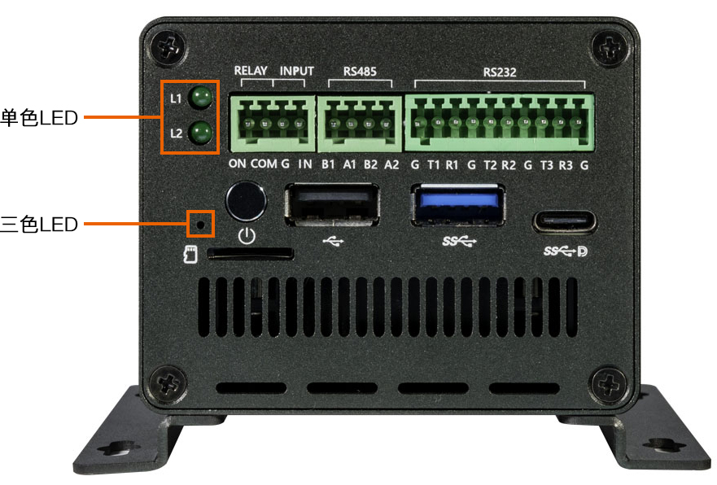
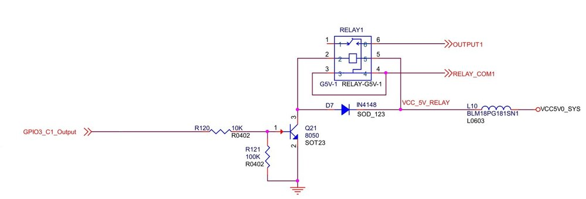
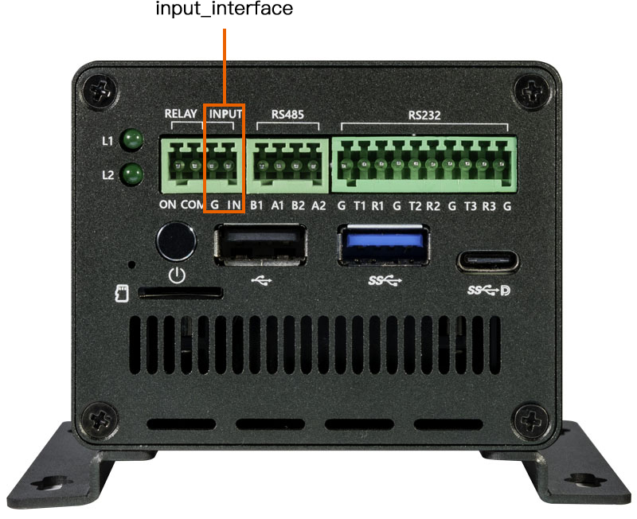
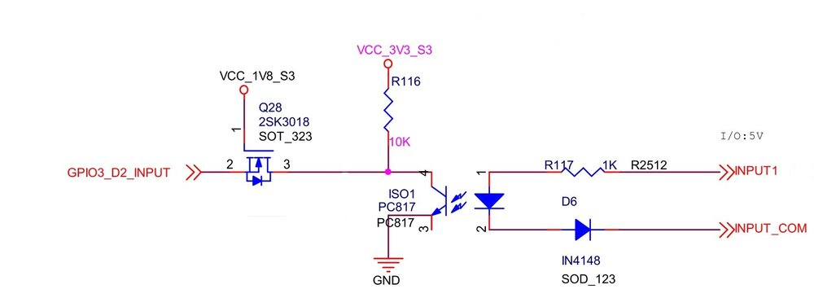
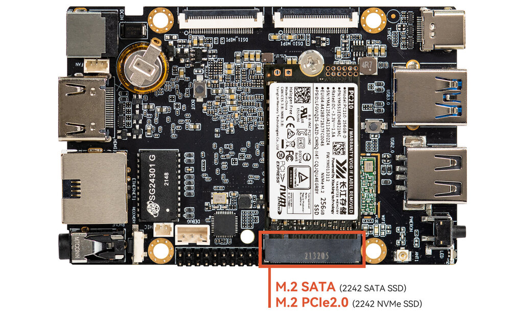
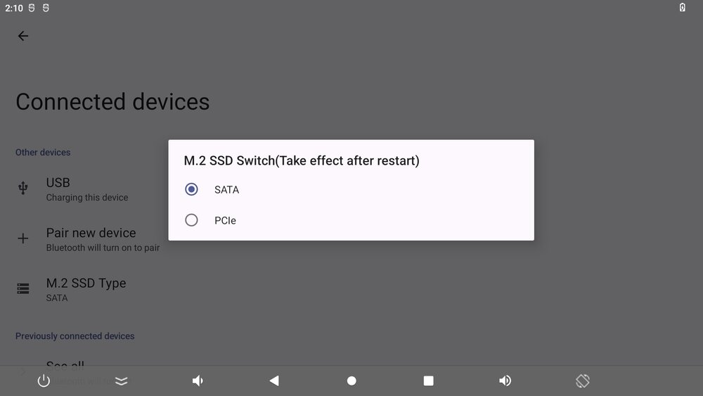

# 硬件功能使用
## 调试串口

EC-R3588SPC 整机未引出调试串口接口，需要拆开主机后接入底板上的调试串口并外接 USB 转 TTL 串口模块进行调试。

调试串口的连接方式与使用方法详见：[调试串口](usb_to_ttl.md)。

## CAN 使用
### CAN 简介
CAN(Controller Area Network)总线，即控制器局域网总线，是一种有效支持分布式控制或实时控制的串行通信网络。CAN总线是一种在汽车上广泛采用的总线协议，被设计作为汽车环境中的微控制器通讯。
如果想了解更多的内容可以参考[CAN应用报告](https://www.ti.com/lit/an/sloa101b/sloa101b.pdf)
### 硬件连接
CAN模块之间接线：CAN_H接CAN_H，CAN_L接CAN_L。

<center>


</center>

### DTS 节点配置
* 公共配置 `kernel-5.10/arch/arm64/boot/dts/rockchip/rk3588s.dtsi`

    ```
        can0: can@fea50000 {
                compatible = "rockchip,can-2.0";
                reg = <0x0 0xfea50000 0x0 0x1000>;
                interrupts = <GIC_SPI 341 IRQ_TYPE_LEVEL_HIGH>;
                clocks = <&cru CLK_CAN0>, <&cru PCLK_CAN0>;
                clock-names = "baudclk", "apb_pclk";
                resets = <&cru SRST_CAN0>, <&cru SRST_P_CAN0>;
                reset-names = "can", "can-apb";
                pinctrl-names = "default";
                pinctrl-0 = <&can0m0_pins>;
                tx-fifo-depth = <1>;
                rx-fifo-depth = <6>;
                status = "disabled";
        };

        can1: can@fea60000 {
                compatible = "rockchip,can-2.0";
                reg = <0x0 0xfea60000 0x0 0x1000>;
                interrupts = <GIC_SPI 342 IRQ_TYPE_LEVEL_HIGH>;
                clocks = <&cru CLK_CAN1>, <&cru PCLK_CAN1>;
                clock-names = "baudclk", "apb_pclk";
                resets = <&cru SRST_CAN1>, <&cru SRST_P_CAN1>;
                reset-names = "can", "can-apb";
                pinctrl-names = "default";
                pinctrl-0 = <&can1m0_pins>;
                tx-fifo-depth = <1>;
                rx-fifo-depth = <6>;
                status = "disabled";
        };

        can2: can@fea70000 {
                compatible = "rockchip,can-2.0";
                reg = <0x0 0xfea70000 0x0 0x1000>;
                interrupts = <GIC_SPI 343 IRQ_TYPE_LEVEL_HIGH>;
                clocks = <&cru CLK_CAN2>, <&cru PCLK_CAN2>;
                clock-names = "baudclk", "apb_pclk";
                resets = <&cru SRST_CAN2>, <&cru SRST_P_CAN2>;
                reset-names = "can", "can-apb";
                pinctrl-names = "default";
                pinctrl-0 = <&can2m0_pins>;
                tx-fifo-depth = <1>;
                rx-fifo-depth = <6>;
                status = "disabled";
        };
    ```
* 板级配置 `arch/arm64/boot/dts/rockchip/roc-rk3588s-pc-ext.dtsi`
```
&can2 {
    status = "okay";
    pinctrl-names = "default";
    pinctrl-0 = <&can2m0_pins>;
};
```


由于系统根据上述dts节点创建的CAN设备只有一个，而第一个创建的设备为CAN0

### 通信测试
#### CAN 通信测试    
使用 candump 和 cansend 工具进行收发报文测试即可，将工具push到/system/bin/目录下执行。工具包含在SDK中,也可以在 [官方](http://www.t-firefly.com/share/index/index/id/3cacb04c663f9fe97bf494ca55763dcd.html) 或者 [github](https://github.com/linux-can/can-utils) 下载。    

```
#在收发端关闭can0设备
ip link set can0 down
#在收发端设置比特率为250Kbps                 
ip link set can0 type can bitrate 250000
#在收发端打开can0设备  	
ip link set can0 up
#在接收端执行candump,阻塞等待报文                        	
candump can0
#在发送端执行cansend，发送报文        	
cansend can0 123#1122334455667788  	
```

### 更多指令
```
1、 ip link set canX down 		//关闭can设备；
2、 ip link set canX up   		//开启can设备；
3、 ip -details link show canX 		//显示can设备详细信息；
4、 candump canX  			//接收can总线发来数据；
5、 ifconfig canX down 			//关闭can设备，以便配置;
6、 ip link set canX up type can bitrate 250000 //设置can波特率
7、 conconfig canX bitrate + 波特率；
8、 canconfig canX start 		//启动can设备；
9、 canconfig canX ctrlmode loopback on //回环测试；
10、canconfig canX restart 		// 重启can设备；
11、canconfig canX stop 		//停止can设备；
12、canecho canX 			//查看can设备总线状态；
13、cansend canX --identifier=ID+数据 	//发送数据；
14、candump canX --filter=ID：mask	//使用滤波器接收ID匹配的数据
```

### FAQS
总结调试过程中遇到的几个问题及解决方法：

#### 报文发送后很久才接收到，或者接收不到。

检查总线 CAN_H 和 CAN_L， 杜邦线是否松动或者接反。
#### CAN时钟频率配置
##### CAN
如果CAN的比特率1M建议修改CAN时钟到300M, 信号更稳定。低于1M比特率的, 时钟设置200M就可以。


# Display 使用


<center>


</center>


RK3588S 拥有四路 Video 输出端口，每一个 Video 输出端口都绑定了固定的显示控制器，如 Port0 可以用于与 DP0、DP1、HDMI/eDP0 和 HDMI/eDP1 等显示控制器的连接，其他 Portx 以此类推。  

每一个 Portx 都有各自所能输出的最大分辨率：  
* Port0 最大可以输出 7680x4320@60Hz  
* Port1 最大可以输出 4096x2304@60Hz  
* Port2 最大可以输出 4096x2304@60Hz  
* Port3 最大可以输出 1920x1080@60Hz  

软件上如果把 HDMI0 显示控制器连接在 Port0 上，且硬件 phy 支持 HDMI2.1，则 HDMI0 支持 8K@60Hz 的输出。  

如果给每一个 Portx 都单独分配一个显示控制器的话，便可支持同一时间的四屏同显（异显）。  

但从软件的角度上，有以下的配置注意事项：  

1. RK3588S 在做 8K 输出的时候，其实芯片内部是同时使用了 Port0 以及 Port1 的资源，只是借用 Port0 口做输出，所以当与 Port0 连接的显示控制器连接外部的 8K 显示器做输出的时候，与 Port1 连接的显示控制器工作会有异常。  

   例如 HDMI0（接Port0) 接 8K 输出的时候，DP0（接Port1) 显示会有异常。只有当 Port0 输出小于等于4K@60Hz 的时候，Port1 才可以正常输出 4K@60Hz。  


## EC-R3588SPC 显示接口的配置  

EC-R3588SPC 有二种显示输出接口，分别是 HDMI、Display Port ，可以做到双屏同显/异显，接口图如下所示：  

* HDMI0/ Display Port

<center>


</center>


下面对各个显示输出接口的配置和使用作基本的介绍，详细内容可以参考文件：   
* `kernel-5.10/arch/arm64/boot/dts/rockchip/roc-rk3588s-pc.dtsi`  

### HDMI

EC-R3588SPC 硬件上有一个 HDMI 显示输出接口：

* HDMI0 支持 HDMI2.1 协议，分辨率最高可以支持 7680x4320@60Hz


#### 软件配置

下面描述以 HDMI0 的配置为例，HDMI0 软件上表示为 `hdmi0`,在设备树中添加：

```
//打开 hdmi0 功能
&hdmi0 {
        enable-gpios = <&gpio4 RK_PB2 GPIO_ACTIVE_HIGH>;
        status = "okay";
};

//把 hdmi0 的显示接口连接在 Port0
&hdmi0_in_vp0 {
        status = "okay";
};

//打开 hdmi0 音频输出
&hdmi0_sound {
        status = "okay";
};

//打开 hdmi0 的 硬件 phy
&hdptxphy_hdmi0 {
        status = "okay";
};

//打开 hdmi0 的 开机 logo
&route_hdmi0{
        status = "okay";
};

```

需要注意的是，由于这里默认会把 HDMI0 连接在 Port0 上，即为了支持 8K 输出。如果这个时候 DP0 连接在了 Port1 端口，如：

```
&dp0_in_vp1 {
        status = "okay";
};
```

则会出现前文说的 DP0 显示异常的情况，所以如果要支持 HDMI0（8K）+ DP0（4K）场景，需要把 DP0 连接在 Port2 上，如：

```
diff --git a/kernel-5.10/arch/arm64/boot/dts/rockchip/roc-rk3588s-pc.dtsi b/kernel-5.10/arch/arm64/boot/dts/rockchip/roc-rk3588s-pc.dtsi
index afb176b9f8..099cccbf65 100644
--- a/kernel-5.10/arch/arm64/boot/dts/rockchip/roc-rk3588s-pc.dtsi
+++ b/kernel-5.10/arch/arm64/boot/dts/rockchip/roc-rk3588s-pc.dtsi
@@ -94,7 +94,7 @@ &dp0 {

+&dp0_in_vp2 {
         status = "okay";
 };
```


### Display Port

EC-R3588SPC 有一个 Display Port 显示输出接口，支持  DP TX 1.4a 协议，分辨率最高可以支持 7680x4320@30Hz。


#### 软件配置

Display Port 软件上表示为 `dp0`，在设备树上添加：

```
// 打开 dp0 的音频输出功能
&spdif_tx2{
        status = "okay";
};

&dp0_sound{
        status = "okay";
};

//打开 dp0 功能
&dp0 {
        status = "okay";
};

//把 dp0 的显示接口连接在 port2
&dp0_in_vp2 {
        status = "okay";
};

//使能对应 Type-C 口的 PD 电源芯片
&usbc0{
        status = "okay";
        interrupt-parent = <&gpio0>;
        interrupts = <RK_PC4 IRQ_TYPE_LEVEL_LOW>;
};

/* typec0 */
&vbus5v0_typec_pwr_en {
		status = "okay";
		regulator-min-microvolt = <5000000>;
		regulator-max-microvolt = <5000000>;
		gpio = <&gpio1 RK_PB1 GPIO_ACTIVE_HIGH>;
		vin-supply = <&vcc5v0_usb>;
		pinctrl-names = "default";
		pinctrl-0 = <&typec5v_pwren>;
};

/* 注意：目前 dp0 暂不支持 开机 logo 的显示功能 */

```

这里要注意，SDK 默认的软件配置是把 dp0 连接在 vp2 上面，这样会导致 dp0 最高只能输出 4096x2304@60Hz，所以如果需要 7680x4320@30Hz 的功能，需要把 dp0 连接在 vp0上面，软件修改如下：

```
diff --git a/kernel-5.10/arch/arm64/boot/dts/rockchip/roc-rk3588s-pc.dtsi b/kernel-5.10/arch/arm64/boot/dts/rockchip/roc-rk3588s-pc.dtsi
index fc08eb7543..fee53ed2e9 100644
--- a/kernel-5.10/arch/arm64/boot/dts/rockchip/roc-rk3588s-pc.dtsi
+++ b/kernel-5.10/arch/arm64/boot/dts/rockchip/roc-rk3588s-pc.dtsi
@@ -301,7 +301,7 @@ &dp0 {
        status = "okay";
 };

-&dp0_in_vp2 {
+&dp0_in_vp0 {
        status = "okay";
 };

```

## EC-R3588SPC 双屏场景的配置

下面列出一些常规的场景下，关于 Portx 以及 显示控制器之间的配置方法：  

* HDMI0（8K@60Hz） + Display Port（4K@60Hz）
```
&hdmi0_in_vp0 {
        status = "okay";
};

&dp0_in_vp2 {
        status = "okay";
};
```
  
* HDMI0（8K@60Hz） + Display Port（4K@60Hz） 
```
&hdmi0_in_vp0 {
        status = "okay";
};

&dp0_in_vp2 {
        status = "okay";
};
```

## 调试手段

* 在系统中设置分辨率

系统鼠标点击：‘设置->显示->HDMI->分辨率设置’  

* 获取 HDMI/Display Port 的 edid(以 HDMI 为例)
```
:/ # busybox hexdump /sys/class/drm/card0-HDMI-A-1/edid
0000000 ff00 ffff ffff 00ff 040d 0030 0001 0000
0000010 1e01 0301 8b80 784e 502a a31f 4959 2497
0000020 4fbb 2153 0008 8081 c081 0081 c0d1 7c61
0000030 fc81 0101 0101 7404 7c00 70f6 805a 58fc
0000040 008a 1072 0053 1e00 3a02 1880 3871 402d
0000050 2c58 0045 1072 0053 1e00 0000 fc00 4300
0000060 5348 5648 200a 2020 2020 2020 0000 fd00
0000070 1700 0f4c 1e50 0a00 2020 2020 2020 4a01
0000080 0302 f07c 015f 0302 0504 0706 1190 1312
0000090 1514 1f16 2220 5e5d 605f 6261 6564 c266
00000a0 c4c3 c7c6 0932 0717 0715 5750 0106 0467
00000b0 3d03 c007 7e5f e601 4611 00d0 8070 4783
00000c0 0000 036e 000c 0020 3cb8 0020 0180 0302
00000d0 6d04 5dd8 01c4 8078 2267 0000 67cf e51f
00000e0 000f 3000 e363 0506 e301 c305 e201 ff00
00000f0 01eb d046 4800 42af 38a2 d727 0000 a400
0000100
```  

* 获取 HDMI/Display Port 所支持的分辨率(以 HDMI 为例)
```
:/ # cat /sys/class/drm/card0-HDMI-A-1/modes
3840x2160
7680x4320
7680x4320
7680x4320
7680x4320
7680x4320
7680x4320
7680x4320
7680x4320
4096x2160
4096x2160
4096x2160
4096x2160
4096x2160
4096x2160
4096x2160

```  
* 获取 HDMI/Display Port 的连接状态(以 HDMI 为例)
```
:/ # cat /sys/class/drm/card0-HDMI-A-1/status
connected
```  

* 获取系统中正在使用的 Video Portx（与所连接的显示控制器） 信息
```
:/ # cat /d/dri/0/summary
Video Port0: ACTIVE
    Connector: HDMI-A-1
        bus_format[2026]: UYYVYY8_0_5X24
        overlay_mode[1] output_mode[e] color_space[3], eotf:0
    Display mode: 7680x4320p60
        clk[2376000] real_clk[2376000] type[40] flag[5]
        H: 7680 8232 8408 9000
        V: 4320 4336 4356 4400
    Cluster0-win0: ACTIVE
        win_id: 0
        format: AB24 little-endian (0x34324241)[AFBC] SDR[0] color_space[0] glb_alpha[0xff]
        rotate: xmirror: 0 ymirror: 0 rotate_90: 0 rotate_270: 0
        csc: y2r[0] r2y[1] csc mode[1]
        zpos: 0
        src: pos[0, 0] rect[3840 x 2160]
        dst: pos[0, 0] rect[7680 x 4320]
        buf[0]: addr: 0x0000000010971000 pitch: 15360 offset: 0
Video Port1: DISABLED
Video Port2: DISABLED
Video Port3: DISABLED
```


一般如果遇到 HDMI/Display Port 无法显示的问题，都需要先执行上面的命令去看一下连接状态、edid 和分辨率是否正确。
## Ethernet 使用

### dts 配置

#### 公共的配置
`kernel-5.10/arch/arm64/boot/dts/rockchip/rk3588-firefly-port.dtsi`
```
&gmac1 {                                                                                                                                                                
    /* Use rgmii-rxid mode to disable rx delay inside Soc */
    phy-mode = "rgmii-rxid";
    clock_in_out = "output";

    snps,reset-gpio = <&gpio3 RK_PB7 GPIO_ACTIVE_LOW>;
    snps,reset-active-low;
    /* Reset time is 20ms, 100ms for rtl8211f */
    snps,reset-delays-us = <0 20000 100000>;

    pinctrl-names = "default";
    pinctrl-0 = <&gmac1_miim
            &gmac1_tx_bus2
            &gmac1_rx_bus2
            &gmac1_rgmii_clk
            &gmac1_rgmii_bus>;

    tx_delay = <0x42>;
    //rx_delay = <0x4f>;

    phy-handle = <&rgmii_phy1>;
    status = "disbaled";
};

```

#### 板级的配置
`kernel-5.10/arch/arm64/boot/dts/rockchip/roc-rk3588s-pc.dtsi`
```
/* gmac1 */
&gmac1{
 	snps,reset-gpio = <&gpio0 RK_PD3 GPIO_ACTIVE_LOW>;
	tx_delay = <0x43>;
	status = "okay";
};

```

### 如何使用双以太网
Android 双以太网口分内网和外网。

<font color=#FF0000>注意：eth1副网口为usb2.0拓展网口因此最高速率为百兆</font>

| 硬件设备名 |驱动 | Android 系统设备名 | 主副关系 |网速|
|---|---|---|---|---|
| eth0 | rk_gmac | Ethernet | 主网口，用于外网 | 千兆网|
| eth1 | r8152 | Ethernet 2 | 副网口，用于内网 |百兆网|

<center>


</center>

#### 查看IP地址
* 双以太网口接入网络，可以通过调试串口或者adb来查看IP地址，比如

	```
	ifconfig eth0
	eth0      Link encap:Ethernet  HWaddr 52:22:4b:e4:f8:3c  Driver rk_gmac-dwmac
          inet addr:168.168.104.210  Bcast:168.168.255.255  Mask:255.255.0.0
          inet6 addr: 240e:3b1:f175:9df0:ea6d:9993:33e6:202d/64 Scope: Global
          inet6 addr: 240e:3b1:f175:9df0:e0e8:b021:fc7a:dafc/64 Scope: Global
          inet6 addr: fe80::9cd8:e64d:b9c2:6f4/64 Scope: Link
          UP BROADCAST RUNNING MULTICAST  MTU:1500  Metric:1
          RX packets:229 errors:0 dropped:0 overruns:0 frame:0
          TX packets:62 errors:0 dropped:0 overruns:0 carrier:0
          collisions:0 txqueuelen:1000
          RX bytes:40526 TX bytes:6698
          Interrupt:70


	```
	```
	ifconfig eth1
	eth1      Link encap:Ethernet  HWaddr e2:76:ef:f2:13:4f  Driver r8152
          inet addr:168.168.105.2  Bcast:168.168.255.255  Mask:255.255.0.0
          inet6 addr: 240e:3b1:f175:9df0:7355:7ec7:fed3:ecab/64 Scope: Global
          inet6 addr: 240e:3b1:f175:9df0:2e23:792d:f04a:2975/64 Scope: Global
          inet6 addr: fe80::564f:1114:e491:4bbd/64 Scope: Link
          UP BROADCAST RUNNING MULTICAST  MTU:1500  Metric:1
          RX packets:124 errors:0 dropped:1 overruns:0 frame:0
          TX packets:18 errors:0 dropped:0 overruns:0 carrier:0
          collisions:0 txqueuelen:1000
          RX bytes:12387 TX bytes:2072


	```

#### 连通性测试
* eth0

	```
	ping -I eth0 -c 10  www.baidu.com
	PING www.a.shifen.com (14.215.177.38) from 168.168.104.210 eth0: 56(84) bytes of data.
	64 bytes from 14.215.177.38: icmp_seq=1 ttl=55 time=9.45 ms
	64 bytes from 14.215.177.38: icmp_seq=2 ttl=55 time=9.36 ms
	64 bytes from 14.215.177.38: icmp_seq=3 ttl=55 time=10.0 ms
	64 bytes from 14.215.177.38: icmp_seq=4 ttl=55 time=11.3 ms
	64 bytes from 14.215.177.38: icmp_seq=5 ttl=55 time=41.7 ms
	64 bytes from 14.215.177.38: icmp_seq=6 ttl=55 time=9.73 ms
	64 bytes from 14.215.177.38: icmp_seq=7 ttl=55 time=9.28 ms
	64 bytes from 14.215.177.38: icmp_seq=8 ttl=55 time=9.26 ms
	64 bytes from 14.215.177.38: icmp_seq=9 ttl=55 time=9.50 ms
	64 bytes from 14.215.177.38: icmp_seq=10 ttl=55 time=12.9 ms

	--- www.a.shifen.com ping statistics ---
	10 packets transmitted, 10 received, 0% packet loss, time 9013ms
	rtt min/avg/max/mdev = 9.265/13.262/41.757/9.562 ms
	```

* eth1

	```
	ping -I eth1 -c 10 168.168.4.168
	PING 168.168.4.168 (168.168.4.168): 56 data bytes
	64 bytes from 168.168.4.168: seq=0 ttl=64 time=2.408 ms
	64 bytes from 168.168.4.168: seq=1 ttl=64 time=1.574 ms
	64 bytes from 168.168.4.168: seq=2 ttl=64 time=1.669 ms
	64 bytes from 168.168.4.168: seq=3 ttl=64 time=1.913 ms
	64 bytes from 168.168.4.168: seq=4 ttl=64 time=1.666 ms
	64 bytes from 168.168.4.168: seq=5 ttl=64 time=1.500 ms
	64 bytes from 168.168.4.168: seq=6 ttl=64 time=1.631 ms
	64 bytes from 168.168.4.168: seq=7 ttl=64 time=1.740 ms
	64 bytes from 168.168.4.168: seq=8 ttl=64 time=1.590 ms
	64 bytes from 168.168.4.168: seq=9 ttl=64 time=1.924 ms

	--- 168.168.4.168 ping statistics ---	
	10 packets transmitted, 10 packets received, 0% packet loss
	round-trip min/avg/max = 1.500/1.761/2.408 ms

	```
# LED 使用

## 前言

EC-R3588SPC开发板上有一个三色LED灯，二个单色灯，如下表所示：

| LED     | Pin name  | Pin number |remarks|
| ----    | ----      | ----       |----|
| Blue    | GPIO1_D5  | 61         |Tricolor Led| 
| Red     | GPIO3_B2  | 106        |Tricolor Led|
| Green   | GPIO3_C0  | 112        |Tricolor Led|
| Ext Yellow（L2）    | GPIO3_B7  | 111         |Lower Monochrome Led work with Relay| 
| Ext Green（L1）    | GPIO3_C1  | 113        |Upper Monochrome Led|

<center>


</center>


可通过使用 LED 设备子系统或者直接操作 GPIO 控制该 LED。

## 以设备的方式控制 LED

标准的 Linux 专门为 LED 设备定义了 LED 子系统。 在 EC-R3588SPC开发板中的LED 均以设备的形式被定义。用户可以通过 `/sys/class/leds/` 目录控制LED。

开发板上的 LED 的默认状态为：

三色灯：
*   Blue:  系统上电时打开状态
*   Red:   用户自定义状态 
*   Green: 用户自定义状态

单色灯：
*   Ext Yellow : 继电器吸合指示灯(丝印：L2)
*   Ext Green : 用户自定义状态  (丝印：L1)


用户可以通过 `echo` 命令向其 `brightness` 属性输入命令控制每一个 LED：

三色灯：
```
echo 1 > sys/class/leds/\:power/brightness //蓝灯亮
echo 0 > sys/class/leds/\:power/brightness //蓝灯灭
```
```
echo 1 > sys/class/leds/\:user/brightness //红灯亮
echo 0 > sys/class/leds/\:user/brightness //红灯灭
```
```
echo 1 > sys/class/leds/\:user1/brightness //绿灯亮
echo 0 > sys/class/leds/\:user1/brightness //绿灯灭
```

L1单色灯：
```
echo 1 > /sys/class/leds/ext_led1/brightness //黄灯亮
echo 0 > /sys/class/leds/ext_led1/brightness //黄灯灭
```

L2单色灯：
```
echo 1 > /sys/class/leds/ext_led2/brightness //绿灯亮
echo 0 > /sys/class/leds/ext_led2/brightness //绿灯灭
```

## 使用 trigger 方式控制 LED

Trigger 包含多种方式可以控制 LED，这里就用两个例子来说明。

*    Simple trigger LED
*    Complex trigger LED

更详细的说明请参考 `leds-class.txt` 。

首先我们需要知道定义多少个 LED，同时对应的 LED 的属性是什么。

在 `kernel/arch/arm64/boot/dts/rockchip/roc-rk3588s-pc.dtsi` 文件中定义 三色LED 节点，具体定义如下：
```
firefly_leds: leds {
    compatible = "gpio-leds";
    power_led: power {
        label = ":power"; //blue led
        linux,default-trigger = "ir-power-click";
        default-state = "on";
        gpios = <&gpio1 RK_PD5 GPIO_ACTIVE_HIGH>;
        pinctrl-names = "default";
        pinctrl-0 = <&led_power>;
    };

    user_led: user {
        label = ":user"; //red led
        linux,default-trigger = "ir-user-click";
        default-state = "off";
        gpios = <&gpio3 RK_PB2 GPIO_ACTIVE_HIGH>;
        pinctrl-names = "default";
        pinctrl-0 = <&led_user>;
    };

    user1_led: user1 {
        label = ":user1"; //green led
        default-state = "off";
        gpios = <&gpio3 RK_PC0 GPIO_ACTIVE_HIGH>;
        pinctrl-names = "default";
        pinctrl-0 = <&led_user1>;
    };
};

```
在 `kernel/arch/arm64/boot/dts/rockchip/roc-rk3588s-pc-ext.dtsi` 文件中定义 单色LED 节点，具体定义如下：
```
&firefly_leds {
		ext_yellow_led: ext_led1 {
			gpios = <&gpio3 RK_PB7 GPIO_ACTIVE_HIGH>;//yellow led
			pinctrl-names = "default";
			pinctrl-0 = <&led_user2>;
		};

		ext_green_led: ext_led2 {
			gpios = <&gpio3 RK_PC1 GPIO_ACTIVE_HIGH>;//green led
			pinctrl-names = "default";
			pinctrl-0 = <&led_user3>;
		};
};
```


注意：`compatible` 的值要跟 `drivers/leds/leds-gpio.c` 中的 `.compatible` 的值要保持一致。

### Simple trigger LED

按名字来是看就是简单的触发方式控制 LED，如下就默认打开黄灯，EC-R3588SPC开机后黄灯就亮。

（1）定义 LED 触发器在 `kernel-5.10/drivers/leds/trigger/led-firefly-demo.c` 文件中有如下添加：

```
DEFINE_LED_TRIGGER(ledtrig_default_control);
```

（2）注册该触发器

```
led_trigger_register_simple("ir-user-click", &ledtrig_default_control);
```

（3）控制 LED 的亮。

```
led_trigger_event(ledtrig_default_control, LED_FULL);     #led on
```

（4）打开LED demo

led-firefly-demo 默认没有打开，如果需要的话可以使用以下补丁打开 demo 驱动：

```
--- a/kernel-5.10/arch/arm64/boot/dts/rockchip/rk3588-firefly-demo.dtsi
+++ b/kernel-5.10/arch/arm64/boot/dts/rockchip/rk3588-firefly-demo.dtsi
@@ -52,7 +52,7 @@
led_demo: led_demo {
-     status = "disabled";
+     status = "okay";
      compatible = "firefly,rk3588-led";
};
```

### Complex trigger LED

如下是 trigger 方式控制 LED 复杂一点的例子，`timer trigger` 就是让 LED 达到不断亮灭的效果：

我们需要在内核把 timer trigger 配置上。

在 `kernel-5.10` 路径下使用 `make menuconfig`，按照如下方法将 timer trigger 驱动选中。

```
Device Drivers
--->LED Support
   --->LED Trigger support
      --->LED Timer Trigger
```
保存配置并编译内核，把 `kernel.img` 烧到 EC-R3588SPC板子上 我们可以使用串口输入命令，就可以看到蓝灯不停的间隔闪烁。

```
echo "timer" > /sys/class/leds/:user/trigger
```

用户还可以使用 `cat` 命令获取 trigger 的可用值：

```
# cat /sys/class/leds/:user/trigger
none ir-power-click rfkill-any rfkill-none test_ac-online test_battery-charging-or-full 
test_battery-charging test_battery-full test_battery-charging-blink-full-solid 
test_usb-online mmc0 [timer] heartbeat backlight default-on ir-user-click mmc1 
rfkill0 tcpm-source-psy-6-0022-online rfkill1 rfkill2
```

# RELAY 使用

EC-R3588SPC支持一路继电器输出，其中，ON对应于硬件原理图中的OUTPUT1，COM对应于硬件原理图中的RELAY_COM1。

### 接口图
<center>


</center>

### 电路原理图
<center>


</center>

### 控制
当 GPIO3_C1_Output 输出低电平，OUTPUT1、RELAY_COM1 断开；当 RELAY_CTL1 输出高电平，OUTPUT1、RELAY_COM1 导通。

由于下层Ext Yellow(L2)与继电器为同一GPIO控制，因此控制Ext Yellow(L2)就是控制继电器输出

控制方式如下：
```
echo 1 > /sys/class/leds/ext_led2/brightness //下层单色灯(L2)灯亮，即继电器吸合
echo 0 > /sys/class/leds/ext_led2/brightness //下层单色灯(L2)灯灭，即继电器断开
```

LED 接口使用说明见上文「LED 使用」章节。
# DIN 使用

EC-R3588SPC支持一路光耦隔离输入，其中，IN在硬件原理图中对应于INPUT1，G在硬件原理图中对应于INPUT_COM。

### 接口图
<center>


</center>

### 电路原理图
<center>


</center>

### 检测
原理图中的`INPUT1`对应丝印的`IN`，`INPUT_COM`对应`G`。当 `INPUT1(IN)`与`INPUT_COM(G)`导通时，`GPIO3_D2_INPUT` 会检测到低电平；当 `INPUT1(IN)`与`INPUT_COM(G)` 断开时，`GPIO3_D2_INPUT` 会检测到高电平。

* 例1：`INPUT(IN)`接5V，那么就是检测`INPUT_COM(G)`的输入状态，当`INPUT_COM(G)`为低，主控检测到的`GPIO3_D2_INPUT`为低；

* 例2：`INPUT(IN)`想接入24V的话，需要串联个电阻（阻值为3.9K至4.7K之间）后再接入到`INPUT(IN)`以防止烧坏光耦隔离芯片，逻辑与例1一致；

<font color=#FF0000>注意：强烈建议采用例1的方案，如有其他配置想法，请根据实际电路原理图来配置`INPUT(IN)`与`INPUT_COM(G)`，以防烧坏光耦</font>

检测方式如下：
```
# 申请 GPIO 
echo 122 > /sys/class/gpio/export
# 设置为输入
echo in > /sys/class/gpio/gpio122/direction
# 读取电平值
cat /sys/class/gpio/gpio122/value
```
# RTC 使用

## 简介

EC-R3588SPC开发板采用HYM8563作为RTC(*Real Time Clock*)，HYM8563是一款低功耗CMOS实时时钟/日历芯片,它提供一个可编程的时钟输出,一个中断
输出和一个掉电检测器,所有的地址和数据都通过I2C总线接口串行传递。最大总线速度为
400Kbits/s,每次读写数据后,内嵌的字地址寄存器会自动递增

* 可计时基于 32.768kHz 晶体的秒,分,小时,星期,天,月和年
* 宽工作电压范围:1.0~5.5V
* 低休眠电流:典型值为 0.25μA(VDD =3.0V, TA =25°C)
* 内部集成振荡电容
* 漏极开路中断引脚


## RTC驱动


驱动参考：`kernel-5.10/drivers/rtc/rtc-hym8563.c`

## 接口使用

Linux 提供了三种用户空间调用接口。在 EC-R3588SPC开发板中对应的路径为：

*    SYSFS接口：/sys/class/rtc/rtc0/
*    PROCFS接口： /proc/driver/rtc
*    IOCTL接口： /dev/rtc0

### SYSFS接口

可以直接使用 `cat` 和 `echo` 操作 `/sys/class/rtc/rtc0/` 下面的接口。

比如查看当前 RTC 的日期和时间：

```
# cat /sys/class/rtc/rtc0/date 
2022-06-21
# cat /sys/class/rtc/rtc0/time 
06:52:08
```

设置开机时间，如设置 120 秒后开机：

```
#120秒后定时开机
echo +120 >  /sys/class/rtc/rtc0/wakealarm
# 查看开机时间
cat /sys/class/rtc/rtc0/wakealarm
#关机
reboot -p
```

### PROCFS 接口

打印 RTC 相关的信息：

```
# cat /proc/driver/rtc
rtc_time        : 06:53:50
rtc_date        : 2022-06-21
alrm_time       : 06:55:05
alrm_date       : 2022-06-21
alarm_IRQ       : yes
alrm_pending    : no
update IRQ enabled      : no
periodic IRQ enabled    : no
periodic IRQ frequency  : 1
max user IRQ frequency  : 64
24hr            : yes
```

### IOCTL接口

可以使用 `ioctl` 控制 `/dev/rtc0`。

详细使用说明请参考文档 `kernel-5.10/Documentation/admin-guide/rtc.rst` 。

## FAQs

#### Q1: 开发板上电后时间不同步？

A1:  检查一下 RTC 电池是否正确接入。


# SATA 使用

<font color=#FF0000>注意：EC-R3588SPC默认配置是不包含SATA 或PCIe存储设备</font>

## 简介
EC-R3588SPC 上有 1 个 M.2 接口。

可以软件配置成 M.2 SATA3.0 接口，支持 SATA 协议的 SSD 使用，也可以软件配置成 M.2 PCIe2.0 接口，支持 NVMe 协议的 SSD 使用。

默认软件配置成 M.2 SATA3.0 接口, 支持 SATA 协议的 SSD 使用。

<center>


</center>

## 软件配置
### 方式一：系统设置修改

Settings->Connected devices -> M.2 SSD Type

选择需要生效的选项SATA 或 PCIe

 <center>

 
 </center>

 修改后需要重启系统才会生效
 
### 方式二：DTS 配置
一般根据原理图在 DTS 中选择正确的控制器节点和 PHY 节点使能，并关闭与其复用的控制器节点就可以。

在 `kernel-5.10/arch/arm64/boot/dts/rockchip/roc-rk3588s-pc.dtsi` 中有下面一段配置：
```
#define M2_SATA_OR_PCIE 1 /*1 = SATA , 0 = PCIe */

/* default use sata3.0 , pcie2.0 optional*/
&combphy0_ps {
    status = "okay";
};

#if M2_SATA_OR_PCIE
&sata0 {
    pinctrl-names = "default";
    pinctrl-0 = <&sata_reset>;
    status = "okay";
};
#else
&pcie2x1l2 {
    reset-gpios = <&gpio3 RK_PD1 GPIO_ACTIVE_HIGH>;
    vpcie3v3-supply = <&vcc3v3_pcie20>;
    status = "okay";
};
#endif
```
`combphy0_ps`：PHY 节点

`sata0`：sata0 控制器节点

`pcie2x1l2`：pcie2x1l2 控制器节点

`M2_SATA_OR_PCIE`：**默认值为 1 即配置成 SATA3.0，如果需要配置成 PCIe2.0，需修改为 0**

## 挂载

### 自动挂载
在 Android 系统界面中将硬盘格式化为可用格式就可以开机自动挂载

### 命令手动挂载
* 查找设备节点
```
ls /dev/block/sd*                                 
/dev/block/sda
```

* 格式化为EXT4文件格式
```
mkfs.ext4 /dev/block/sda
```

* 挂载
```
mount /dev/block/sda /mnt/media_rw/
```

* 查看挂载路径
```
df -h
/dev/block/sda               916G  24K  916G   1% /mnt/media_rw
```
或者
```
cat /proc/mounts  | grep sda
/dev/block/sda /mnt/media_rw ext4 rw,seclabel,relatime 0 0
```

## 读写测速
SATA3.0 的传输速率理论上达到 6.0 Gbps，可以参考如下命令进行读写速度测试：
* dd
```
# 路径根据实际挂载路径修改
# 写1G文件
echo 3 > /proc/sys/vm/drop_caches
busybox dd if=/dev/zero of=/mnt/media_rw/41AD-09EA/test1 bs=1M count=1024 conv=sync
# 读1G文件
echo 3 > /proc/sys/vm/drop_caches
busybox dd if=/mnt/media_rw/41AD-09EA/test1 of=/dev/null conv=sync
```

* fio
```
# 使用 fio 会格式化硬盘
# 写
fio -filename=/dev/block/sda -direct=1 -iodepth 1 -thread -rw=write -ioengine=psync -bs=1M -size=200G -numjobs=30 -runtime=60 -group_reporting -name=mytes
# 读
fio -filename=/dev/block/sda -direct=1 -iodepth 1 -thread -rw=read -ioengine=psync -bs=1M -size=200G -numjobs=30 -runtime=60 -group_reporting -name=mytes
```


# UART使用

<font color=#FF0000> 本章包含RS232节点和RS485节点的说明</font>

## 硬件

EC-R3588SPC的串口接口图如下：

<center>


</center>

## DTS配置

文件路径`kernel-5.10/arch/arm64/boot/dts/rockchip/roc-rk3588s-pc.dtsi`
```
/* uart7 */
&uart7{
    pinctrl-0 = <&uart7m2_xfer>;
    status = "okay";
};
```
文件路径`kernel-5.10/arch/arm64/boot/dts/rockchip/roc-rk3588s-pc-ext.dtsi`
```
&spi1 {
	status = "okay";
	max-freq = <48000000>;
	dev-port = <0>;
	pinctrl-0 = <&spi1m2_pins>;
	num-cs = <1>;

	spi_wk2xxx: spi_wk2xxx@00{
		status = "okay";
		compatible = "firefly,spi-wk2xxx";
		reg = <0x00>;
		spi-max-frequency = <10000000>;
		reset-gpio = <&gpio3 RK_PA6 GPIO_ACTIVE_HIGH>;
		irq-gpio = <&gpio3 RK_PC6 IRQ_TYPE_EDGE_FALLING>;
		cs-gpio = <&gpio1 RK_PD3 GPIO_ACTIVE_HIGH>;
	};
};
```

配置好串口后，硬件接口对应软件上的节点为：
```
RS485 节点:   /dev/ttysWK0(丝印：A1 B1)    /dev/ttysWK1(丝印：A2 B2)
RS232 节点:   /dev/ttysWK3(丝印：T1 R1)    /dev/ttysWK2(丝印：T2 R2)   /dev/ttyS7(丝印：T3 R3)
```

## 232 节点 收发验证

最简单的方式短接RS232 TX RX 引脚, 然后使用命令在调试串口或ADB执行命令

节点/dev/ttyS7测试示例如下（请根据实际短接脚位选择 /dev/ttysWK2， /dev/ttysWK3， /dev/ttyS7）
```
busybox  stty -echo -F /dev/ttyS7          # 关闭回显，
cat /dev/ttyS7 &                           # 后台获取/dev/ttyS7输入字符串
echo "firefly uart test..." > /dev/ttyS7   # 输入字符串
```
最终调试串口终端即可接收到字符串 "firefly uart test..."

## 485 节点 收发验证

最简单的方式两个RS485互相短接， A1接A2,B1接B2, 然后使用命令在调试串口或ADB执行命令

```
busybox  stty -echo -F /dev/ttysWK0          # 关闭回显
cat /dev/ttysWK1 &                           # 后台获取/dev/ttysWK1输入字符串
echo "firefly uart test..." > /dev/ttysWK0   # 输入字符串
```

最终调试串口终端即可接收到字符串 "firefly uart test..."


# Watchdog 使用

## 简介

看门狗（watchdog）实际是一个定时器，启动之后会开始计时。系统或者软件需要在规定时间内与看门狗通信（俗称喂狗）重置计时，如此反复下去，以此来确定系统和软件正常运行。

如果规定时间内没有喂狗，看门狗超时，说明系统或应用陷入循环、卡死，此时看门狗会发出复位信号让主控复位，脱离卡死。

本章节主要介绍 EC-R3588SPC 开发板内部看门狗的使用。


## DTS配置

EC-R3588SPC的 watchdog 的 DTS 节点在 `kernel-5.10/arch/arm64/boot/dts/rockchip/rk3588s.dtsi` 文件中定义，如下所示：

```
wdt: watchdog@feaf0000 {
    compatible = "snps,dw-wdt";
    reg = <0x0 0xfeaf0000 0x0 0x100>;
    clocks = <&cru TCLK_WDT0>, <&cru PCLK_WDT0>;
    clock-names = "tclk", "pclk";
    interrupts = <GIC_SPI 315 IRQ_TYPE_LEVEL_HIGH>;
    status = "disabled";
};
```

用户首先需在 DTS 文件中打开 wdt 节点：

```
&wdt{
    status = "okay";
};
```

## 使用
watchdog 默认是关闭的，需按上述说明在 DTS 文件中打开相关节点方能使用。

watchdog 的驱动文件为 `kernel-5.10/drivers/watchdog/dw_wdt.c`。下面介绍两种方法来使用 watchdog：

内部看门狗的设备名称为`/dev/watchdog`，用户可通过 `echo` 命令来控制该设备

```
# 写入任意内容（大写字母‘V’除外），开启看门狗，每 44 秒内需要写入一次（喂狗）
echo A > /dev/watchdog

# 开启看门狗，并且内核会每隔 22 秒自动喂一次狗
echo V > /dev/watchdog
```

也可以通过程序来控制看门狗，通过Android.mk编译生成可执行文件，在机器启动后，push到上面运行，demo代码如下：

```
#include <stdio.h>
#include <stdlib.h>
#include <string.h>
#include <unistd.h>
#include <fcntl.h>
#include <signal.h>
#include <sys/ioctl.h>
#include <linux/types.h>
#include <linux/watchdog.h>

#define WDIOC_SETTIMEOUT        _IOWR(WATCHDOG_IOCTL_BASE, 6, int)
#define WDIOC_GETTIMEOUT        _IOR(WATCHDOG_IOCTL_BASE, 7, int)


int main(void)
{
    int timeout1 = 22;
    int timeout2;
    int fd = open("/dev/watchdog", O_WRONLY); //start watchdog
    int ret = 0;
    if (fd == -1) {
        perror("watchdog");
        exit(EXIT_FAILURE);
    }

    ret = ioctl(fd, WDIOC_SETTIMEOUT, &timeout1); //set timeout
    if (ret < 0)
        printf("ioctl WDIOC_SETTIMEOUT failed.\n"); 

    ret = ioctl(fd, WDIOC_GETTIMEOUT, &timeout2); //get timeout
    if (ret < 0)
        printf("ioctl WDIOC_SETTIMEOUT failed.\n"); 
    printf("timeout = %d\n", timeout2);

    while (1) {
        ret = write(fd, "\0", 1); //feed the dog
        if (ret != 1) {
            ret = -1;
            break;
        }
        printf("feed the dog\n");
        sleep(10);

    }
    close(fd);
    return ret;
}
```

demo说明：

1、内部看门狗在使用 open 函数打开后会立刻开始计时。

2、关于超时时间：用户可以用 ioctl 来设置超时时间和获取超时时间。当用户没有设置超时时间时，驱动会应用默认请求的超时时间为 30 s。需要说明的是驱动最终设置的超时时间并不一定是应用层传输的时间或者驱动一开始设置的默认时间。驱动函数里有一个超时时间的列表，该列表中存放了 16 个超时时间（前 9 个是 0）。驱动会在超时时间列表中找到一个合适的时间作为最终 watchdog 设置的超时时间。

以下为超时时间的详细列表：

| 请求的超时时间                |通过 ioctl 获取的超时时间              |watchdog最终设置的超时时间   |
| ----                        | ----                              | ----                     |
| timeout_request > 89        | timeout_get = timeout_request     | timeout_set =  89        |
| 44 < timeout_request <= 89  | timeout_get =  89                 | timeout_set =  89        |
| 22 < timeout_request <= 44  | timeout_get =  44                 | timeout_set =  44        |
| 11 < timeout_request <= 22  | timeout_get =  22                 | timeout_set =  22        |
| 5 < timeout_request <= 11   | timeout_get =  11                 | timeout_set =  11        |
| 2< timeout_request <= 5     | timeout_get =  5                  | timeout_set =  5         |
| timeout_request = 2         | timeout_get =  2                  | timeout_set =  2         |
| timeout_request = 1         | timeout_get =  1                  | timeout_set =  1         |

参考文档：SDK/RKDocs(linux 为 docs)/common/watchdog

## 外部看门狗

很多设备上有外部硬件看门狗，通过查看设备文件可以确认是否支持外部看门狗。如果有硬件看门狗 /dev/ 下应该会生成 wdt_XXX 的设备文件。
```
ls /dev/wdt_*
```

通过写设备文件完成使能和喂狗。
```
echo e > /dev/wdt_core
echo 1 > /dev/wdt_core


case '0':0.64s
case '1':2.56s
case '2':10.24s
case '3':40.96s
case 'e':enable wdt
```
## SIM 卡

EC-R3588SPC 的 SIM 卡槽用于配合 4G 模块实现移动网络连接。**4G 模块为选配**，需要在机箱内部安装 4G 模块后，SIM 卡功能才能正常使用。SIM 卡插入方向如下图所示，插拔前请先断电。

<center>


</center>

* [设备树手册](linux_dts_manual.md)
