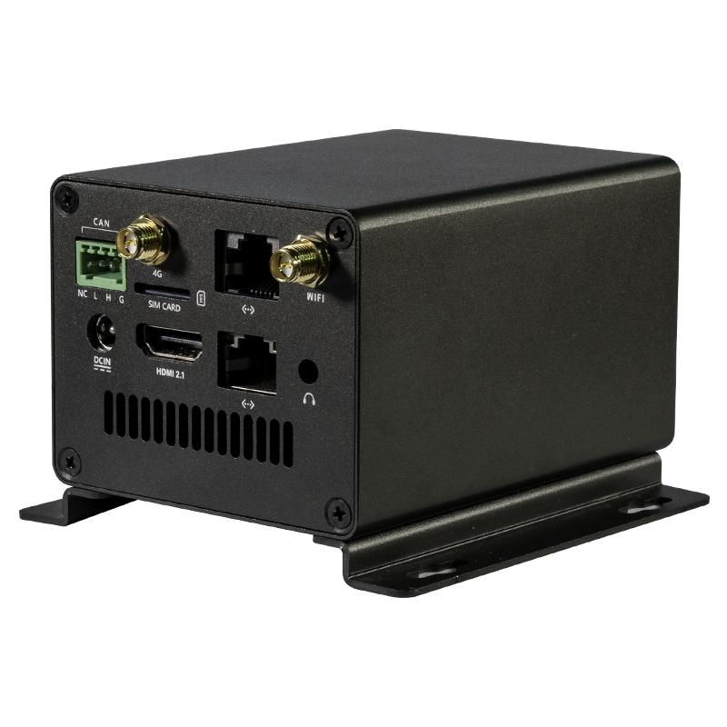
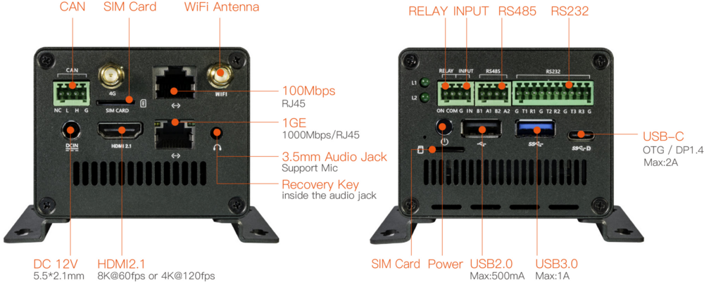
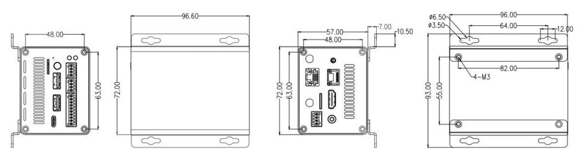

# 简介

[规格书](https://download.t-firefly.com/Spec/Computers/EC-R3588SPC_Specification_CN.pdf) | [购买链接](https://item.taobao.com/item.htm?id=685501243765) | [下载资料](https://community.t-firefly.com/doc/download/182)

EC-R3588SPC 嵌入式主机，基于 ROC-3588S-PC 高性能开源平台，长时间稳定运行，支持 8K 编解码，丰富的接口方便连接各种工业设备。采用Rockchip RK3588S新一代八核64位处理器，最大可配32GB超大内存。支持8K视频编解码，支持千兆网、双频WiFi，4G LTE；拥有RS485、RS232、CAN等丰富接口，适用于边缘计算、人工智能、智能家居、智慧零售、智能工业等领域中。

## 接口描述

**** 提供了丰富的接口，主要包括：

* 1 x HDMI2.1（最大支持 8K@60Hz 输出）
* 1 x USB3.0 OTG(Type-C)
* 1 x Display Port1.4（最大支持 8K@30Hz 输出）
* 1 x 4G LTE
* 1 x SIM卡槽
* 1 x CAN
* 3 x RS232
* 2 x RS485
* 1 x SATA3.0 或 PCIe2.0
* 1 x RELAY（继电器输出）
* 1 x INPUT（光耦隔离输入）
* 3 x LED（一个三色灯，两个单色灯）
* 1 x TF Card
* 1 x USB3.0
* 1 x USB2.0
* 1 x WIFI
* 1 x Bluetooth
* 2 x RJ45（其中一个支持 1Gbps，一个支持100Mbps）
* 1 × 3.5mm耳机接口

具体如下图：

## 结构尺寸

## 资源与技术支持

* [[开发使用文档]](../../主板/ROC-RK3588S-PC/index.md)：包含 Android&Ubuntu 驱动开发等资料(参考 EC-R3588SPC Wiki)
* [[技术交流论坛]](https://forum.t-firefly.com/)：超过10万企业客户和用户沟通交流平台

### 联系方式

* 邮箱：sales@t-firefly.com
* 手机：(+86) 186 8811 7175
* 座机：0760-89881218
* 全国服务热线：4001-511-533
* 地址：广东省中山市东区中山四路 57 号宏宇大厦 2101 室
