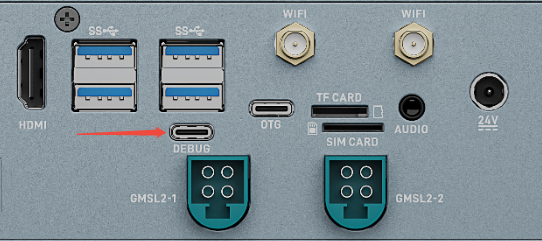
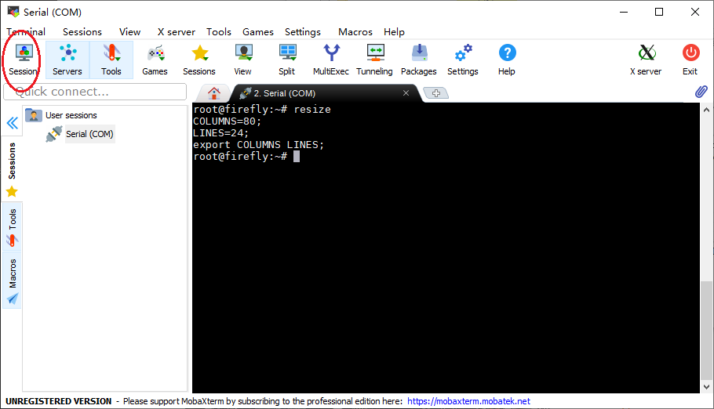
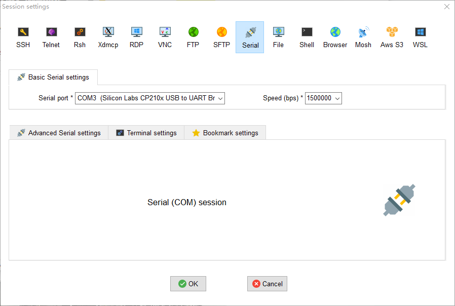

# 硬件功能使用
## 调试串口

EC-ThorT5000 板载 Type-C 调试串口，使用 Type-C 数据线将整机与 PC 直连即可进行串口调试，串口波特率为 115200，无需额外的 USB 转串口适配器。

### 使用 Type-C 串口调试

EC-ThorT5000 可以使用 Type-C 线连接到 PC 机进行串口调试：

<center>


</center>

#### 串口参数配置

EC-ThorT5000 使用以下串口参数：

* 波特率：115200
* 数据位：8
* 停止位：1
* 奇偶校验：无
* 流控：无

#### Windows 上使用串口调试

Windows 上一般用 putty 或 SecureCRT 软件。其中我们推荐使用 MobaXterm 免费版本。这是一款功能强大的终端软件，在这里介绍一下，其他软件的使用方法与之类似。

到这里[下载 MobaXterm](https://mobaxterm.mobatek.net/)：

1. 选择 `session` 为 `Serial`。
2. 将 `Serial port` 修改为在设备管理器中找到的 COM 端口。
3. 设置 `Speed (bsp)` 为 `115200`。
4. 点击 `OK` 按钮。

<center>


</center>
<center>


</center>

#### Linux 上使用串口调试

在 Linux 上可以有多种选择：

* minicom
* picocom
* kermit

篇幅关系，以下就介绍 minicom 的使用。

安装 minicom：

```
sudo apt-get install minicom
```

连接好串口线的，看一下串口设备文件是什么（**注意，如果 Type-C 接口，在 Linux 系统的设备文件为：/dev/ttyACMx**），下面示例是 `/dev/ttyUSB0`：

```
$ ls /dev/ttyUSB*
/dev/ttyUSB0
```

运行：

```
$ sudo minicom
Welcome to minicom 2.7
OPTIONS: I18n
Compiled on Jan  1 2014, 17:13:19.
Port /dev/ttyUSB0, 15:57:00
Press CTRL-A Z for help on special keys
```

以上提示 `CTRL-A Z` 是转义键，按 `Ctrl-a` 然后再按 `z` 就可以调出菜单：

```
   +-------------------------------------------------------------------+
                          Minicom Command Summary                      |
  |                                                                    |
  |              Commands can be called by CTRL-A <key>                |
  |                                                                    |
  |               Main Functions                  Other Functions      |
  |                                                                    |
  | Dialing directory..D  run script (Go)....G | Clear Screen.......C  |
  | Send files.........S  Receive files......R | cOnfigure Minicom..O  |
  | comm Parameters....P  Add linefeed.......A | Suspend minicom....J  |
  | Capture on/off.....L  Hangup.............H | eXit and reset.....X  |
  | send break.........F  initialize Modem...M | Quit with no reset.Q  |
  | Terminal settings..T  run Kermit.........K | Cursor key mode....I  |
  | lineWrap on/off....W  local Echo on/off..E | Help screen........Z  |
  | Paste file.........Y  Timestamp toggle...N | scroll Back........B  |
  | Add Carriage Ret...U                                               |
  |                                                                    |
  |             Select function or press Enter for none.               |
  +--------------------------------------------------------------------+
```

根据提示按 `O` 进入设置界面，如下：

```
           +-----[configuration]------+
           | Filenames and paths      |
           | File transfer protocols  |
           | Serial port setup        |
           | Modem and dialing        |
           | Screen and keyboard      |
           | Save setup as dfl        |
           | Save setup as..          |
           | Exit                     |
           +--------------------------+
```

把光标移动到“Serial port setup”，按enter进入串口设置界面，再输入前面提示的字母，选择对应的选项，设置成如下：

```
   +-----------------------------------------------------------------------+
   | A -    Serial Device      : /dev/ttyUSB0                              |
   | B - Lockfile Location     : /var/lock                                 |
   | C -   Callin Program      :                                           |
   | D -  Callout Program      :                                           |
   | E -    Bps/Par/Bits       : 115200 8N1                                |
   | F - Hardware Flow Control : No                                        |
   | G - Software Flow Control : No                                        |
   |                                                                       |
   |    Change which setting?                                              |
   +-----------------------------------------------------------------------+
```

**注意：**`Hardware Flow Control` 和 `Software Flow Control` 都要设成 No，否则可能导致无法输入。

设置完成后回到上一菜单，选择 `Save setup as dfl` 即可保存为默认配置，以后将默认使用该配置。


## 网络

EC-ThorT5000 支持以太网，系统中对应的默认网卡名如下：

* 千兆网口：`enP2p1s0`
* 万兆网口：`mgbe0`、`mgbe1`、`mgbe2`、`mgbe3`

网络配置方法可参考[网络配置](https://wiki.t-firefly.com/zh_CN/Firefly-Linux-Guide/first_use.html#wang-luo-pei-zhi)。

## SIM 卡

EC-ThorT5000 的 SIM 卡槽用于配合 4G/5G 模块实现移动网络连接。**4G/5G 模块为选配**，需要在机箱内部安装 4G/5G 模块后，SIM 卡功能才能正常使用。SIM 卡插入方向如下图所示，插拔前请先断电。

<center>


</center>

## CAN

CAN（Controller Area Network）总线是一种有效支持分布式控制或实时控制的串行通信网络，更多介绍可参考[CAN应用报告](https://www.ti.com/lit/an/sloa101b/sloa101b.pdf)。

**CAN 版** 整机的 4 路 CAN 接口由 24Pin 凤凰端子座引出，接线时 CAN_H 接 CAN_H，CAN_L 接 CAN_L。

Ubuntu 系统可先执行 `apt update && apt install can-utils` 安装测试工具，通信测试命令如下（以 `can0` 为例）：

```
# 关闭 can0 设备
ip link set can0 down
# 设置比特率为 250Kbps
ip link set can0 type can bitrate 250000
# 打开 can0 设备
ip link set can0 up
# 接收端执行 candump，阻塞等待报文
candump can0
# 发送端执行 cansend，发送报文
cansend can0 123#1122334455667788
```

若发送后接收不到报文，请检查总线 CAN_H 和 CAN_L 是否松动或者接反。

## IO

### INPUT

```
sudo su
gpioget `gpiofind "PAL.01"`
```

### OUTPUT

拉高：

```
sudo su
gpioset `gpiofind "PT.06"`=1
```

拉低：

```
sudo su
gpioset `gpiofind "PT.06"`=0
```

## UART（RS232 / RS485）

**CAN 版** 整机通过 24Pin 凤凰端子座引出 RS232 和 RS485 接口，引脚定义见[产品简介](started.md)中的接口描述。接线时 RS232 的 TXD、RXD 需与对端设备交叉连接，RS485 的 485_A、485_B 与对端设备的 A、B 对应连接。

可使用 `ls /dev/tty*` 查看系统中的串口设备节点，收发测试可使用 `cat`、`echo` 命令或 minicom 等串口终端工具（工具用法与调试串口章节一致）。

**网口版** 整机未引出 RS232/RS485 接口。

## Watchdog

EC-ThorT5000 有 1 个外部看门狗，对应 `/dev/wdt_crl`。使用方法：

```bash
# 开启看门狗
echo e > /dev/wdt_crl

# 设置超时时间，共 4 个挡位
echo 0 > /dev/wdt_crl # 0.64 秒
echo 1 > /dev/wdt_crl # 2.56 秒
echo 2 > /dev/wdt_crl # 10.24 秒
echo 3 > /dev/wdt_crl # 40.96 秒

# 关闭看门狗
echo d > /dev/wdt_crl
```

## 音频

用户可以通过耳机口以及 HDMI 口做音频输出，在系统设置中可切换耳机以及 HDMI 接口，选择单独一路进行输出。

命令行下，执行 `cat /proc/asound/cards` 可查看声卡：`HDA` 代表 HDMI 的声卡，`APE` 代表耳机的声卡。

HDMI 输出：

```shell
aplay -D hw:HDA,3 hdmi.wav # 其中 hdmi.wav 需要双声道格式文件
```

耳机输出：

```shell
aplay -D hw:APE,0 test.wav
```

音频输入（接入耳机录音）：

```shell
arecord -D hw:APE,0 -c 2 -r 16000 -f S32_LE test.wav
```

## 存储

EC-ThorT5000 支持多种存储设备接口（USB、TF 卡等）。插入存储设备后，设备会被识别为 `/dev/sdb1`、`/dev/nvme0n1p1` 或者 `/dev/mmcblk1p1` 类似节点，与桌面 PC Linux 环境下相同。文件系统支持 FAT、FAT32、EXT2/3/4、NTFS。整机不支持自动挂载，需要手工执行 `mount` 挂载，例如挂载 U 盘：

```shell
# 创建挂载目录
mkdir disk
# 挂载
sudo mount /dev/sdb1 disk
# 查看 U 盘内的文件
ls disk
```

TF 卡、PCIE SSD 的挂载方法与 U 盘类似，对应节点以 `dmesg` 的实际输出为准。数据写入完成后请及时使用 `sync` 或 `umount` 操作，关机时请使用 `sudo poweroff` 命令，避免暴力下电关机，以免数据丢失。

## 显示接口

EC-ThorT5000 提供 4 个 HDMI2.0 显示输出接口（最高支持 4K@60Hz），接入显示器即可输出画面；另提供 8 路 GMSL2 接口，可连接 GMSL2 摄像模组进行视频输入。
