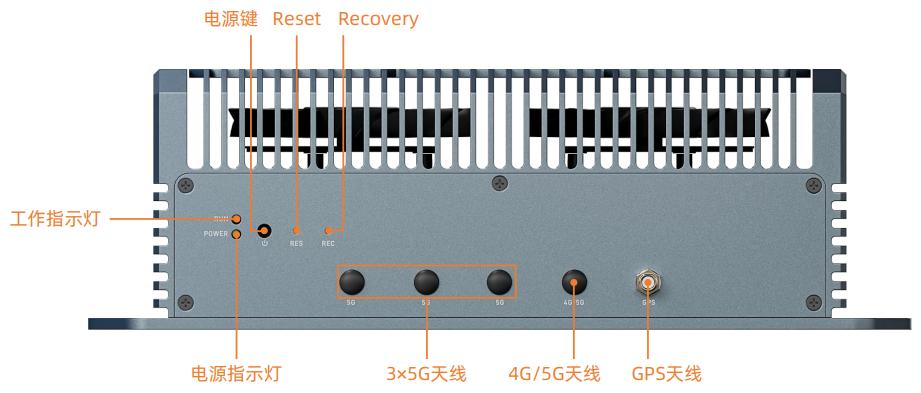
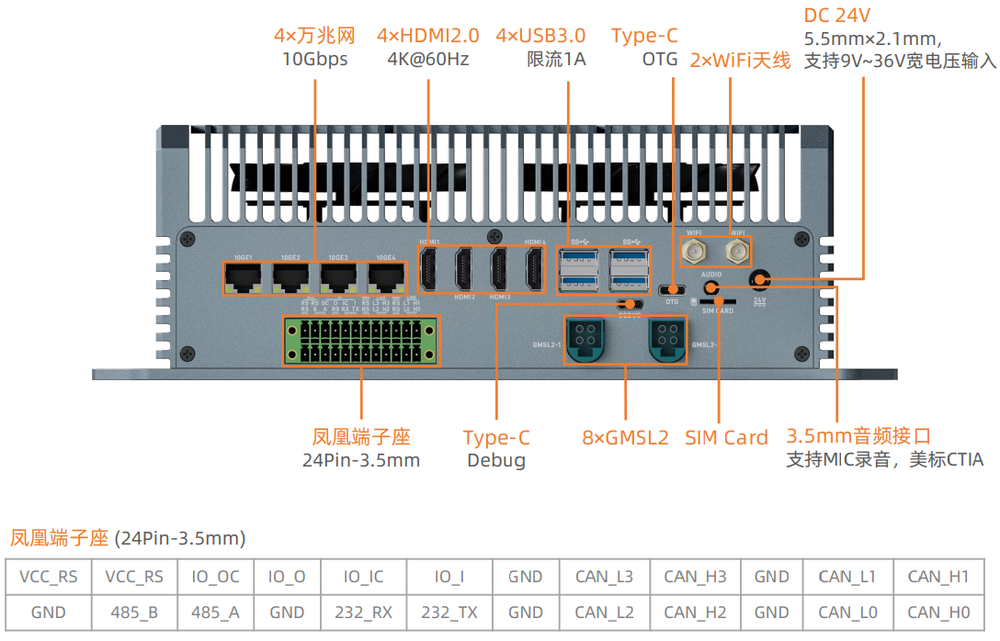
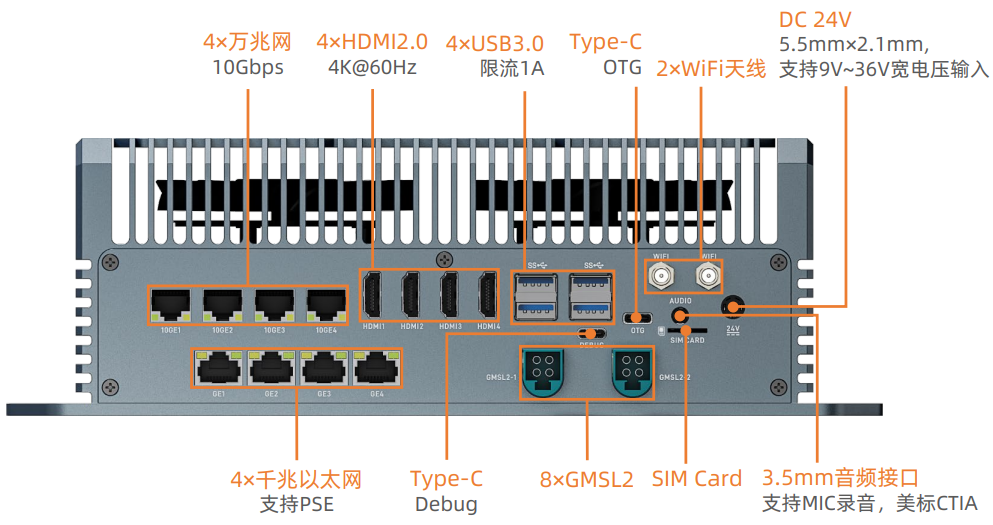

# 简介
EC-ThorT5000 搭载NVIDIA 官方原装 Jetson Thor T5000 核心板模组，拥有 128GB 内存，算力高达 2070 TFLOPS，它可以运行所有现代AI模型，包括 Transformer 和 ROS 机器人模型。可以实现更大型、更复杂的深度神经网络，如运用 TENSORFLOW、OPENCV、JETPACK、KERASMXNET、PY-TORCH 等,实现物体识别、目标检测追踪、语音识别、及其他视觉开发等功能，满足更高 AI 人工智能应用场景的需求。 

# 接口介绍
## CAN 版

## 网口版

