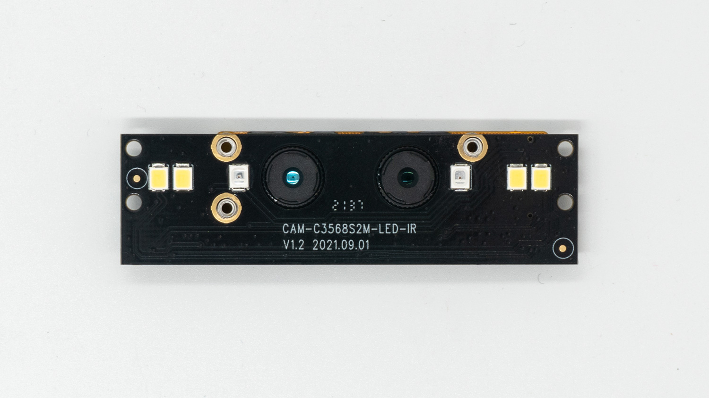
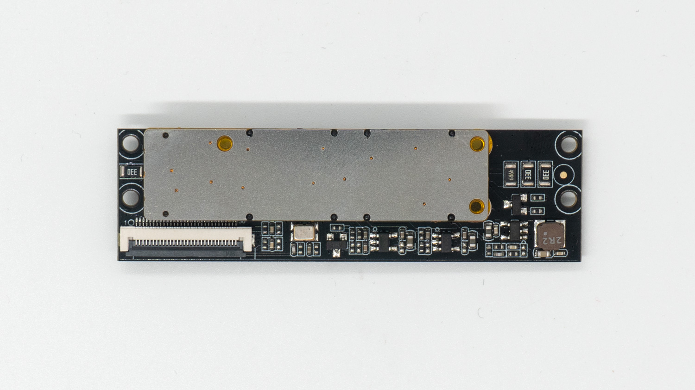
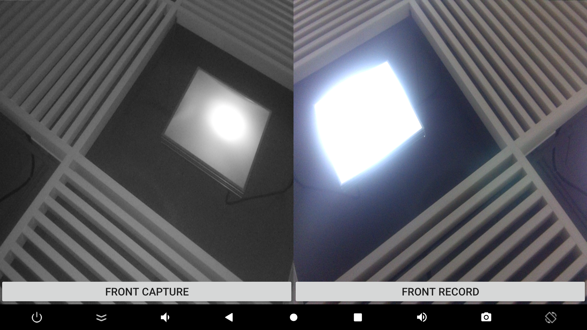

# 摄像头模组

## [CAM-8MS1M 单目摄像头模组](https://item.taobao.com/item.htm?ft=t&id=659032651408) 

### 产品参数
* **品牌**：SV 
* **ISP**：xc7160
* **Sensor**: sc8238
* **接口**: MIPI
* **像素**: 800W(当前仅支持1080P，4K仍在适配中)

### 规格书
[CAM-8MS1M_800万单目MIPI摄像模组_规格书](https://download.t-firefly.com/%E4%BA%A7%E5%93%81%E8%A7%84%E6%A0%BC%E6%96%87%E6%A1%A3/%E9%85%8D%E4%BB%B6/CAM-8MS1M_800%E4%B8%87%E5%8D%95%E7%9B%AEMIPI%E6%91%84%E5%83%8F%E6%A8%A1%E7%BB%84_%E8%A7%84%E6%A0%BC%E4%B9%A6.pdf?)

### 参考固件
公版固件默认支持 CAM-8MS1M 单目摄像头模组。若无法使用单目摄像头 CAM-8MS1M，请更新固件

### 实物图参考

### 连接方法

### 实拍图片

## [CAM-2MS2MF 双目摄像头模组](https://item.taobao.com/item.htm?ft=t&id=657886928669) 

### 产品参数
* **品牌**：SV 
* **Sensor**: gc2053(IR)/gc2093(RGB)
* **接口**: MIPI
* **像素**: 200W

### 规格书
[CAM-2MS2MF_200万双目MIPI摄像模组_规格书](https://download.t-firefly.com/%E4%BA%A7%E5%93%81%E8%A7%84%E6%A0%BC%E6%96%87%E6%A1%A3/%E9%85%8D%E4%BB%B6/CAM-2MS2M_200%E4%B8%87%E5%8F%8C%E7%9B%AEMIPI%E6%91%84%E5%83%8F%E6%A8%A1%E7%BB%84_%E8%A7%84%E6%A0%BC%E4%B9%A6.pdf?)

### 参考固件
双目摄像头 CAM-2MS2MF Android11 固件下载

### 实物图参考

### 连接方法

### 实拍图片

