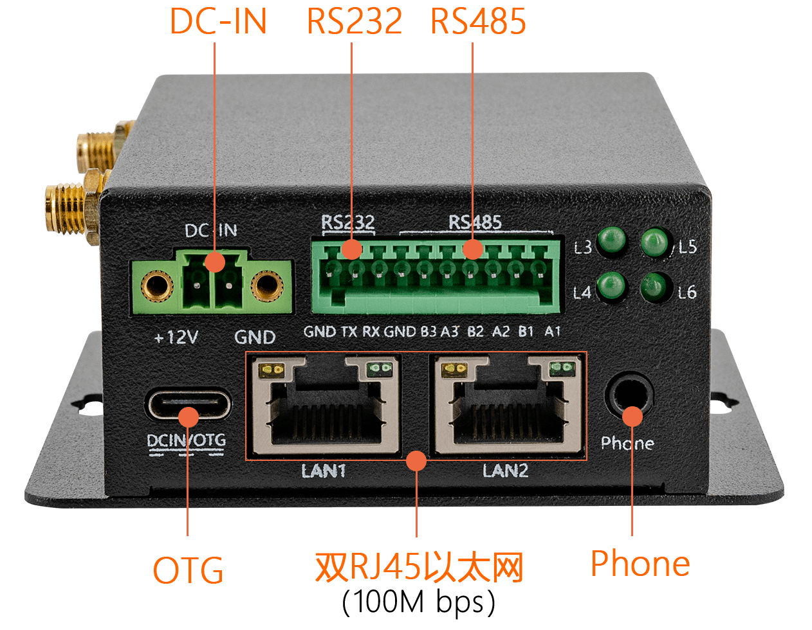
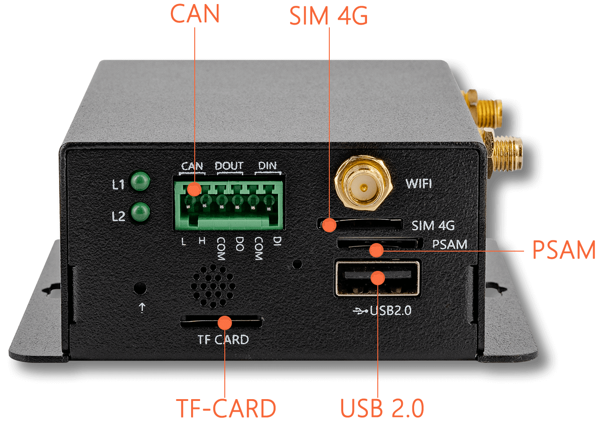

# 介绍
iHC-3308GW是专为工业环境打造的4G智能网关，采用IoT专用的四核64位处理器RK3308B；全面支持4G LTE，NB-IoT，LoRa通信；拥有双百兆以太网口以及RS485、CAN、RS232等控制接口，并支持国家商用密码安全算法；广泛适用于工业4G路由、IoT物联网、自动化系统等工业领域。

## 硬件接口图

## 软硬件参数

| 基 本 参 数          |                                                              |
| -------------------- | ------------------------------------------------------------ |
| 主控芯片             | RK3308B (28纳米制程）                                        |
| 处理器               | 四核64位ARM Cortex-A35，主频1.3GHz                           |
| 内 存                | 256M DDR3（128MB ~ 512MB可选）                               |
| 存储器               | 4GB eMMC：支持4G/8G/16G/32G/64G/128G SPI Flash： 支持16MB ~512 MB 支持MicroSD (TF) Card Slot扩展 |
| **硬 件 特 性**      |                                                              |
| 以太网               | 双RJ45以太网口（100M bps）                                   |
| WiFi                 | 支持 2.4GHz WiFi，支持802.11/b/g/n协议                       |
| 音频                 | 内置音频CODEC，包含8路ADC，集成高性能Codec和Hardware VAD     |
| 接 口                | PSAM × 1 CAN × 1 SIM 4G × 1 RJ45百兆以太网口 × 2 RS232 × 1 RS485 × 3 DC IN (12V ) × 1 Type-C (OTG) × 1 DIN× 1 DOUT× 1 Phone × 1 TF-Card × 1 USB 2.0 × 1 |
| **系 统 软 件**      |                                                              |
| 系统支持             | 支持Buildroot（Linux）嵌入式系统、Ubuntu 18.04               |
| 无线通信             | 支持4G LTE Cat1无线通信模块，可实现任意运营商的4G网络无缝对接； 支持NB-IOT 物联网通信支持全球频段B1/B3/B5/B8/B20/B28等，速度快、功耗低； 支持工业级远距离LoRa通信，868MHz频率，户外视距通讯距离高达8Km，高稳定性 |
| MQTT协议             | 支持Modbus标准工业协议转MQTT协议， 云端支持阿里云、私有云部署，适用于物联网PLC数据采集和控制场景 |
| 国家商用密码安全算法 | 板载有PSAM卡卡槽，方便系统集成PSAM卡功能； 具有强大的设备认证、数据加密解密功能;  提供性能优异的 DES/3DES、 AES、 SHA、 RSA、 ECC； 以及国家商用密码 SM1/SM2/SM3/SM4 等安全算法模块 |
| **其 他 参 数**      |                                                              |
| 规格尺寸             | 99.4 mm * 84 mm * 35.2 mm                                    |
| 工作温度             | -10℃～60℃                                                    |
| 工作湿度             | 10%～90 %                                                    |
 