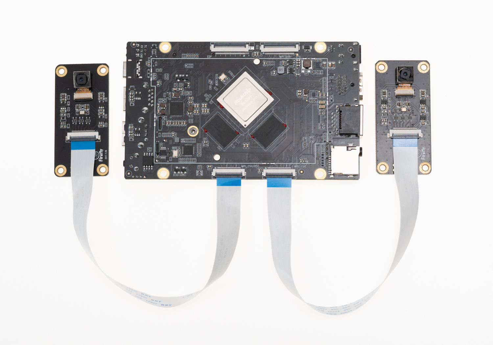

## [OV13850 摄像头模组](https://store.t-firefly.com/goods.php?id=6)<font color=#ff0000>(已停产)</font> <br />

### 产品参数

* 品牌：Omnivision
* 型号：CMK-OV13850
* 接口：MIPI
* 像素：1320W


### 参考固件

* Android 7.1 公版固件默认支持 CMK-OV13850 摄像头模组
* Android 10.0 公版固件须手动修改DTS

#### 10.0 固件修改方法

```
--- a/kernel/arch/arm64/boot/dts/rockchip/rk3399-roc-pc-plus.dtsi
+++ b/kernel/arch/arm64/boot/dts/rockchip/rk3399-roc-pc-plus.dtsi
 &i2c1{

-    XC6130b@23{
+    ov13850b@10{
     status = "okay";
     };
-    XC7022b@1b{
+    ov13850f@10{
     status = "okay";
     };

-    /delete-node/ ov13850b@10;
-    /delete-node/ ov13850f@10;
+    /delete-node/ XC6130b@23;
+    /delete-node/ XC7022b@1b;

 };

```
修改以上补丁后重新编译内核并烧写boot.img后重启。


### 技术资料

[OV13850 摄像头 DataSheet](http://download.t-firefly.com/product/RK3288/Docs/Peripherals/OV13850%20datasheet/Sensor_OV13850-G04A_OmniVision_SpecificationV1.pdf)

### 实物图


### 连接方法



### 实拍图片


