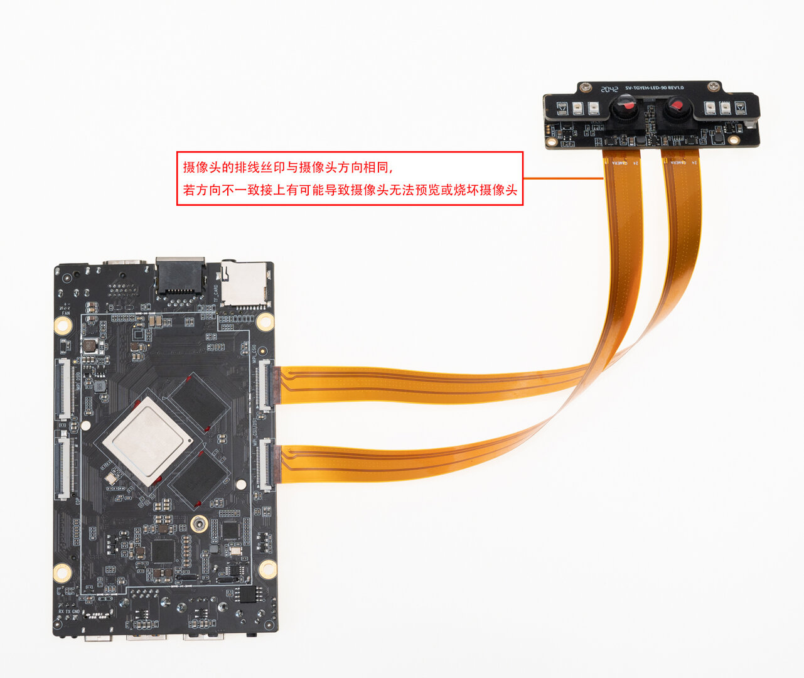

## SV-TAYSH-TQ摄像头模组

### 产品参数

* 型号：XC7022(RGB)/XC6130(IR)

* 接口：MIPI

* 像素：200W

### 修改方法 (手动修改)
「 Android 7.1 」device/rockchip/rk3399/rk3399_roc_pc_plus.mk

```
 BOARD_NFC_SUPPORT := false
 BOARD_HAS_GPS := false
+BOARD_XC7022_XC6130_SUPPORT := true

 #for 3G/4G modem dongle support
 BOARD_HAVE_DONGLE := false
```
修改上述补丁后重新 [编译Android](compile_android7.1_industry_firmware.html#zheng-ti-bian-yi)并烧写 system.img 后重启。

「 Android 10  」kernel/arch/arm64/boot/dts/rockchip/rk3399-roc-pc-plus.dtsi
```
    xc7160b@1b{
+    status = "disabled";
    };
    xc7160f@1b{
+    status = "disabled";
    };

    XC6130b@23{
+    status = "okay";
    };
    XC7022b@1b{
+    status = "okay";
    };
```
修改上述补丁后重新[编译内核](compile_android10.0_firmware.html#fen-bu-bian-yi)并烧写 boot.img 后重启。


### 实物图


### 连接方式



### 实拍图片


