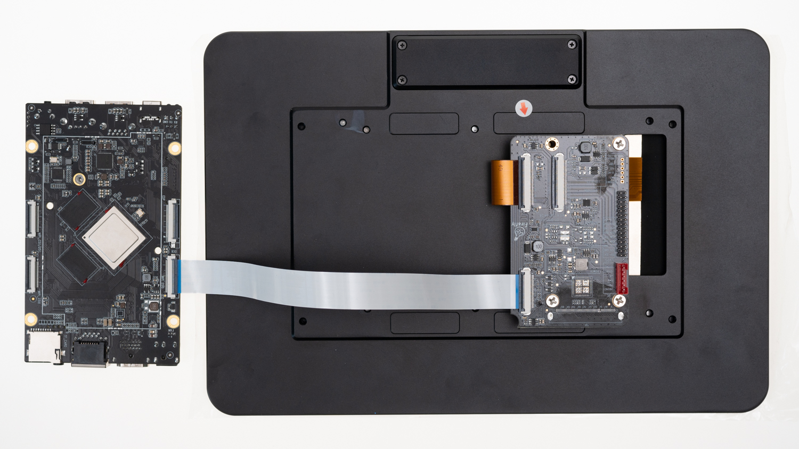

# 屏幕模组

## [DM-M10R800V2 MIPI 屏模组](https://item.taobao.com/item.htm?ft=t&id=655100190974)

### 产品参数

* 型号：M101014_BE45_A1
* 尺寸：10.1 寸
* 分辨率：800x1280
* 显示接口：MIPI
* 可视角度：160°
* 触摸屏：多点电容触摸

###  参考固件

**注意：** 支持 10.1 寸 MIPI 屏的官方固件名带有 `MIPI` 字样，下面是固件的链接：

* [下载](https://www.t-firefly.com/doc/download/125.html)

### 编译命令

* Android 7.1

```
./FFTools/make.sh -j8 -d rk3399-roc-pc-plus-mipi101-JDM101014_BC45_A1 -l rk3399_roc_pc_plus_mipi101-userdebug
./FFTools/mkupdate/mkupdate.sh -l rk3399_roc_pc_plus_mipi101-userdebug
```
* Android 10.0
```
./FFTools/make.sh -j8 -d rk3399-roc-pc-plus-mipi101-JDM101014_BC45_A1 -l rk3399_roc_pc_plus_mipi-userdebug
./FFTools/mkupdate/mkupdate.sh -l rk3399_roc_pc_plus_mipi-userdebug
```
### 实物图


### 参考资料

[屏幕模组 Datasheet & 转接板原理图](https://www.t-firefly.com/doc/download/125.html#other_489)

