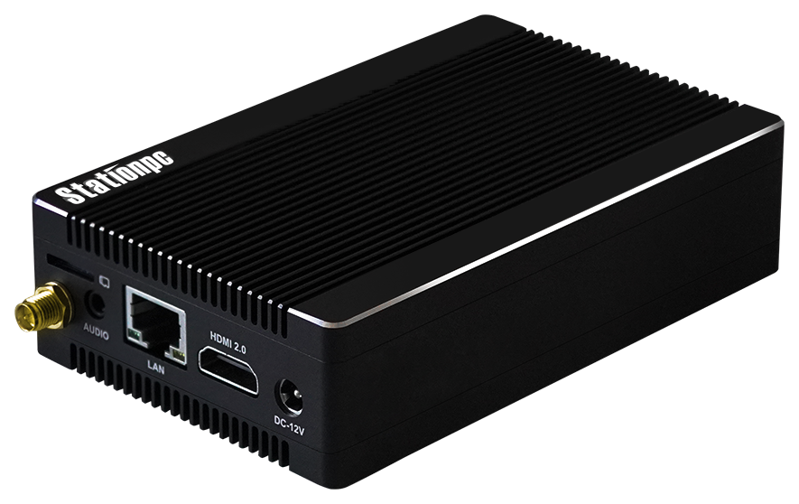
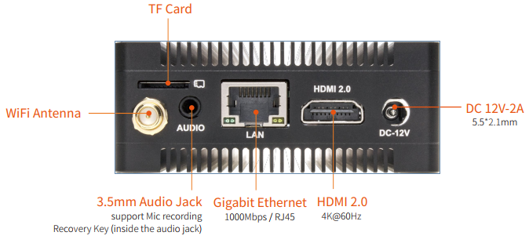
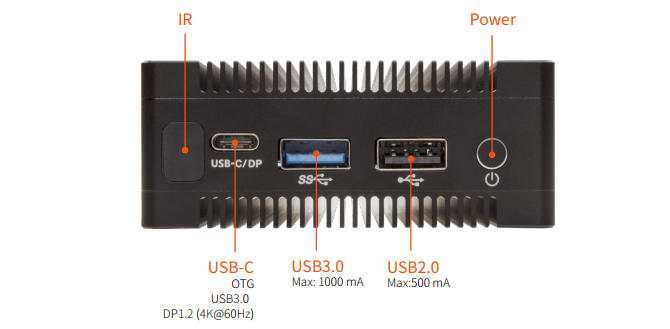

# 产品简介

Station P1 Pro  嵌入式主机，基于 ROC-RK3399-PC Pro 高性能开源平台，配置工业级外壳，防尘防干扰，长时间稳定运行，支持 4K 硬解。
搭载Rockchip RK3399六核处理器，采用“服务器级”（双核Cortex-A72+四核Cortex-A53）大小核构架，主频高达1.8GHz，支持OpenGL ES1.1/2.0/3.0/3.1，内置 VPU视频处理器。

 