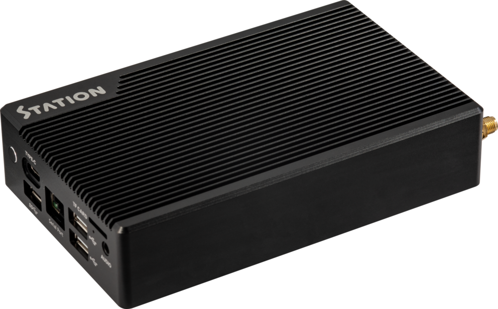
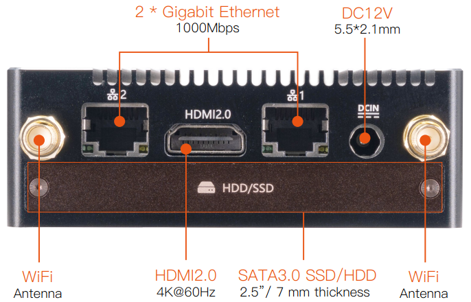
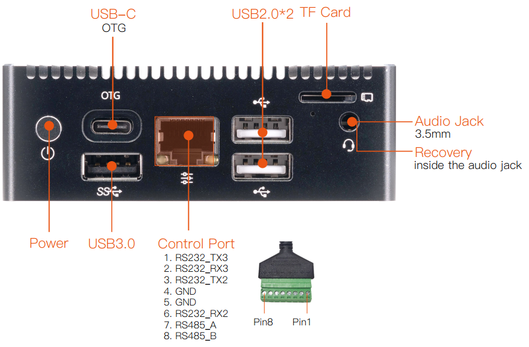

# 介绍
# 产品简介

Station-P2 嵌入式主机，基于 ROC-RK3568-PC 高性能开源平台，配置工业级外壳，防尘防干扰，长时间稳定运行，支持 4K 硬解，丰富的接口方便连接各种工业设备。
搭载 ARM  Cortex-A55 架构、四核64位高性能处理器，主频高达 2.0GHz，ARM G52 2EE 图形处理器。RKNN NPU AI 加速器 ( SoC集成 ) 。

 