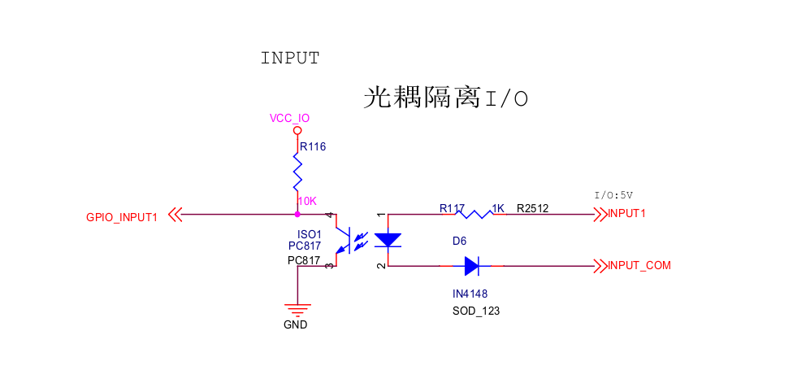
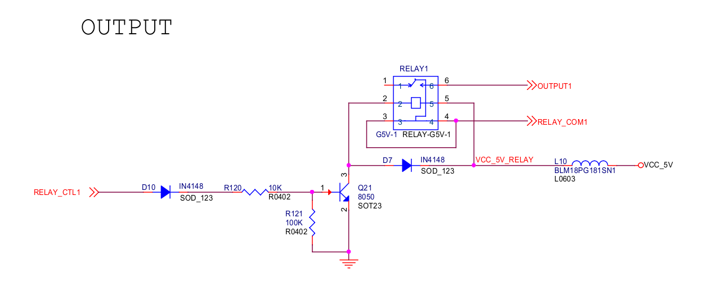

# 硬件功能使用
## 调试串口

IHC-3308GW 的调试串口为 UART4，串口参数为：波特率 1500000、数据位 8、停止位 1、无奇偶校验、无流控。

调试串口为 TTL 电平接口，使用时需外接 USB 转 TTL 串口模块进行调试。

调试串口的连接方式与使用方法详见：[调试串口](usb_to_ttl.md)。

## UART（RS485 / RS232）

扩展板上扩展了多个串口可供使用，包括 3 个 `RS485`，1个 `RS232`。

内核已默认支持上述串口功能，各串口对应的设备文件如下：

```bash
RS485_1: /dev/ttysWK0
RS485_2: /dev/ttysWK1
RS485_3: /dev/ttysWK2
RS232  : /dev/ttysWK3
```

以 RS485_1 为例：

* 连接

将 RS485_1 的 A、B 引脚分别和主机串口适配器（USB 转 485 转串口模块）的 A、B 引脚相连。

* 打开主机的串口终端

在终端打开 kermit，并设置波特率：

```bash
$ sudo kermit
C-Kermit> set line /dev/ttysWK0
C-Kermit> set speed 9600
C-Kermit> set flow-control none
C-Kermit> connect
```

`/dev/ttyUSB0` 为主机识别到的 USB 转串口适配器的设备文件。

* 发送数据

在设备上运行如下命令：

```bash
echo "Firefly RS485 test..." > /dev/ttysWK0
```

主机中的串口终端即可接收到字符串 "Firefly RS485 test…"。

* 接收数据

首先在设备上运行下列命令：

```bash
cat /dev/ttysWK0
```

然后在主机的串口终端输入字符串 "Firefly RS485 test…"，设备端即可见到相同的字符串。RS232（`/dev/ttysWK3`）与 RS485_2、RS485_3 的验证方法同理。

## CAN

- 连接

只需将设备的 `CANH`、`CANL` 和通讯端的 `CANH`、`CANL` 对应连接即可。

* 发送数据

```bash
ip link set can0 down
ip link set can0 type can bitrate 250000
ip link set can0 up
cansend can0 123#1122334455667788
```

* 接收数据

```bash
ip link set can0 down
ip link set can0 type can bitrate 250000
ip link set can0 up
candump can0
```

* loopback 模式测试

```bash
ip link set can0 down
ip link set can0 type can bitrate 50000 loopback on
ip link set can0 up
candump can0 &
cansend can0 123#11223344556677
```

## DIN

IHC-3308GW 支持一路光耦隔离接口，其中，`DI`在硬件原理图中对应于`INPUT1`，`COM`在硬件原理图中对应于`INPUT_COM`。

- 电路原理图

<center>


</center>

* 检测

当 `INPUT1`、`INPUT_COM` 导通时，`GPIO_INPUT1` 会检测到低电平；当 `INPUT1`、`INPUT_COM` 断开时，`GPIO_INPUT1` 会检测到高电平。

对应 `GPIO` 口如下：

```bash
GPIO_INPUT1：GPIO1_A6，38
```

检测方式如下：

```bash
# 申请 GPIO
echo 38 > /sys/class/gpio/export
# 设置为输入
echo in > /sys/class/gpio/gpio38/direction
# 读取电平值
cat /sys/class/gpio/gpio38/value
```

## DOUT

IHC-3308GW 支持一路继电器接口，`DO`对应于硬件原理图中的`OUTPUT1`，`COM`对应于硬件原理图中的`RELAY_COM1`。

* 电路原理图

<center>


</center>

* 控制

当 `RELAY_CTL1` 输出低电平，`OUTPUT1`、`RELAY_COM1` 断开；当 `RELAY_CTL1` 输出高电平，`OUTPUT1`、`RELAY_COM1` 导通。

对应 `GPIO` 口如下：

```
RELAY_CTL1：GPIO1_B2，42
```

控制方式如下：

```bash
# 申请 GPIO
echo 42 > /sys/class/gpio/export
# 设置为输出
echo out > /sys/class/gpio/gpio42/direction
# 设置电平值，1 / 0
echo 1 > /sys/class/gpio/gpio42/value
```

## LED

IHC-3308GW 支持6个可自定义LED灯，分别对应的GPIO口如下：

| **L1** | GPIO2_A7 （gpio71）    |
| ------ | ---------------------- |
| **L2** | **GPIO2_A6（gpio70）** |
| **L3** | **GPIO2_B3（gpio74）** |
| **L4** | **GPIO2_B2（gpio73）** |
| **L5** | **GPIO2_B5（gpio76）** |
| **L6** | **GPIO2_B4（gpio75）** |

控制方式如下，以L1为例：

```bash
# 亮
echo 1 > /sys/class/leds/firefly\:green\:L1/brightness
# 灭
echo 0 > /sys/class/leds/firefly\:green\:L1/brightness
```
