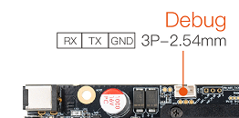
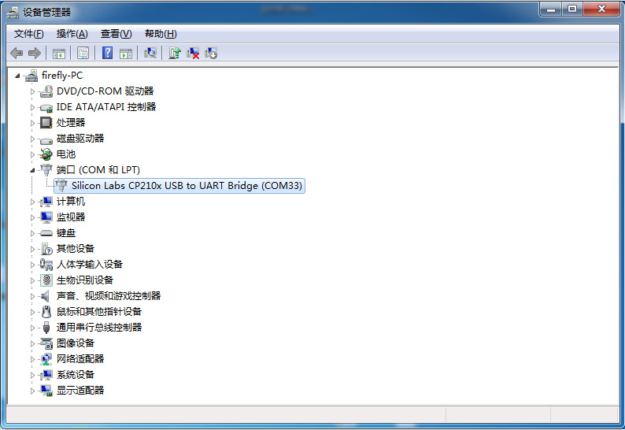

# 串口调试

USB 转串口适配器，是 USB 转串口 TTL 适配器的简称。
## 使用 DEBUG 口调试

如果要进行 U-Boot 或内核开发，需要使用 DEBUG 口进行调试，操作与 RS232 调试是一致的，需要注意的是适配器及其驱动问题。

### 选购适配器

网店上有许多 USB 转串口的适配器，按芯片来分，有以下几种：

| 串口  | 最高波特率 | 是否推荐 | 评价 | 购买链接 |
| :--------: | :-------: |:-------: | :-------: | :-------: |
| [CP2104](https://item.taobao.com/item.htm?spm=a1z10.5-c.w4002-12605442688.14.aa5e1e8srwECg&id=546045713700) | 2Mbps | 推荐 | 支持高波特率通信，稳定性好耐用 | [点击购买](https://item.taobao.com/item.htm?spm=a1z10.5-c.w4002-12605442688.14.aa5e1e8srwECg&id=546045713700) |
| CH340 | 2Mbps | 不推荐 | 实际使用中发现，市面上很多 CH340 的实际波特率达不到 1.5 Mbps |  |
| PL2303 | 1.2Mbps | 不推荐 | 最高波特率达不到 1.5Mbps |  |

一般来说，采用 CH340 芯片的适配器，性能比较稳定，价格上贵一些。

**注意：** AIO-1684XQ 默认的波特率是 115200。

### 硬件连接

USB 转串口适配器，有四个引脚：

* 3.3V 电源（NC），不需要连接
* GND，串口的地线，接开发板串口的 GND 针
* TXD，串口的输出线，接开发板串口的 TX 针
* RXD，串口的输入线，接开发板串口的 RX 针

**注意：** 如使用其它串口适配器遇到 TX 和 RX 不能输入和输出的问题，可以尝试对调 TX 和 RX 的连接。

AIO-1684XQ DEBUG 口：

### 驱动安装

Windows 系统需要安装适配器驱动（Linux 则不需要）：

下载驱动并安装:

* [CH340](https://www.wch.cn/downloads/CH341SER_EXE.html)
* [PL2303](https://www.prolific.com.tw/en/portfolio-item/pl2303gl/)
* [CP210X](https://www.silabs.com/software-and-tools/usb-to-uart-bridge-vcp-drivers)

插入适配器后，系统会提示发现新硬件，并初始化，之后可以在设备管理器找到对应的 COM 口：

