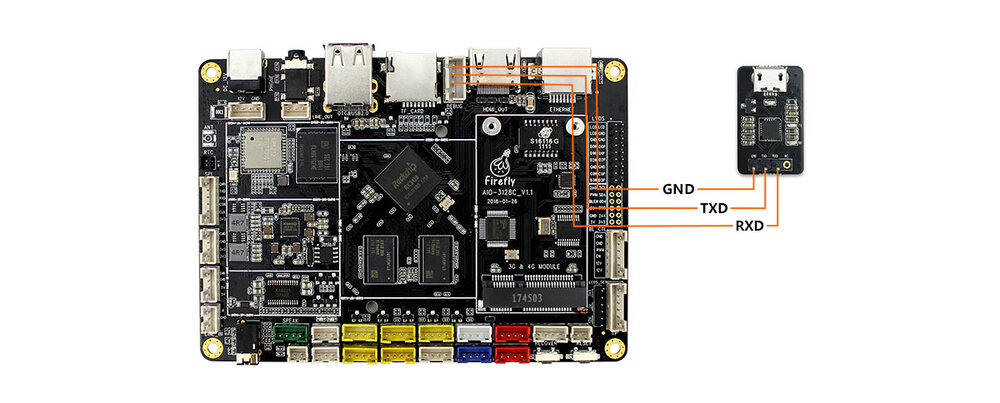
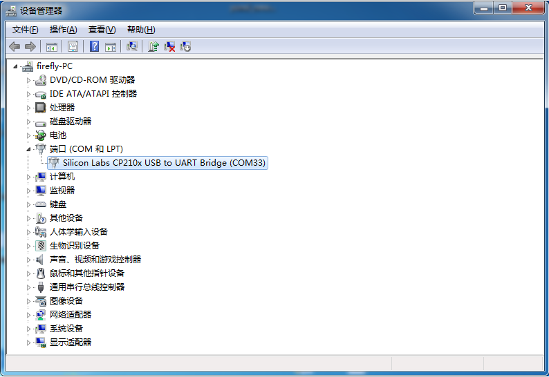
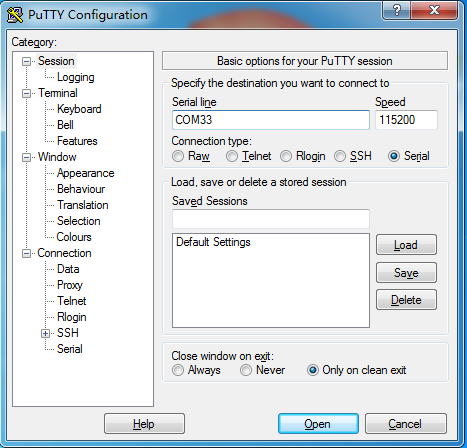

# 串口调试

## 注意事项  

AIO-3128C 开发板的调试串口与 TF 卡接口有信号引脚复用，因此无法同时使用，即：
使用调试串口时必须拔掉 TF 卡，而使用 TF 卡时不要连接调试串口。    

## 选购适配器
网店上有许多USB转串口的适配器，按芯片来分，有以下几种：  

* [CP2104](https://store.t-firefly.com/goods.php?id=24)
* PL2303  
* CH340    
 

## 硬件连接
串口转 USB 适配器，有四根不同颜色的连接线：  

* 红色：3.3V 电源，不需要连接  
* 黑色：GND，串口的地线，接开发板串口的 GND 针  
* 白色：TXD，串口的输出线，接开发板串口的 TX 针  
* 绿色：RXD，串口的输入线，接开发板串口的 RX 针  

注：如使用其它串口适配器遇到TX和RX不能输入和输出的问题，可以尝试对调TX和RX的链接线，AIO-3128C串口连接如图所示:
 

## 连接参数  
AIO-3128C 使用以下串口参数：  

* 波特率：115200
* 数据位：8
* 停止位：1
* 奇偶校验：无
* 流控：无

## Windows 上使用串口调试
### 安装驱动
下载驱动并安装:  
* [CP2104](https://www.silabs.com/software-and-tools/usb-to-uart-bridge-vcp-drivers)
* CH340 [[1]](https://www.wch.cn/downloads/CH341SER_EXE.html)
* PL2303 [[2]](https://www.prolific.com.tw/en/portfolio-item/pl2303gl/)

插入适配器后，系统会提示发现新硬件，并初始化，之后可以在设备管理器找到对应的 COM 口：  
 

### 安装软件

Windows 上一般用 putty 或 SecureCRT。其中 putty 是开源软件，在这里介绍一下，SecureCRT 的使用方法与之类似。  
到这里 [[3]](https://www.chiark.greenend.org.uk/~sgtatham/putty/latest.html) 下载 putty，建议下载 putty.zip，它包含了其它有用的工具。  
解压后运行`PUTTY.exe`，选择 Connection type（连接类型）为 Serial（串口），将 Serial line（串口线）设置成设备管理器所看到的  COM 口，并将 Speed（波特率）设置为 115200，按 Open（打开）即可:  
 
### Ubuntu 上使用串口调试

在 Ubuntu 上可以有多种选择：  

* picocom
* minicom
* kermit  

picocom 的使用比较简单，以下就介绍 picocom，其它软件也是类似的。  
安装： 
```
sudo apt-get install picocom  
```

连接好串口线的，看一下串口设备文件是什么，下面示例是`/dev/ttyUSB0`
```
$ ls /dev/ttyUSB*  
/dev/ttyUSB0  
```

运行： 
```
$ picocom -b 115200 /dev/ttyUSB0
picocom v1.7

port is        : /dev/ttyUSB0
flowcontrol    : none
baudrate is    : 115200
parity is      : none
databits are   : 8
escape is      : C-a
local echo is  : no
noinit is      : no
noreset is     : no
nolock is      : no
send_cmd is    : sz -vv
receive_cmd is : rz -vv
imap is        : 
omap is        : 
emap is        : crcrlf,delbs,

Terminal ready
```  

以上提示 `Ctrl-a` 是转义键，按 `Ctrl-a Ctrl-q` 就可以退出终端。除了 `Ctrl-q` 外，还有几个比较常用的控制命令： 

* Ctrl-u ：提高波特率  
* Ctrl-d ：降低波特率  
* Ctrl-f ：切换流控设置（硬件流控 RTS/CTS, 软件流控 XON/XOFF, 无 none）  
* Ctrl-y ：切换奇偶校验 （偶 even, 奇 odd, 无 none）  
* Ctrl-b : 切换数据位 （5, 6, 7, 8）  
* Ctrl-c ：切换本地回显（local-echo）开关  
* Ctrl-v ：显示当前串口参数和状态