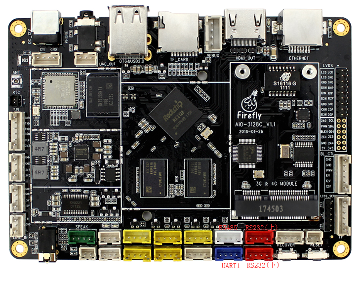

# UART 使用

## 板载资源介绍

AIO-3128C 开发板内置 3 路 UART，分别为 uart0，uart1，uart2。  

uart0 用于蓝牙数据传输，如果要使用 uart0，必须关掉蓝牙，才可以使用扩展槽上的 UART0 针脚。  

uart1, 因为存在以下复用：

* SPI_TXD/UART1_TX  
* SPI_RXD/UART1_RX  
* SPI_CSN0/UART1_RTS  

AIO-3128C 使用SPI桥接/扩展4个增强功能串口(UART)的功能，分别为UART1，RS232(上)，RS232(下),RS485功能,其中RS232(下)口硬件可做修改为TTL功能。
每个UART都拥有256字节的FIFO缓冲区，用于数据接收和发送。


uart2 一般用做调试串口，但同样存在复用，也就是说 TF 卡与调试串口不可以同时使用： 

* SDMMC_D0/UART2_TX  
* SDMMC_D1/UART2_RX  

uart2 有 32 字节的 FIFO 收发缓冲区，uart0 则要有双 64 字节的 FIFO 用作蓝牙数据收发。所有 uart 均支持 5 位、6 位、7 位、8 位数据收发和 DMA 操作。  

## 配置 DTS 节点

文件 kernel/arch/arm/boot/dts/aio-3128c.dtsi 中已经有 spi转uart 相关节点定义，如下所示：

```
&spi0 {
    status = "okay";
    max-freq = <48000000>;

    dac0: dh2228@00 {
        status = "disabled";
        compatible = "rohm,dh2228fv";
        reg = <00>;
        spi-max-frequency = <100000>;
    };

    spi_wk2xxx: spi_wk2xxx@00{
        status = "okay";
        compatible = "firefly,spi-wk2xxx";
        reg = <0x00>;
        spi-max-frequency = <10000000>;
        reset-gpio = <&gpio3 GPIO_D3 GPIO_ACTIVE_HIGH>; 
        irq-gpio = <&gpio1 GPIO_B4 IRQ_TYPE_EDGE_FALLING>;
        cs-gpio = <&gpio1 GPIO_B3 GPIO_ACTIVE_HIGH>;
        pwr-en-gpio = <&gpio0 GPIO_B4 GPIO_ACTIVE_HIGH>;
    };
};
```
### 调试方法
```
RS485：/dev/ttysWK0
RS232(上)：/dev/ttysWK1
RS232(下)：/dev/ttysWK2
UART1：/dev/ttysWK3
```

### 配置 uart0

用户只需在 kernel/arch/arm/boot/dts/aio-3128c.dts 文件中打开 uart0 ，并关掉蓝牙，如下所示：

```
&uart0 {
  status = "okay";
  dma-names = "!tx", "!rx";
  pinctrl-0 = <&uart0_xfer &uart0_cts>;}; 
  wireless-bluetooth {
  compatible = "bluetooth-platdata";
  ...
  status = "disabled";
  };
};
```
        

## 编译并烧写内核

将串口驱动编译到内核中，在 kernel 目录下执行如下命令：

```
make AIO-3128C_defconfig
make AIO-3128C.img -j4
```

把 kernel 目录下生成的 kernel.img 和 resource.img 烧录到开发板中即可。

## 测试串口通讯

配置好串口后，用户可以通过主机的 USB 转串口适配器向开发板的串口收发数据，以 uart0 为例，步骤如下：

### 连接硬件

将开发板 uart0 的 TX、RX、GND 引脚分别和主机串口适配器的 RX、TX、GND 引脚相连。     
注意：如果是使用 Firefly 的串口适配器，则是 TX 对 TX，RX 对 RX 连接。 

### 打开主机的串口终端

在终端打开 kermit，并设置波特率：

```
$ sudo kermit
C-Kermit> set line /dev/ttyUSB0
C-Kermit> set speed 9600
C-Kermit> set flow-control none
C-Kermit> connect
```

* /dev/ttyUSB0 为 USB 转串口适配器的设备文件
* uart0 的波特率默认为 9600


### 发送数据

uart0 的设备文件为 /dev/ttyS0。在设备上运行下列命令：

```
echo firefly uart test... > /dev/ttyS0
```

主机中的串口终端即可接收到字符串“firefly uart test...”

### 接收数据

首先在设备上运行下列命令：

```
cat /dev/ttyS0
```

然后在主机的串口终端输入字符串 “Firefly uart test...”，设备端即可见到相同的字符串。   
要改变 uart0 的波特率，例如 115200，可以运行以下命令：   
```
stty -F /dev/ttyS0 115200
```