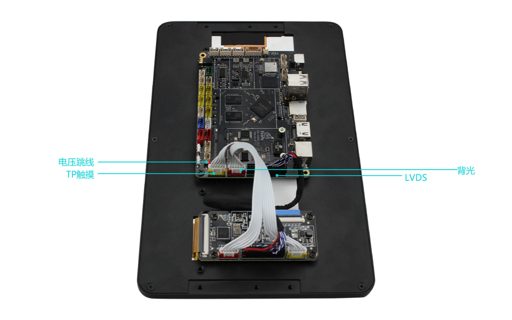

# 屏幕模组

## 10.1寸LVDS显示模组

### 产品参数
* 型号：HSX101H40C-L28B   
* 尺寸：10.1 inch     
* 分辨率：1280x800  
* 接口：LVDS  
* 可视角度：170°
* 触摸屏：多点电容触摸

***注意：***   

1.支持10.1寸屏的官方固件[[AIO-3128C LVDS 固件]](https://community.t-firefly.com/doc/download/48)  

2.更新AIO-3128C最新代码后，支持使用10.1寸屏。

### 技术资料
[[10.1寸屏幕模组DataSheet&转接板原理图]](https://community.t-firefly.com/doc/download/48)  

### 连接方法
