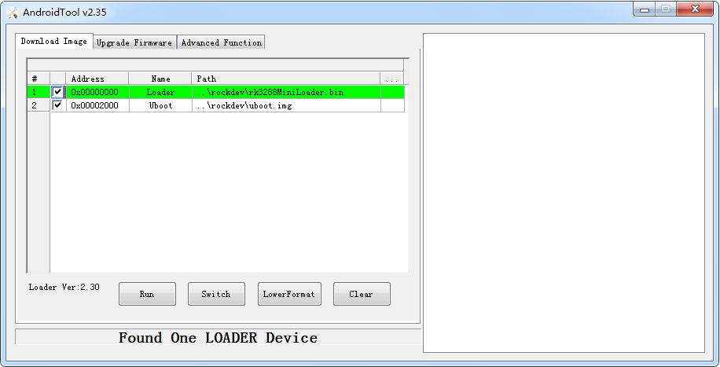

# U-Boot使用

## 前言

RK U-Boot 基于开源的 U-Boot 进行开发，工作模式有启动加载模式和下载模式。启动加载模式是 U-Boot 的正常工作模式，嵌入式产品发布时，U-Boot 都工作在此模式下，主要用于开机时把内存中的内核加载到内存中，启动操作系统；下载模式主要用于将固件下载到闪存，开机时长按 Recovery 键可进入下载模式。本文简单说明 U-Boot 的使用，更多相关文档请看 SDK 下面的 RKDocs/common/uboot/RockChip_Uboot开发文档V3.0.pdf。  
## 编译

编译 U-Boot 与编译内核类似，编译前把默认配置写入 .config，执行：  
```
cd SDK/u-boot
make rk3128_defconfig
```
如果需要修改相关选项，也可以用:
```
make menuconfig
```

编译：
```
make
```

编译后生成：
```
RK3128MiniLoaderAll(L)_V2.20.bin
uboot.img
```

RK3128MiniLoaderAll(L)_V2.20.bin 和 uboot.img 的组合是二级 loader 模式，同时支持 eMMC 和 NAND 闪存。  

## 烧录

打开烧录工具，板子接好 USB OTG 线，接通电源时按住 Recovery 键，使开发板进入 U-Boot 的下载模式，在烧录工具中选择编译好的 Loader 文件，点击执行即可，如下图：

  

## 确认是否正确烧写新的 Loader

如果你已经成功烧写你最新编译的 Loader，在开机的串口输出中可以看到类似如下信息：
```
#Boot ver: 2015-01-05#2.19
```
如果打印的时间及版本与你编译的一致，说明你成功更新了Loader。

## 进入 U-Boot 命令行模式

一般情况下无需进入 U-Boot 的命令行模式。但如果需要调度 U-Boot，可以修改 include/configs/rk30plat.h：
```
/* mod it to enable console commands.  */
#define CONFIG_BOOTDELAY               0
```
将 0 改成 3 即可在开机时有 3 秒的时延，在此时间内在串口输入任意键即可进入u-boot命令行模式。
